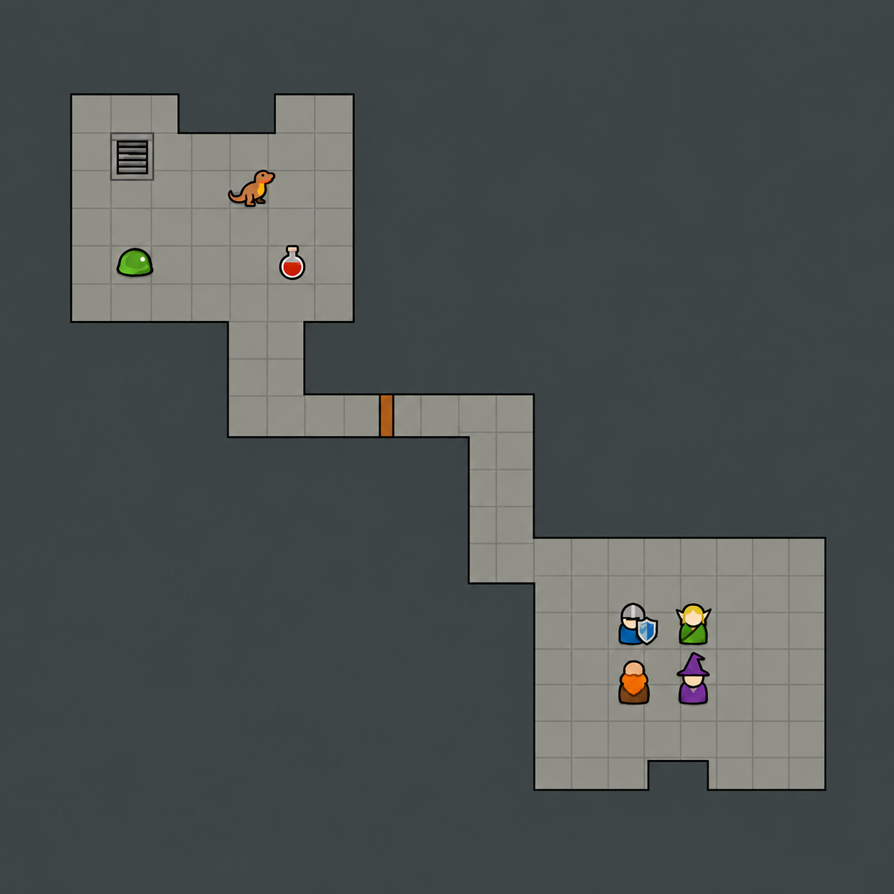

# 평면 벽 연결 목업

2026-09-16 · 내장 image_gen으로 생성하고 벽 외곽선을 한 차례 수정했다.

## 의도와 결과

- 두 방을 꺾인 복도로 연결하고, 들어간 모서리와 바깥 모서리를 함께 확인한다.
- 벽 옆면과 높이 표현을 없애고, 어두운 벽 덩어리와 밝은 바닥의 경계만 표시한다.
- 작은 파티원 4명, 몬스터, 물약, 문과 계단으로 게임 크기에서의 식별성을 검토한다.
- 첫 생성에서 생긴 불필요한 이중 외곽선은 수정본에서 제거했다.
- 생성 이미지에는 미세한 질감·명암이 남았으며, 복도 폭과 바닥 격자도 완전히 일정하지 않다. 실제 타일 합성 결과나 이동·충돌 검증 화면은 아니다. 게임 적용 시 단색 채우기와 정수 격자로 구현해야 한다.
- 기존 게임 코드와 에셋은 교체하지 않았다. PNG 열기와 시각 검토만 수행했다.

## 생성 프롬프트

Use case: stylized-concept. Create one square game MAP MOCKUP, approximately 1024x1024, demonstrating completely FLAT orthographic top-down fantasy dungeon walls. Reference image is ONLY for tiny simple head-and-torso pawn character styling; do not copy its dimensional walls, layout or UI.
Primary subject: exactly two medium rectangular dungeon rooms connected by a continuous walkable two-tile-wide corridor with two right-angle bends. Upper-left room and lower-right room, completely visible, surrounded by solid dark slate rock. Include one small rectangular indentation in a room boundary to demonstrate inside and outside corners. Camera zoomed out, implied square grid about 20 cells across. Each room about 7 by 6 cells. Consistent scale.
ABSOLUTELY FLAT MAP: walkable floor a single uniform light warm gray (#92958f); surrounding solid walls a single uniform dark desaturated slate (#42494a). Wall mass fills all nonwalkable area. Draw a single clean dark charcoal 3px boundary only where floor meets wall. Walls are one contiguous solid color mass without any internal tile seams, bricks, masonry, repeated squares or texture. NO wall height, no visible vertical faces, no bevels, no highlights, no ambient occlusion, no cast shadows, no drop shadows, no gradients, no isometric view, no perspective. All north/south/east/west boundaries have the same simple treatment. Floor has extremely faint thin square grid lines, much quieter than silhouettes.
Place four VERY SMALL fantasy pawns together in lower-right room, each comfortably within one grid square (32-38px tall on full image): blue knight with simple cream blank head and shield, green elf with pointed ears, brown dwarf with single orange beard block, purple hooded mage. Head and compact torso only, no visible arms or legs, very few interior details, bold clean outline, flat color only. Two tiny enemies in upper-left room: green blob and orange lizard. One tiny red potion on floor. One wooden closed door across corridor shown strictly FROM ABOVE as a thin brown rectangular bar within one opening, never an upright door facade. One simple flat stairs-down map glyph in upper-left room consisting of nested gray lines, no shaded stairwell.
This is a plausible playable connected dungeon layout, not a tileset sheet, not an infographic, not a decorative painting. No text, no labels, no arrows, no UI, no border. Focus on readable continuous wall silhouettes and tiny characters at gameplay scale. Beautiful restraint and clear silhouette readability.

## 수정 프롬프트

Edit this dungeon mockup. Preserve exact room shapes, walkable floor, corridor, characters, door, stairs and framing. Change ONLY wall rendering: remove the extra black contour running outside the walkable floor boundary; it currently makes a ribbon around the rooms. All nonwalkable space must be ONE continuous uninterrupted solid dark slate #42494a, with NO outer contour, stray black lines, highlights, texture or gradient. Retain ONLY the single black line exactly at the boundary between light floor and dark rock. Remove the stray vertical black line below bottom room indentation. Flat fill for dark wall mass, no lighting. All other layout and sprites unchanged.
