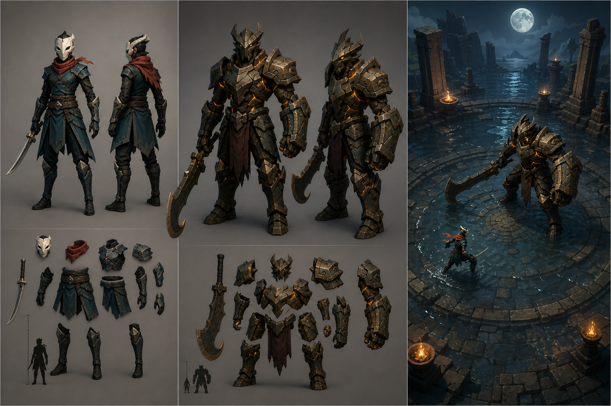

# 3D Art Direction

## 목표

모바일 웹에서도 읽기 쉬운 실루엣과 낮은 제작비를 함께 확보한다. 현실적인 인체나 고밀도 텍스처 대신, 각진 면과 제한된 색을 사용한 프리미엄 스타일라이즈드 로우폴리 방향을 채택한다.

이 이미지는 플레이어, 보스, 경기장 색과 비율을 맞추기 위한 컨셉 시트다. 게임 안에서는 동일한 방향을 따른 절차적 3D 메시를 실제 카메라·조명 아래 렌더링한다.

## 공통 시각 문법

- 플레이어: 청록색 천과 가죽, 상아색 가면, 붉은 스카프, 가는 직검
- 보스: 산화된 짙은 청동, 비대칭 양팔, 갈고리 날, 호박색 에너지 균열
- 경기장: 얕은 물이 고인 원형 성소, 부서진 돌기둥, 따뜻한 화로, 차가운 달빛
- 비율: 보스는 플레이어 키의 약 2.5배로, 화면을 압도하지만 초거대 괴수로 보이지 않게 한다.
- 재질: 플레이어는 거친 천, 보스는 중간 거칠기의 금속, 핵과 화염만 발광시킨다.
- 색 대비: 배경은 남청색, 플레이어는 청록·적색, 보스의 위험 신호는 호박·주황색으로 분리한다.

## 런타임 모델 구성

- 모든 주요 몸체는 분리된 `Node3D` 피벗을 가진다.
- 플레이어 팔·다리·몸통·검·스카프를 별도 회전해 걷기, 검격, 패링, 회피를 만든다.
- 보스 몸통·양팔·갈고리를 분리해 패턴별 예고 동작과 부위 파괴를 만든다.
- 파괴 가능한 장갑과 갈고리는 독립 노드라 전투 중 즉시 숨길 수 있다.
- 경기장은 단순 메시를 반복 배치해 모바일 드로콜과 다운로드 용량을 제한한다.

## 컨셉 시트 생성 지시문 요약

`stylized-concept` 유형으로, 세로형 모바일 3D 액션 게임의 최종 품질 후보를 위한 일관된 모델링 기준 시트를 생성했다. 가면을 쓴 청록색 방랑자와 붉은 스카프, 어두운 산화 청동의 비대칭 보스 Hollow Warden, 갈고리 날과 호박색 균열, 달빛 아래 얕은 물의 폐허 성소를 지정했다. 스타일은 각진 면과 제한된 텍스처의 프리미엄 로우폴리로 제한했고, 거상·돌 골렘·사실적인 얼굴·로고·UI·문자는 제외했다.
