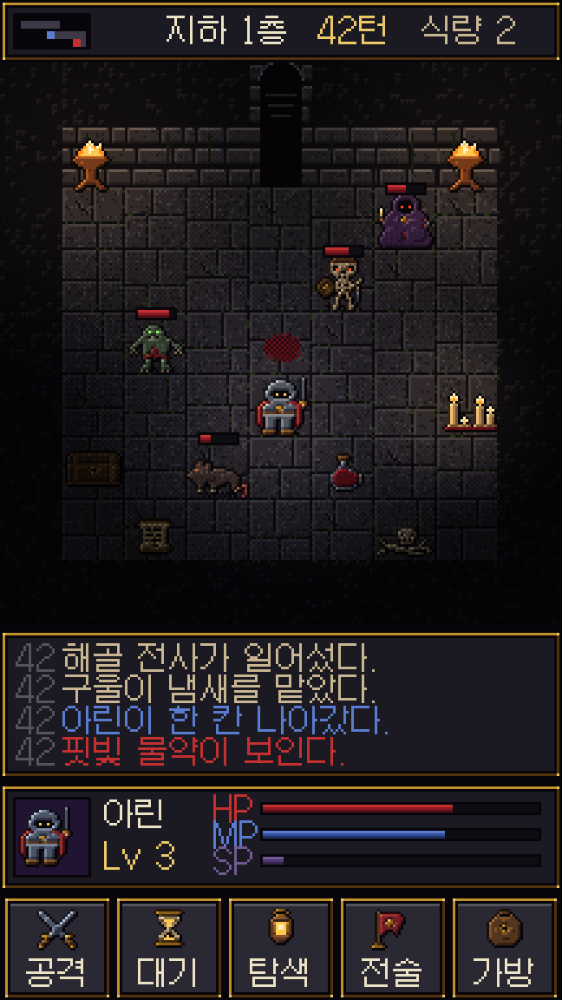
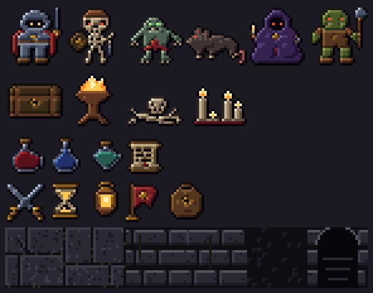

# 다크 판타지 16비트 샘플 v1

Forge Master 컨셉을 버리고 다크 판타지 분위기의 16비트(SNES 시대) 고전 스타일로 다시 찍은 샘플이다. 이미지 생성 모델을 쓰지 않았다. 스프라이트의 모양은 `tools/art/build_darkfantasy_16bit.py`에 재질 격자(강철, 뼈, 진홍 천 …)로 한 픽셀씩 적혀 있고, 명암·외곽선·조명은 스크립트가 규칙으로 입힌다.





## 8비트 샘플과 다른 점

| | 8비트 v1 | 16비트 다크 판타지 v1 |
| --- | --- | --- |
| 크기 | 캐릭터·타일 16×16 | 캐릭터·타일 24×24, 아이템·아이콘 16×16 |
| 색 | 30색, 색마다 3단계 | 재질 17종 × 5단계 램프 + 발광색 6개 |
| 명암 | 손으로 칠함 | 왼쪽 위 광원 기준 자동 셰이딩(가장자리·대각 거리) |
| 외곽선 | 전부 검정 | 셀아웃: 빛 받는 쪽은 재질의 가장 어두운 색, 그늘 쪽은 검정 |
| 분위기 | 평면 조명 | 화로·촛불·주인공 주변 광원, 4×4 베이어 디더로 밝기 5단계 띠 |
| UI | 원색 버튼 | 검은 판에 청동 테두리, 뼈색 글씨 |

- 발광 픽셀(눈, 불꽃, 촛불)은 조명에 어두워지지 않는다.
- 캐릭터 발밑에 체크무늬 디더 그림자를 깐다.
- 한글은 Galmuri11 12px, 안티앨리어싱 없음.
- 화면 샘플은 논리 해상도 216×384(방 9×9칸)이고 검토용으로 3배 확대했다.

## 파일

| 파일 | 내용 |
| --- | --- |
| `assets/16bit/darkfantasy-v1/characters.png` | 6×1: 기사(주인공), 해골 전사, 구울, 거대 쥐, 광신도, 오크 |
| `assets/16bit/darkfantasy-v1/props.png` | 4×1: 철테 상자, 화로, 뼈 무더기, 촛대 |
| `assets/16bit/darkfantasy-v1/items.png` | 4×1: 핏빛·공허·독 물약, 두루마리 |
| `assets/16bit/darkfantasy-v1/icons.png` | 5×1: 공격, 대기, 탐색(등불), 전술, 가방 |
| `assets/16bit/darkfantasy-v1/tiles.png` | 6×1: 판석 바닥 2종, 벽 앞면 2종, 벽 윗면, 아치 입구 |
| `assets/16bit/darkfantasy-v1/gameplay-216x384.png` | 위 에셋만으로 조립한 화면(원본 크기) |

다시 만들기:

```bash
python3 tools/art/build_darkfantasy_16bit.py
```

게임 코드에는 아직 연결하지 않았다. 조명은 샘플 화면에서만 구운 것이고, 게임에 넣을 때는 같은 밴드·디더 규칙을 셰이더나 보드 렌더러에서 실시간으로 계산해야 한다.
