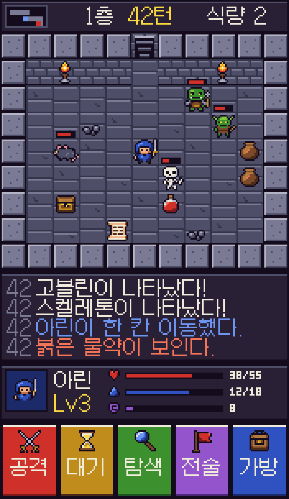
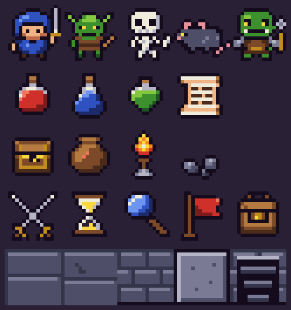

# 손으로 찍은 8비트 샘플 v1

Forge Master Idle RPG 풍 평면 일러스트 대신 고전 8비트 픽셀 스타일로 갈 경우의 샘플이다. 이미지 생성 모델을 쓰지 않았다. 모든 스프라이트는 `tools/art/build_handmade_8bit.py` 안에 16×16 문자 격자로 한 픽셀씩 적혀 있고, 스크립트가 그대로 PNG로 옮긴다. 축소·안티앨리어싱·반투명 픽셀이 없다.





## 규칙

- 스프라이트 16×16, 타일 16×16, 상태 아이콘 7×7, 작은 숫자는 3×5 비트맵 글꼴.
- 팔레트 30색 하나를 모두가 공유한다. 윤곽선은 거의 검정(`#140c1c`) 1픽셀, 색마다 그림자·기본·밝은 면 3단계.
- 빛은 왼쪽 위에서 온다. 밝은 면은 위·왼쪽, 그림자는 아래·오른쪽.
- 한글은 저장소의 Galmuri11 픽셀 글꼴을 12px, 안티앨리어싱 없이 쓴다.
- 화면 샘플은 논리 해상도 176×304(방 11×9칸)이고 검토용으로 4배 확대했다. 게임에서는 nearest 필터로 정수배 확대한다.

## 파일

| 파일 | 내용 |
| --- | --- |
| `assets/8bit/handmade-v1/characters.png` | 5×1: 주인공(파란 두건·검), 고블린, 해골, 쥐, 오크 |
| `assets/8bit/handmade-v1/items.png` | 4×1: 붉은·푸른·초록 물약, 두루마리 |
| `assets/8bit/handmade-v1/props.png` | 4×1: 상자, 항아리, 횃불, 잔해 |
| `assets/8bit/handmade-v1/icons.png` | 5×1: 공격, 대기, 탐색, 전술, 가방 |
| `assets/8bit/handmade-v1/tiles.png` | 5×1: 판석 바닥 2종, 벽 앞면, 벽 윗면, 계단 |
| `assets/8bit/handmade-v1/gameplay-176x304.png` | 위 에셋만으로 조립한 화면(원본 크기) |

다시 만들기:

```bash
python3 tools/art/build_handmade_8bit.py
```

게임 코드에는 아직 연결하지 않았다. 방향이 정해지면 `floor_monsters.json`의 나머지 몬스터(목도리 도마뱀, 코볼트, 홉고블린, 놀, 강쥐)와 동료 종족을 같은 격자로 추가하고 `expedition/art/mobile_art.gd`의 영역을 바꾼다.
