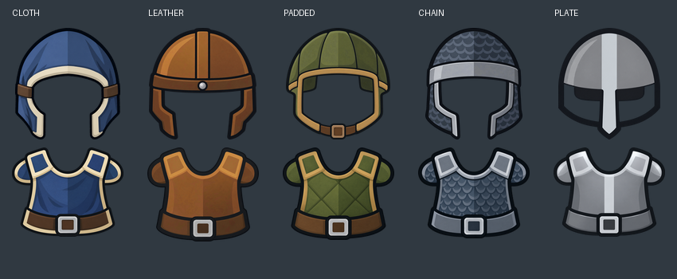
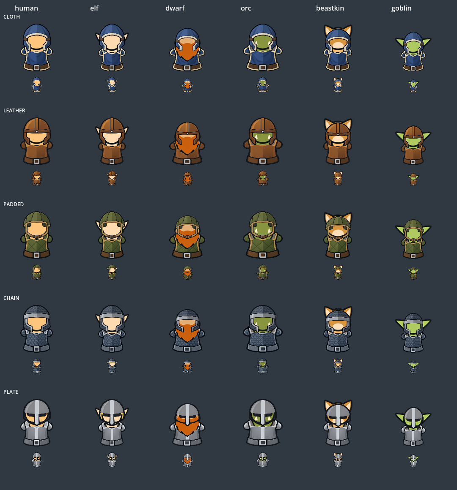
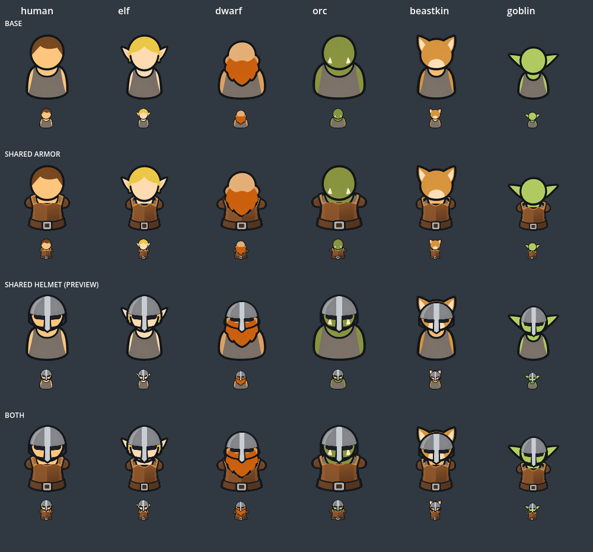

# 공용 장비 오버레이 정렬

## 개별 에셋

납품 기준은 캐릭터 합성본이 아닌 갑옷 5장·투구 5장의 독립 투명 PNG다.
[소재별 개별 파일 목록](../../../assets/fantasy_pawns_v1/equipment/README.md)을 참조한다.

천 갑옷은 런타임에서 허리 하단을 고정하고 폭을 90%로 줄이며,
상단을 원본 128px 캔버스 기준 5px 올린다. 천 후드는 상단을 고정하고
높이를 92%로 줄인다. 각 부위의 위치 보정은 독립적이다.

## 소재별 세트

기존 방어구 카탈로그의 5종을 모두 공용 오버레이로 지원한다.
갑옷·머리 장비는 세트별 색과 테두리를 공유하며, 종족별 장비 이미지는 만들지 않는다.

| 세트 | 색·재질 | 몸통 아이템 | 머리 표시 키 |
|---|---|---|---|
| 천 | 남색 천, 아이보리 테두리 | ARMOR_CLOTH_ROBE | HELMET_CLOTH |
| 가죽 | 황갈색 가죽, 짙은 갈색 테두리 | ARMOR_LEATHER | HELMET_LEATHER |
| 누비 | 올리브 누비, 황토색 테두리 | ARMOR_PADDED | HELMET_PADDED |
| 사슬 | 청회색 사슬, 강철 테두리 | ARMOR_CHAIN | HELMET_CHAIN |
| 판금 | 회색 강철, 은색 중앙 보강 | ARMOR_PLATE | HELMET_PLATE / HELMET_IRON |





기존 가죽갑옷과 철투구는 그대로 재사용하고 8개 레이어를 추가했다.
갑옷 5종은 실제 장착 표시에 연결되며, 머리 장비는 계속 미리보기 입력 전용이다.
새 능력치·드롭·머리 슬롯은 추가하지 않는다. 천 로브도 현재 다리 없는 베이스에
맞춘 짧은 몸통 표현을 사용한다.

원본/프롬프트는 `art/sources/fantasy_equipment_materials_v1/manifest.json`에서 관리한다.
생성 시 배경이 체크무늬로 구워진 파일은 기존에 승인된 코드 배경 제거로 처리하고,
진짜 알파가 있는 파일은 알파를 유지한다. 밝은 금속을 배경으로 오인하지 않도록
어두운 외곽선을 기준으로 추출한다.

```
python3 tools/art/build_equipment_materials.py
godot --display-driver x11 --path . --script tools/art/review_equipment_materials.gd
godot --headless --path . --script tests/equipment_materials_acceptance.gd
```

검증: Godot 4.6.2 import 성공, `equipment_materials_acceptance` 및
`fantasy_item_expansion_acceptance` PASS. 30개 조합의 128px/40px 실제 렌더링을
확인했다. 자동 검사는 카탈로그 방어구 누락·장착 표시 전달·베이스 유지·알파를 검증하며,
미세한 정렬 품질은 위 비교 이미지의 시각 검토로 판단했다.

## 최초 공용 레이어 기준

캐릭터 완성 이미지를 종족별로 만들지 않고, 변경하지 않은 기존 종족 베이스에
가죽갑옷 1장과 철투구 1장을 런타임에 겹친다. 다리는 사용하지 않는다.



열: 인간 / 엘프 / 드워프 / 오크 / 수인 / 고블린.
행: 원본 / 갑옷 / 투구 / 둘 다. 각 조합 아래는 40px 표시다.

## 구현

- `playtest/fantasy_equipment_overlays.gd`: 원본 128px 캔버스 좌표에 종족별
  몸통·머리 사각형을 정의한다. 동일한 장비 텍스처를 위치·크기만 달리해 사용한다.
- 갑옷이 덮는 기본 회색 옷은 그리지 않고, 원본 머리·목 영역을 UV 폴리곤으로
  다시 그린다. 드워프 수염은 별도 전경 영역으로 보존한다. 베이스 PNG는 수정하지 않는다.
- 순서: 갑옷 → 원본 머리/수염 → 투구 → 기존 방패/확대 무기.
- 갑옷을 해제하면 원본 전신 표시로 돌아간다. 대응하지 않는 종족·장비는 기존 표시를 유지한다.
- `ARMOR_LEATHER`는 기존 장착 DTO를 통해 지도·초상화·페이퍼돌에 반영된다.
- `head_definition_id: HELMET_IRON`은 렌더러와 비교용 입력에만 연결했다.
  실제 인벤토리 HEAD 슬롯은 기존과 같이 비활성 상태다. 투구 장착/능력치/저장은
  이번 작업에서 추가하지 않았다.

## 재현·검증

생성 원본과 프롬프트: `art/sources/fantasy_equipment_overlays_v1/`.
`python3 tools/art/build_equipment_overlays.py`로 투명 이미지의 여백만 잘라 런타임
PNG 두 장을 재생성한다. 종족별 합성 PNG는 만들지 않는다.

```
godot --headless --editor --path . --import --quit
godot --display-driver x11 --path . --script tools/art/review_equipment_overlays.gd
godot --headless --path . --script tests/fantasy_item_expansion_acceptance.gd
```

비교 스크립트는 실제 공용 `draw_actor` 경로로 `/tmp/equipment-overlays-review.png`를
출력한다. 6종족 × 4조합을 128px/40px로 시각 확인했다. 이 정렬표는 현재 정면 고정
베이스 전용이며, 새 종족·방향·다른 장비 실루엣을 추가하면 별도 피팅이 필요하다.
