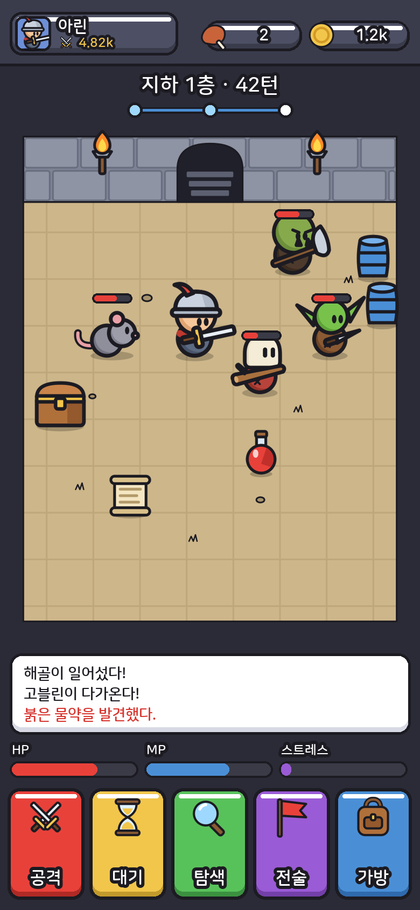
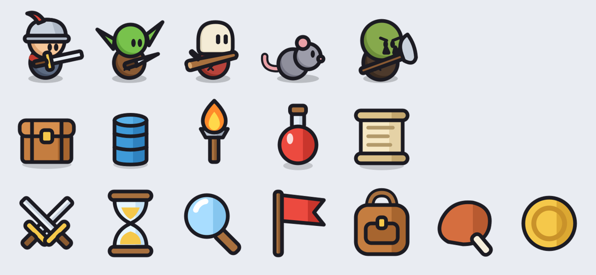

# 평면 카툰 샘플 v1 (Forge Master 풍)

Forge Master: Idle RPG의 앱스토어 스크린샷을 보고 그림 문법을 뽑아, 이 게임의 던전 화면에 적용한 원본 샘플이다. 이미지 생성 모델을 쓰지 않았다. 모든 그림은 `tools/art/build_flat_cartoon.py` 안에 SVG 코드로 적혀 있고, Godot 내장 SVG 렌더러로 래스터화한다.





## 참고 화면에서 뽑은 문법

- 모든 도형에 같은 두께의 검은 외곽선(64 단위 격자에서 3), 둥근 이음새.
- 그라데이션 없는 평면 채색. 소품은 오른쪽에 평면 그림자 한 조각까지만 둔다.
- 인물은 큰 원형 머리가 작은 원형 몸통 위에 겹친 두 덩어리다. 팔, 다리, 발, 손이 없다.
- 눈은 세로로 긴 알약 두 개로, 바라보는 쪽(오른쪽)으로 치우친다. 입은 대개 없다.
- 무기는 손 없이 몸통 앞을 가로지르며 떠 있고, 몸에 비해 크다.
- 명암은 원마다 왼쪽 아래의 어두운 초승달 하나다. 몸통에는 작은 X자 바느질 자국을 넣는다.
- 해골은 크림색 두개골에 세로 틈 눈이 있고, 붉은 몸통 위에 얹힌다.
- 주인공은 특정 복장에 묶지 않는다. 샘플에서는 붉은 깃털을 단 강철 투구의 전사로 그렸다.
- 바닥에는 반투명 타원 그림자. 넓은 면은 검은 잉크 낙서(ᴍ 모양 풀, 조약돌)로만 질감을 준다.
- UI는 두꺼운 검은 테두리의 둥근 사각형, 아래쪽은 어두운 턱, 위쪽은 밝은 띠. 글씨는 굵은 둥근 고딕에 검은 외곽선.
- 상단에는 초상 알약과 자원 알약, 층 제목 아래에 진행 점을 둔다. 하단은 색이 다른 큰 버튼 다섯 개다.

## 파일

| 파일 | 내용 |
| --- | --- |
| `assets/flat-cartoon-v1/svg/*.svg` | 원본 벡터: 주인공(투구 전사), 고블린, 해골, 쥐, 오크, 상자, 통, 횃불, 물약, 두루마리, 아이콘 7종, 방 배경 |
| `assets/flat-cartoon-v1/png/*.png` | 위 SVG를 192×192(방은 780×960)로 래스터화한 것 |
| `docs/art/flat-cartoon-v1/gameplay-780x1688.png` | 390×844 화면을 2배로 조립한 검토용 화면 |

다시 만들기:

```bash
python3 tools/art/build_flat_cartoon.py
```

## 주의

- UI 글꼴은 시스템의 나눔스퀘어라운드 Bold를 쓴다. 저장소에는 없으므로 게임에 넣으려면 글꼴 파일을 `assets/fonts/`에 추가해야 한다(OFL). 없으면 나눔스퀘어 Regular로 대신한다.
- Godot는 SVG를 그대로 임포트할 수 있어, 게임에서는 PNG 대신 SVG를 해상도별로 래스터화해 쓸 수 있다.
- 게임 코드에는 아직 연결하지 않았다.
