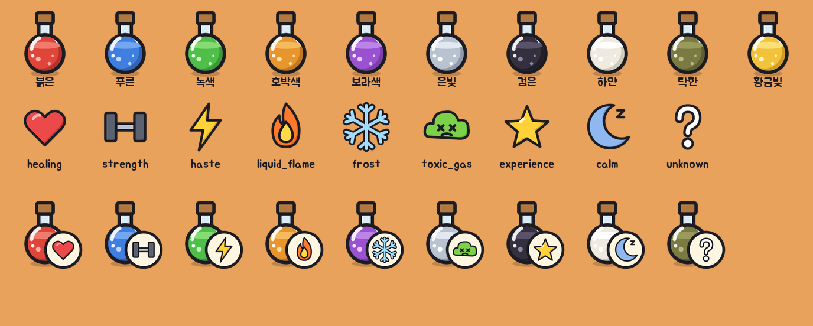

# 물약과 효과 아이콘 v1

기본 인형과 같은 문법(굵은 검은 외곽선, 평면 채색, 오른쪽 아래 초승달 그림자)으로 그린 물약이다. 병 모양은 하나이고 내용물 색만 다르다. 효과는 따로 그린 아이콘을 병 위에 겹쳐 보여 준다.



## 물약 병 10종

`data/content/consumables.json`의 `appearances.potion` 순서와 같다.

| 파일 | 외관 |
| --- | --- |
| `red` | 붉은 |
| `blue` | 푸른 |
| `green` | 녹색 |
| `amber` | 호박색 |
| `purple` | 보라색 |
| `silver` | 은빛 |
| `black` | 검은 |
| `white` | 하얀 |
| `murky` | 탁한 |
| `golden` | 황금빛 |

코르크, 유리 목, 둥근 몸통은 모두 같다. 내용물은 몸통 위쪽 수위선까지 차고, 밝은 수면, 거품 셋, 유리 반사광이 올라간다.

## 효과 아이콘

물약 종류(`kinds`의 id)와 같은 이름이다. 미감정 물약용 `unknown`(물음표)이 하나 더 있다.

| 파일 | 효과 | 그림 |
| --- | --- | --- |
| `healing` | 치유 물약 | 하트 |
| `strength` | 힘의 물약 | 아령 |
| `haste` | 가속 물약 | 번개 |
| `liquid_flame` | 액체 화염 | 불꽃 |
| `frost` | 냉기 물약 | 눈송이 |
| `toxic_gas` | 독가스 물약 | 해골 얼굴 구름 |
| `experience` | 경험의 물약 | 별 |
| `calm` | 정신 안정제 | 잠든 초승달 |
| `unknown` | 미감정 | 물음표 |

## 겹치는 방법

- `potion-effects/`는 아이콘만 있는 버전이다. 상세창이나 목록에 따로 쓸 때 쓴다.
- `potion-effects-badge/`는 아이콘을 크림색 원판 위에 올린 버전이다. 어떤 색 물약 위에서도 읽히도록 이것을 병 위에 겹친다.
- 배지는 물약 크기의 55% 정도로, 물약의 오른쪽 아래 모서리에 맞춘다. 시트 셋째 줄이 그 예시다.
- 감정 전에는 `unknown` 배지를, 감정 후에는 그 종류의 배지를 겹친다. 병 색은 외관이므로 감정 여부와 상관없이 그대로 둔다.

## 파일

| 파일 | 내용 |
| --- | --- |
| `assets/items-v1/potions/{색}.png` | 물약 병 192×192, `svg/`에 원본 |
| `assets/items-v1/potion-effects/{효과}.png` | 아이콘만 192×192 |
| `assets/items-v1/potion-effects-badge/{효과}.png` | 배지 아이콘 192×192 |

다시 만들기:

```bash
python3 tools/art/build_potions.py
```

## 게임 적용

- `Consumables.look_index(s, kind)`가 이번 Run의 외관 이름에서 외관 목록의 몇 번째인지 돌려준다. 병 파일 순서가 같으므로 `Art.potion_icon(look)`가 그 색의 병을 준다.
- `Art.potion_badge(kind, known)`는 감정 전에는 물음표를, 감정 후에는 효과 배지를 준다.
- 가방: 물약 칸에 병을 그리고 배지를 오른쪽 아래에 겹친다. 개수 표시와 겹치지 않게 배지를 칸 크기의 14%만큼 올린다.
- 바닥: 떨어진 물약은 외관 색의 병으로 그린다. 감정한 종류만 효과 배지를 붙인다.
- 두루마리는 기존 아이콘을 그대로 쓴다.
