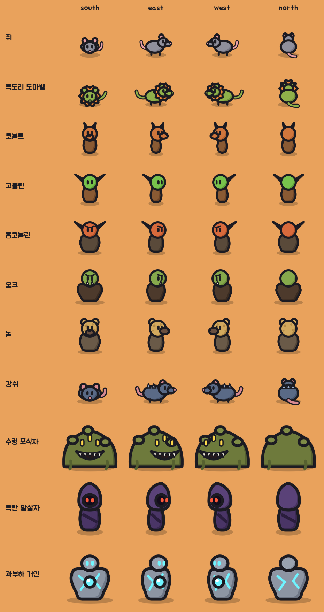

# 몬스터 스프라이트 v1 (기본 인형 스타일)

[기본 인형](paperdoll-v1.md)과 같은 규칙으로 그린 몬스터다. 굵은 검은 외곽선, 평면 채색, 윤곽을 따르는 오른쪽 아래 초승달 그림자, 세로 알약 눈, 팔다리 없는 몸을 쓴다. 무기 같은 아이템은 들지 않는다. 방향은 네 가지이고, 왼쪽도 따로 그려서 빛은 늘 왼쪽 위에서 온다.



## 목록

`floor_monsters.json`의 8종과 보스 3종이다. 파일 이름은 게임의 `species_id`를 그대로 쓴다.

| id | 이름 | 구성 |
| --- | --- | --- |
| `dcss_rat` | 쥐 | 짐승형. 회색 몸, 분홍 귀·코·꼬리 |
| `dcss_frilled_lizard` | 목도리 도마뱀 | 짐승형. 연두 몸, 머리 둘레 주황 톱니 목도리, 긴 꼬리와 주둥이 |
| `kobold` | 코볼트 | 인간형(작은 몸). 주황 비늘 피부, 주둥이, 작은 뿔 |
| `goblin` | 고블린 | 인간형(작은 몸). 초록 피부, 뾰족한 큰 귀 |
| `dcss_hobgoblin` | 홉고블린 | 인간형(표준). 주홍 피부, 뾰족한 귀, 찌푸린 눈썹 |
| `dcss_orc` | 오크 | 인간형(거구). 올리브 피부, 엄니, 찌푸린 눈썹 |
| `dcss_gnoll` | 놀 | 인간형(표준). 하이에나 털빛과 반점, 둥근 귀, 검은 주둥이 |
| `dcss_river_rat` | 강쥐 | 짐승형(큰 몸). 푸른 회색 몸, 등 가시 |
| `boss_mire` | 수렁 포식자 | 진흙 언덕 몸, 이빨 달린 넓은 입, 노란 눈 셋 |
| `boss_bomber` | 폭탄 암살자 | 마른 두건 차림, 얼굴 자리는 어둠, 붉은 눈 |
| `boss_giant` | 과부하 거인 | 돌 거구, 작은 머리, 하늘색으로 빛나는 균열과 가슴 핵 |

- 인간형은 기본 인형의 몸통에 종족 특징(귀, 주둥이, 엄니, 뿔, 반점)을 더한다.
- 짐승형은 몸, 머리, 주둥이 세 덩어리에 귀와 꼬리를 붙인다. 정면에서는 큰 머리가 몸을 가리고 어깨만 양옆으로 보이게 해서 외곽선이 한곳에 몰리지 않게 한다.
- 보스는 같은 64 단위 격자에 그리고, 일반 몬스터(128px)보다 크게(192px) 래스터화한다.

## 파일

| 파일 | 내용 |
| --- | --- |
| `assets/monsters-v1/svg/{id}_{방향}.svg` | 11종 × 4방향 원본 벡터 |
| `assets/monsters-v1/png/{id}_{방향}.png` | 일반 128×128, 보스 192×192 |

다시 만들기:

```bash
python3 tools/art/build_monsters.py
```

게임 코드에는 아직 연결하지 않았다. 연결할 때는 `expedition/art/mobile_art.gd`의 `MONSTER_IDS` 순서를 이 파일 이름으로 바꾸면 된다.
