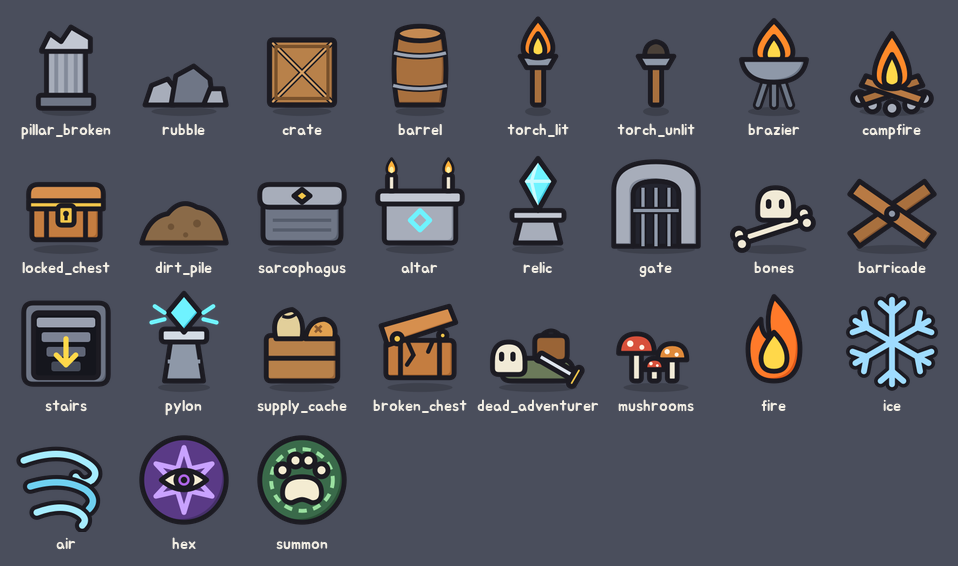

# 바닥 오브젝트·지도 표시·계열 아이콘 v1

기본 인형과 같은 문법(굵은 검은 외곽선, 평면 채색, 오른쪽 아래 초승달 그림자)으로 다시 그린 바닥 오브젝트와 숙련 계열 아이콘이다.



## 오브젝트

- 예전 바닥 카탈로그의 16종을 같은 id로 다시 그렸다: `pillar_broken`, `rubble`, `crate`, `barrel`, `torch_lit`, `torch_unlit`, `brazier`, `campfire`, `locked_chest`, `dirt_pile`, `sarcophagus`, `altar`, `relic`, `gate`, `bones`, `barricade`.
- 지도 표시 6종을 오브젝트로 새로 그렸다: `stairs`, `pylon`, 그리고 조사물마다 하나씩 `supply_cache`, `broken_chest`, `dead_adventurer`, `mushrooms`. 예전에는 보급 상자·부서진 궤짝·죽은 모험가가 같은 자물쇠 상자를 썼다.

`floor1_art.gd`의 `feature_id`가 지도 기능을 오브젝트 id로 바꾼다.

| 기능 | 오브젝트 |
| --- | --- |
| 입구 | `gate` |
| 내려가는 계단 | `stairs`(칸 안에 평평하게) |
| 전력탑 | `pylon` |
| 제단 | `altar` |
| 유물 | `relic` |
| 야영지 | `campfire` |
| 보급 상자 / 부서진 궤짝 / 죽은 모험가 / 버섯 군락 | `supply_cache` / `broken_chest` / `dead_adventurer` / `mushrooms` |

서 있는 오브젝트는 칸 폭의 1.3배로, 밑동(64 단위 격자의 y = 58)이 칸 아래쪽에 닿게 그린다. 조사를 마친 것은 기존처럼 회색으로 칠한다.

## 숙련 계열 아이콘

시작 화면의 장비 선택과 캐릭터 창 숙련 탭이 `Art.mastery_icon(axis)`을 쓴다. 무기 다섯 축은 [장비 그림](items-v1.md)을, 마법 다섯 축은 새 계열 아이콘을 쓴다.

| 축 | 그림 |
| --- | --- |
| `fire` 화염 | 불꽃 |
| `ice` 냉기 | 눈송이 |
| `air` 기류 | 바람 세 줄기 |
| `hex` 변이·주박 | 보라 원판 안의 별과 눈 |
| `summon` 소환 | 점선 소환진 안의 발자국 |

벡터 그림이라 이 아이콘들은 선형 필터로 줄인다. 캐릭터 창의 마법 주문 아이콘은 아직 8비트라 최근접 필터를 유지한다.

## 파일

| 파일 | 내용 |
| --- | --- |
| `assets/objects-v1/{id}.png` | 오브젝트 22종 192×192, `svg/`에 원본 |
| `assets/items-v1/schools/{축}.png` | 계열 아이콘 5종 |

다시 만들기:

```bash
python3 tools/art/build_objects.py
```
