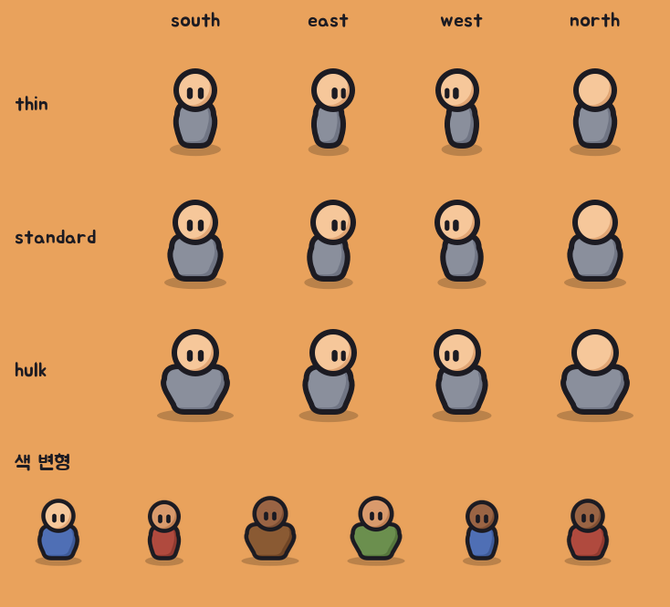

# 기본 인형 v1 (림월드 체형 × 평면 카툰)

모자, 무기 같은 아이템을 모두 뺀 맨몸 캐릭터다. 체형과 방향은 림월드(RimWorld)를, 선과 칠은 Forge Master 모사에서 확인한 평면 카툰 문법을 따른다. 원작의 삼각모, 나팔총, 두개골+붉은 몸통 같은 고유 디자인은 쓰지 않았다.



## 구성

- **체형 3종**: `thin`(마름), `standard`(표준), `hulk`(거구). 어깨 폭, 엉덩이 폭, 머리 크기만 다르다.
- **방향 4종**: `south`(정면), `east`(오른쪽), `west`(왼쪽), `north`(뒷면, 얼굴 없음). 왼쪽은 좌우 반전이 아니라 따로 그려서, 어느 방향이든 빛이 왼쪽 위에서 온다.
- **몸**: 팔다리 없는 종 모양 몸통. 어깨는 둥글고 넓으며 옆선은 바깥으로 불룩하다. 머리는 몸통 위에 얹힌 원이다.
- **칠**: 굵은 검은 외곽선, 평면 채색, 바닥에 반투명 타원 그림자. 눈은 세로로 긴 알약 두 개.
- **그림자**: 몸통과 머리의 윤곽을 따라 오른쪽 아래로 휘는 초승달 하나다. 형태를 그림자색으로 채운 뒤, 같은 형태를 기본색으로 왼쪽 위로 조금 밀어 덮어서 만든다.
- **색**: 피부 3종(light, tan, dark), 옷 5종(grey, green, blue, red, brown). 시트 아래쪽에 조합 예시가 있다.

## 레이어

SVG마다 `shadow`, `body`, `head` 그룹이 따로 있다. 모자는 `head` 위에, 갑옷은 `body` 위에, 무기는 맨 위에 얹으면 된다. 방향별로 아이템 그림을 따로 두는 림월드 방식이 그대로 맞는다.

## 파일

| 파일 | 내용 |
| --- | --- |
| `assets/paperdoll-v1/svg/{체형}_{방향}.svg` | 체형 3 × 방향 4, 회색 옷·밝은 피부 |
| `assets/paperdoll-v1/png/{체형}_{방향}.png` | 128×128 래스터 |
| `assets/paperdoll-v1/{svg,png}/variant_*.{svg,png}` | 피부·옷 색 조합 예시 6종 |

다시 만들기:

```bash
python3 tools/art/build_paperdoll.py
```

게임 코드에는 아직 연결하지 않았다. 저작권 판단은 법률 자문이 아니므로 출시 전에 따로 확인한다.
