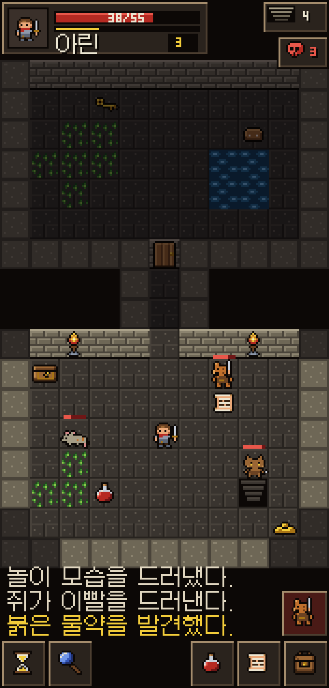
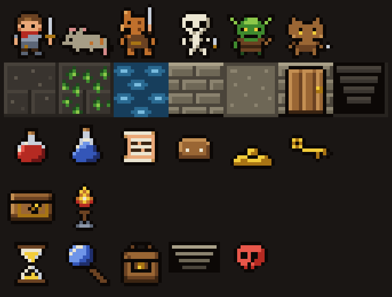

# 픽셀 던전 스타일 샘플 v1

(Shattered) Pixel Dungeon의 그림 문법을 따른 원본 샘플이다. 원작 에셋을 옮기거나 따라 그리지 않았고, 이 게임의 몬스터(쥐, 놀, 코볼트, 고블린, 해골)와 주인공을 그 문법으로 새로 찍었다. 이미지 생성 모델은 쓰지 않았다. 모든 픽셀이 `tools/art/build_pixeldungeon_style.py`에 16×16 문자 격자로 적혀 있다.





## 따른 문법

- 타일 16×16, 캐릭터는 그 안에서 폭 12px 안팎, 머리가 큰 짧은 비율.
- 모든 스프라이트에 검은 1픽셀 외곽선, 면마다 손으로 찍은 2~3단계 명암.
- 흙빛이 도는 회갈색 돌 바닥, 베이지 벽돌 벽, 벽 윗면은 평평한 석판.
- 시야 안은 밝게, 가 본 곳은 절반 밝기로, 가 보지 않은 곳은 검게.
- UI는 검은 테두리에 베이지 베벨, 짙은 갈색 판. 상단 왼쪽에 초상·HP·경험치·레벨, 오른쪽에 층 번호와 보이는 적 수.
- 하단 도구줄은 글씨 없이 아이콘만 쓴다. 왼쪽에 대기와 탐색, 오른쪽에 빠른 슬롯 두 칸과 가방이 있다. 그 위에는 가까운 적을 보여 주는 공격 버튼이 있다.
- 로그는 맵 아래에 판 없이 1픽셀 그림자 글씨로 쓴다(Galmuri11 12px).

## 파일

| 파일 | 내용 |
| --- | --- |
| `assets/pixel-dungeon-style-v1/characters.png` | 6×1: 주인공, 쥐, 놀, 해골, 고블린, 코볼트 |
| `assets/pixel-dungeon-style-v1/tiles.png` | 7×1: 바닥, 풀, 물, 벽, 벽 윗면, 문, 내려가는 계단 |
| `assets/pixel-dungeon-style-v1/items.png` | 6×1: 붉은·푸른 물약, 두루마리, 식량, 금화, 열쇠 |
| `assets/pixel-dungeon-style-v1/props.png` | 2×1: 상자, 횃불 |
| `assets/pixel-dungeon-style-v1/icons.png` | 5×1: 대기, 탐색, 가방, 층, 위험 |
| `assets/pixel-dungeon-style-v1/gameplay-176x368.png` | 위 에셋만으로 조립한 화면(원본 크기) |

다시 만들기:

```bash
python3 tools/art/build_pixeldungeon_style.py
```

게임 코드에는 아직 연결하지 않았다.
