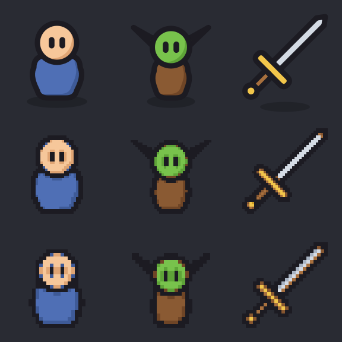
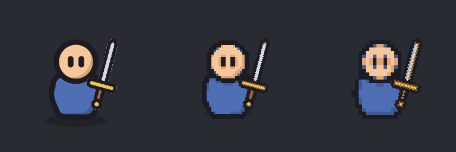

# 픽셀 페이퍼돌 시안

현재 게임이 쓰는 캐릭터·몬스터·무기 SVG를 같은 좌표계에서 다시 래스터화했다. 결과 PNG는 모두 **192×192 RGBA**이고, 기존 게임 에셋은 교체하지 않았다.

위에서부터 원본, 논리 48×48 픽셀, 논리 32×32 픽셀이다. 각 행은 인간·고블린·검 순서다. 아래는 게임의 검 부착 좌표와 회전값을 그대로 쓴 합성 비교다.

48px 격자는 얼굴과 검날을 읽을 수 있으면서 픽셀 경계가 보인다. 32px 격자는 눈·검날 주변의 계단 현상이 강해서 이번 시안에서는 48px을 우선 후보로 본다. SVG 원본의 색만 사용하고 픽셀 단위로 불투명도를 정리했다. 페이퍼돌의 캔버스, 중심, 손 좌표와 무기 회전 공식은 변경하지 않았다.

재생성: `godot --headless --path . --script res://tools/art/build_pixel_paperdoll_preview.gd`
