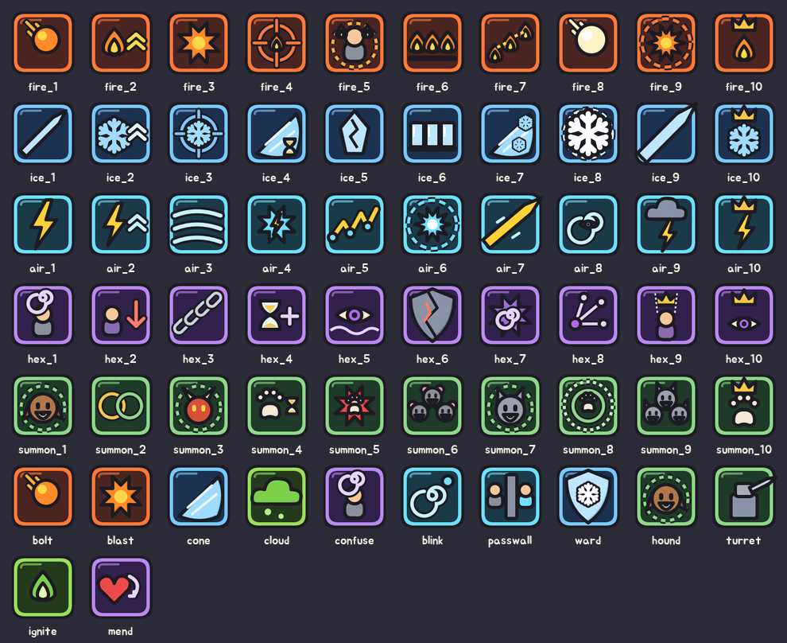

# 주문 아이콘 v1

기본 인형과 같은 문법으로 다시 그린 주문 아이콘 62개다. 다섯 계열의 레벨 1~10 주문 50개와 기본 주문 12개다.



## 규칙

- 모든 아이콘은 계열 색 카드다. 어두운 바탕에 계열 색 테두리를 두른다.
  - 화염: 주황
  - 냉기: 하늘
  - 기류: 청록
  - 변이: 보라
  - 소환: 초록
  - 독(기본 주문의 독 안개·독 점화): 연두
- 가운데 그림은 `combat.json`의 주문 모양과 상태 이상으로 정한다.
  - 탄환(`bolt`): 날아가는 불덩이나 번개
  - 폭발(`burst`): 별 모양 폭발. 반경 2는 점선 고리를 두른다.
  - 표식(`mark`): 표적 위에 상태 그림
  - 벽(`wall`): 불꽃 셋이나 얼음 기둥 셋
  - 직선(`line`): 창이나 광선. 길수록 굵다.
  - 부채꼴(`cone`): 부채 모양
  - 소환(`summon`): 소환진 안의 짐승 머리
  - 자기 강화(`self`): 계열 그림에 약속된 표시를 붙인다.
- 약속된 표시는 두 가지다. "축적" 주문(각 계열 2레벨)은 위쪽 화살표 두 개, "지배" 주문(각 계열 10레벨)은 왕관을 쓴다.
- 상태 그림: 빙결은 눈송이, 취성은 금 간 수정, 둔화는 모래시계, 혼란은 머리 위 소용돌이, 속박은 사슬, 약화는 아래 화살표, 왜곡은 물결 위의 눈, 취약화는 금 간 방패, 상태 전염은 갈라지는 가지, 지배는 왕관을 쓴 인형이다.

## 게임 적용

`Art.spell_icon(id)`가 `SPELL_ICONS`에서 주문 id의 카드를 준다. 모르는 id는 화염탄(`bolt`)으로 대신한다. 하단 주문 막대, 야영의 주문 준비·습득 목록, 캐릭터 창 숙련 탭에 쓰인다. 벡터 그림이라 모두 선형 필터로 줄인다.

## 파일

| 파일 | 내용 |
| --- | --- |
| `assets/items-v1/spells/{id}.png` | 주문 카드 128×128, `svg/`에 원본 |

다시 만들기:

```bash
python3 tools/art/build_spells.py
```
