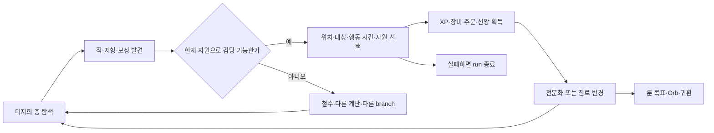
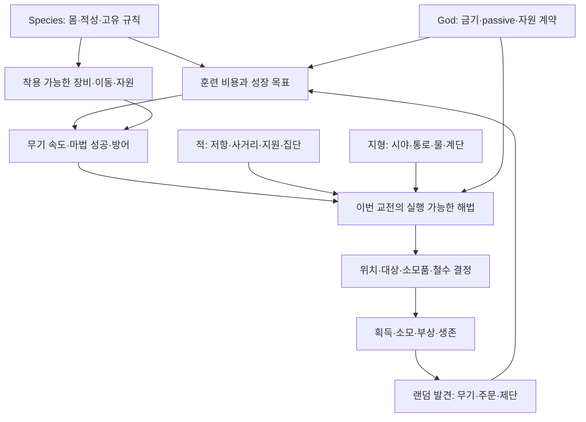

# DCSS를 역설계한 모바일 던전 로그라이크 계획서

분석일: 2026-09-17 · 대상: 공식 `crawl/crawl`의 조사 시점 최신 `master` · 고정 commit: `2bd8e06e6e5614a6f4917c1c24e04a8922319476` (2026-09-16 21:19:28 UTC).

**읽는 기준:** “확인”은 해당 commit의 소스·데이터에 근거한 사실, “해석”은 그 구조의 디자인적 의미, “제안”은 새 모바일 게임의 설계다. 시간·콘텐츠 예산·사용성 목표는 실측 결과가 아니다. 개발 계열은 changelog 기준 **0.35 개발판**이며, 최신 정식판 분석으로 혼동하면 안 된다. 기본 일반 게임을 중심으로 분석하며 Sprint·Descent 등의 별도 모드 분기는 일반 규칙으로 합치지 않았다.

실제로 GitHub를 조회하고 저장소를 shallow clone한 뒤 C++·Lua·YAML·`.des`를 교차 조사했다. 원작 실행·전체 게임 컴파일·승률 시뮬레이션은 수행하지 않았다. 파일/심벌 링크는 모두 commit에 고정했다. [소스 목록](evidence/sources.md), [기계 판독 근거](evidence/source-ledger.json), [정적 콘텐츠 집계](evidence/inventory.json), [재현 스크립트](scripts/audit_sources.py)를 함께 제공한다. 코드 주석도 오래될 수 있으므로 실행 분기와 데이터 정의를 우선했다.

## 1. Executive Summary

**추천은 Model B다.** 유지할 것은 많은 키나 방대한 명칭 목록이 아니라 **돌이킬 수 없는 성장 투자, 발견한 자원에 따른 진로 변경, 공간과 행동 시간, 서로 다른 위협의 조합, 싸움을 미루거나 철수할 자유**다. 단축할 것은 안전한 이동·반복 비교·수치 목표 관리이며, 전투의 대상·위치·자원 지출·도주 판단은 플레이어에게 남긴다.

원작에서 몬스터·장비·종족·신은 독립적인 메뉴가 아니다. 예를 들어 갑옷을 바꾸면 AC만 오르는 것이 아니라 EV와 마법 성공률이 바뀌고, 무기를 바꾸면 종족 적성과 이미 투자한 skill의 기회비용이 바뀐다. 좁은 길은 일반 무리에 유리하지만 합체 슬라임이나 뒤에서 smiting하는 사제가 있으면 다른 해법이 필요하다. [방어 계산][S54] · [갑옷 부담][S55] · [몬스터 주문][S24] · [합체 코드][S32]

첫 개발 목표는 원작 콘텐츠의 30~50%를 구현하는 일이 아니다. **24개 적 정의, 3개 종족 원형, 3개 신 계약, 12개 능력, 8개 탐험 층과 짧은 귀환전**으로 이 상호작용이 작은 화면에서도 살아남는지 검증한다. 성공하면 종족 10, 신 10, 주문 48 안팎의 중규모 제품으로 확장한다. 프로토타입의 작은 수량을 “원작 깊이 50% 보존”이라고 포장하지 않는다.

필수 원칙은 네 가지다. ① 한 번의 공격·이동은 세계 시간을 지불한다. ② 강해져도 모든 적·지형에 같은 행동이 정답이 되지 않는다. ③ 안전한 자동화는 새 위협을 발견하면 멈춘다. ④ 장기 선택은 남기되 결과를 계산해서 보여준다.

## 2. DCSS Core Gameplay Loop

**확인:** 던전은 branch와 floor로 구성되고, 룬으로 진입 조건을 충족한 뒤 Orb를 확보해 탈출하는 일반 승리 흐름을 갖는다. branch 데이터에는 parent, 입구 깊이 범위, 층 수, 룬, 출입 feature, 환경 플래그가 들어간다. Dungeon은 15층, Lair는 5층이며 모든 branch를 순서대로 완주하는 단선 구조가 아니다. Zot 진입에는 세 룬을 사용하는 코드가 있다. [branch 정의][S04] · [룬 사용][S14]



**해석:** 작은 루프는 “다가오는 위험에 다음 한 행동으로 대응하기”, 큰 루프는 “이번 run에서 얻은 자원으로 어떤 위험을 감당할지 정하기”다. permadeath는 두 루프의 판단을 연결한다. 강제 전투 방을 연속 배치하면 적 종류가 같아도 이 루프가 끊긴다.

종족과 background/job도 구분해야 한다. 종족은 몸·적성·고유 규칙을, background는 초기 장비·skill·주문과 출발 경로를 제공한다. 모바일에서도 첫 화면은 “시작 방식” 3개로 줄일 수 있지만 영구 직업 잠금으로 바꾸지는 않는다. 현재 시작 정의는 `dat/jobs/*.yaml`에 있다.

## 3. Dungeon / Map Analysis

### 3.1 실제 생성 구조

| 계층 | 확인한 구현 | 플레이 경험에 주는 효과 |
|---|---|---|
| branch 그래프 | `Branch branches[]`, `random_choose_disabled_branches()` | 매 run 물 계열 Shoals/Swamp 중 하나, 독 계열 Spider/Snake 중 하나를 남겨 준비 대상이 달라짐 |
| 생성 난수·실패 복구 | `builder()`: branch별 RNG, 최대 50회 생성 시도, 실패 시 unique 상태 복원 | 일관된 seed와 유효한 층 생성; 무작위 결과를 무조건 채택하지 않음 |
| 큰 골격 | `_builder_normal()`: 장소 지정 vault → 깊이 조건 vault → `layout` 태그 맵 | 같은 깊이에도 방·동굴·고리·개방 공간의 구조가 달라짐 |
| authored 공간 | `map_def`, `.des`의 `MAP`, `MONS`, `KMONS`, `KITEM`, `DEPTH`, `WEIGHT`, 태그 | 설계된 위험·보상 패턴을 절차적 맵 안에 삽입 |
| 공간 변형 | Lua 생성, glyph 치환·shuffle·회전 제약, 중복 방지 태그 | 같은 vault도 입구, 재료, 내용 배치가 변할 여지 |
| 추가 콘텐츠 | branch 입구, chance/minivault/extra vault, overflow temple, unique | 어느 순서에 무엇을 발견하는지가 달라짐 |
| 환경 후처리 | Lair ruination·식물, 물 조정, 문 정리, 함정, transporter | 통로 폭·시선·이동 가능성·위험이 바뀜 |
| 검증·일반 배치 | 연결성 검사 뒤 몬스터·아이템 배치와 계단/잘못 놓인 아이템 보정 | 탐험 가능한 구조 위에 encounter와 자원이 겹쳐짐 |

근거: [builder][S01], [파이프라인][S02], [선택 순서][S03], [branch 교체][S05], [map_def][S06].

`layout_loops.des`는 고리형 복도와 불규칙한 방을 함수로 만든다. `layout.des`의 spotty 생성은 계단을 중심으로 동굴 덩어리를 만든다. 따라서 “방을 직선 복도로 연결하는 하나의 알고리즘”이라는 설명은 틀린다. layout도 `.des` 맵 시스템을 사용하고, 그 위에 별도 vault가 덮일 수 있다. 방과 복도는 반드시 독립적인 영속 gameplay 객체인 것도 아니다. 생성 후 전술은 주로 격자의 terrain·feature와 actor 배치에서 나온다. [loop layout][S07] · [spotty/layout][S08]

### 3.2 terrain·feature·함정·특수 공간

`dungeon_feature_type`는 벽·문·물·용암·계단·제단·함정 등 타일의 의미를 구분한다. “terrain과 feature가 완전히 별개의 레이어 두 개”라고 가정하면 안 된다. actor, item, cloud, map knowledge 등은 별도 상태와 연결된다. 벽은 종류에 따라 시선·파괴/굴착 가능성이 다르고, 물은 해당 actor의 비행·수영·몸 구조와 상호작용한다. [feature enum][S16]

함정도 두 종류의 구현을 구분한다. 바닥에 놓이는 trap feature와, 새 영역을 탐색하면서 `roll_trap_effects()` → `do_trap_effects()`가 일으키는 shaft/teleport/alarm 계열 효과는 같은 것이 아니다. 현재 바닥 함정 가중치는 branch별로 tyrant·archmage·harlequin·devourer 같은 종류까지 구분한다. “숨겨진 압력판을 매 턴 수색하는 게임”으로 요약하지 않는다. [탐험 함정][S12] · [함정 선택][S13]

현재 일반 feature enum에서 옛 secret door 탐지 루프를 확인하지 못했다. 대신 runed/sealed/clear door, transporter로 접근하는 공간, 포탈 vault, 봉인된 보상 구역을 분석 대상으로 삼는다. 잠긴/위험을 고지한 문은 “열 것인가”라는 자발적 위험 선택을 만든다. 모든 특수 공간이 비밀 방인 것은 아니다. [문과 특수 feature][S16]

### 3.3 branch별 다른 질문

| 환경 | 데이터/생성의 차이 | 바뀌는 질문 |
|---|---|---|
| Dungeon | 단계별 population, 다양한 layout·입구·제단 | 더 내려갈지, 발견한 도구에 맞춰 투자할지 |
| Lair | 자연계 적, 폐허·식생·물 후처리 | 독·다중 근접·수중 추격을 어떻게 처리할지 |
| Shoals / Swamp | 물과 개방성, branch별 population 및 소음 설정 | 엄폐·접근·안전한 철수 경로가 있는지 |
| Snake / Spider | 뱀·나가 계열 조합 대 거미·web; Snake 추가 함정 | 포위/상태이상과 이동 저해를 어떻게 끊을지 |
| Orc | spotty, 무리, 일반 바닥 배치는 gold 위주 | 다수를 깨우지 않고 교전할지, 경제 자원을 어디에 쓸지 |
| Slime | no_items·no_shafts 등 플래그와 특수 계단/연결 보정 | 장비·위치·특수 위험을 감수하고 목표를 노릴지 |
| Vaults | 위험한 말단, 일반 아이템 생성 레벨 보정, 조직적 적 조합 | 지원자·전열·통로 차단자를 어떤 순서로 끊을지 |

색상 변화만을 근거로 환경 차이를 추론한 것이 아니다. 위 해석은 [branch 플래그][S04], [후처리][S02], [아이템 생성][S11], [population][S29]의 조합에 근거한다.

### 3.4 탐험과 층 진행

계단은 단순 “다음 스테이지” 버튼이 아니다. 여러 입구·출구와 재방문은 접근 방향을 바꾸고 실패한 전투를 보류하게 한다. 생성 코드는 층 안 연결성뿐 아니라 계단 연결과 분리 구역을 검사·보정한다. 포탈은 목적지·재입장·시간 조건이 서로 다르므로 영구 branch처럼 모두 왕복 가능하다고 설명해서는 안 된다. 현재 소스에는 transporter 연결 실패를 veto하는 처리도 있다. [생성][S01] · [연결과 배치][S02] · [계단][S14]

autoexplore는 이미 존재하고 아이템·상점·룬·계단·제단·포탈·runed door 같은 발견을 구분한다. **매 판 다른 탐험 경험은 골격 × authored 위험 × branch 구성 × 적 무리 × 자원 발견 순서 × 현재 build가 결합해서 생긴다.** seed가 바뀌어도 매번 같은 build로 모든 방을 쓸어버릴 수 있다면 의미 있는 랜덤성은 약하다. [탐험 중단 대상][S15]

**제안:** B에서도 고리와 우회로, 두 개 이상의 접근점, 선택적 위험 vault, 왕복 가능한 핵심 branch를 남긴다. 층 면적·빈 통로 길이·반복 층 수를 줄인다. 함정은 보이는 위험과 예고된 사건 위주로 바꾸고 무경고 탐험 강제이동은 우선 제외한다. 이는 UI 변경이 아니라 불확실성의 종류를 바꾸는 gameplay 변경이다.

## 4. Monster Analysis

### 4.1 데이터와 실행의 분리

현재 정의 원본은 `dat/mons/*.yaml`이며 여기서 `mon-data.h`를 생성한다. 저장소에 생성된 헤더가 없다고 몬스터 데이터가 없는 것이 아니다. 런타임에는 `monsterentry`가 공통 종류 데이터를, `monster`가 개체 상태를 표현한다. [정의 구조][S17]

| 차원 | 실제 필드/코드 | 의미 |
|---|---|---|
| 종류·분류 | enum, genus, species, holiness, shape, flags | natural/undead/demonic/nonliving 등의 상호작용, 몸·행동 제약 |
| HP·HD | `hp_10x`, `hd` → `avg_hp_10x`, `HD` | 평균 HP와 다양한 판정에 쓰는 수준; HD를 단순 HP 주사위 개수로 해석하지 않음 |
| 방어 | `ac`, `ev`, `resists`, `will` 또는 `will_per_hd` | 타격·원소·상태이상 해법이 분리됨 |
| 시간 | `speed`, action별 `energy` | 높은 speed와 낮은 행동 energy는 다른 레버; 이동/수영/공격/시전이 같지 않을 수 있음 |
| 공격 | 최대 4개 attack의 type, flavour, damage | 물리 피해와 독·구속 등 부가효과; 장비와 특수 코드가 추가됨 |
| 주문·능력 | `spells` → `mon-spell.h`의 spell, weight, flag | wizard/priest/natural 등 능력 종류와 실행 조건 |
| 지능·도구 | `intelligence`, `uses`, habitat | 길 찾기·일부 회피·문/장비 사용·지형 접근 |
| 행동 상태 | `mon-behv.cc`, `mon-act.cc` | 수면·탐색·추적·도주·혼란·우호 등의 개체 상태 |
| 집단 | `mon-place.cc` band 정의, herd flag | 함께 등장하는 구성과 일부 군집 행동; 정교한 지휘 AI와 동일하지 않음 |
| 출현 | branch population의 깊이 구간·weight·분포, vault | 현재 character level에 맞춰 모든 적을 균등 scaling하지 않음 |

HP의 `hp_10x`는 평균치의 10배이며 개체 HP는 변할 수 있다. YAML에 AC 0인 orc warrior도 장비 사용으로 실제 방어가 달라진다. 정적 정의 표만 최종 전투 수치로 보여주면 틀린다. [몬스터 구조][S17] · [행동 시간][S27] · [행동 상태][S28] · [무리][S26]

### 4.2 실제 사례

| 적 | 정의에서 확인한 값 | 고유한 전술 요구 |
|---|---|---|
| Adder | HD 2, 평균 HP 11, AC 1, EV 15, speed 13, 독 bite 4, 수영 energy 6 | 작은 HP여도 회피·속도·독 때문에 한두 번의 잘못된 교전이 위험 |
| Orc priest | HD 3, 평균 HP 15, AC 1, EV 10; 장비 사용 | smiting·치유가 전열 뒤에서도 위협; 단순 가까운 적 우선 정책을 깨뜨림 |
| Hydra | HD 13, 평균 HP 71.5, AC 0, EV 5, 독 저항, 수륙 양용 | 다중 머리와 절단/화염 상호작용 때문에 무기 선택이 핵심 |
| Guardian serpent | HD 8, 평균 HP 44, AC 6, EV 14, speed 15 | `BLINK_ALLIES_ENCIRCLE`로 주변 동료를 포위에 사용; 혼자보다 조합이 위험 |
| Boulder beetle | HD 12, 평균 HP 76.5, AC 20, EV 2, 독 취약 | 높은 장갑과 roll·blink-away가 위치와 타이밍 대응을 요구 |
| Slime creature | HD 11, 평균 HP 60.5, AC 1, EV 4, herd | 합체·분열이 군집과 공간의 가치를 바꿈 |
| Death yak | HD 14, 평균 HP 77, AC 9, EV 5, 강한 gore·herd | 특수 주문 없이도 내구·집단·지형 조합으로 자원 소모를 강요 |
| Sigmund | unique, HD 3, 평균 HP 27, wizard spellbook, 공격 energy 15 | 혼란·투명화·장비를 가진 조기 위험; 만나자마자 잡을 의무가 없음 |

근거: [Adder][S18], [priest][S20], [Hydra][S19], [serpent][S21], [beetle][S22], [slime][S23], [yak][S83], [Sigmund][S84]. 주문 묶음은 [priest][S24]·[serpent][S25], 특수 실행은 [히드라][S31]·[slime][S32]를 함께 확인했다. 이 표의 damage는 무기·방어·랜덤 처리 전 정의값이다.

히드라는 절단에 의해 머리가 잘린 뒤 살아 있는 자연계 개체라면 두 머리를 재생할 수 있고, `SPWPN_FLAMING`은 그 재생을 막는다. “불이면 모든 히드라 문제를 자동 해결한다”가 아니라 **같은 무기 분류에도 브랜드가 상황별 가치를 역전시킨다**는 사례다. [실행 코드][S31]

### 4.3 출현·성장·AI

`population[]`는 branch별 `(min depth, max depth, weight, distribution, monster)` 정의다. FLAT/FALL/PEAK/RISE/SEMI 같은 분포로 깊이에 따라 구성 비중이 변한다. Adder는 D:2부터, Orc는 D:3부터라는 일반 population 구간을 확인했다. vault·band·out-of-depth 경로가 있으므로 “이 깊이에는 절대 안 나온다”와는 다르다. [population][S29]

unique는 unique flag만으로 출현 깊이가 정해지지 않는다. `uniques.des`의 DEPTH·WEIGHT·`place_unique`와 생성기의 중복 상태가 함께 작동한다. 보스 전용 공간이 아닌 일반 층의 뜻밖의 위험이 될 수 있다. [unique 배치][S30] · [생성 상태 복원][S01]

AI는 공통 상태기계·행동 처리와 몬스터별 예외·주문 조건의 결합이다. intelligence가 다른 몬스터의 모든 차이를 결정하지 않으며, 모든 무리가 고급 협동 추론을 하는 것도 아니다. 사제+전사처럼 간단한 개별 행동도 서로의 약점을 보완한다. 몬스터 행동은 플레이어가 소비한 `time_taken`에 따라 에너지를 얻는다. 긴 공격이나 느린 이동이 여러 적의 기회를 증가시키는 점이 중요하다. [행동 시간][S27] · [행동 상태][S28] · [시전 처리][S87]

**답:** 다양성은 **수치가 만드는 시간 압박 위에 이동·공격 형상·저항·상태이상·지원 능력·지형·집단 구성이 중첩되는 데서** 발생한다. 단순 HP 강화형도 필요하지만 콘텐츠 선정은 “이 적이 기존 최적 행동을 바꾸는가”로 한다. 모바일에 남길 적은 외형보다 다른 판단을 만드는 적이다.

## 5. Item Analysis

### 5.1 구조와 카테고리

`item_def`는 base_type/sub_type, plus/charges 등의 union, brand/unrand index, quantity, flags, 위치·소유 관계, 임의 `props`를 가진다. `plus`가 모든 아이템에서 같은 능력치를 뜻하지 않는다. [item_def][S33]

| 종류 | 핵심 구현/값 | build에 주는 선택 |
|---|---|---|
| Weapon | base damage, hit, delay, skill, 손·몸 크기 제한, damage type, 브랜드 분포, enchantment | 피해/시간, reach·cleave·stab, 방패와 양손, 원소·특수 효과 |
| Armour | AC, EV penalty/ER, 부위, 크기, ego, plus, 기본 저항 | 방어 대 회피·마법·일부 공격 부담; 저항 패키지 |
| Jewellery | ring/amulet subtype와 효과, 수치형 bonus, artefact props | 원소/Will 대응, MP·시전·전투 특화; 제한된 부위 경쟁 |
| Wand | subtype, charges, evocation에 연결된 효과 | 마법을 배우지 않은 build의 원거리·제어 보험 |
| Scroll | subtype, 수량, 식별 상태; 읽기 실행 | 위치 탈출·상황 전환·강화 등 비상 자원; 사용 시점이 중요 |
| Potion | subtype, 수량, 식별 상태; 마시기 실행 | 회복·강화·상태 대응을 지금 지출할지 보존할지 |
| Artefact | randart 속성 조합 / 고정 unrand의 특수 코드 | 저항과 대가, 특정 행동 보상으로 장기 진로 변경 |
| Misc evoker | 종류별 효과·charge XP debt·최대 충전 | 안전하게 시간만 보내는 대신 경험 획득에 연결된 강력한 재사용 도구 |
| Book / magical staff | 주문 library 공급 / 학파 강화·전투 효과 | 발견한 주문을 목표로 훈련할지, 현재 무기를 유지할지 |
| Talisman | 변신과 Shapeshifting·장비 사용 변화 | 종족의 몸과 장비 규칙 위에 또 다른 전투 방식 선택 |

무기·갑옷 데이터는 [weapon_def][S34]·[armour_def][S35], artefact는 [속성 조회][S37], misc는 [XP evoker table][S40], 주문 공급은 [book templates][S51], 변신 상태는 [transformation][S78]에 근거한다. 브랜드·ego·enchantment를 모든 카테고리에 동일한 부가 속성 체계처럼 붙이면 원작 구조와 다르다.

### 5.2 수치보다 중요한 차이

무기 데이터에는 무기별 brand 가중치까지 있다. 획득 가능한 좋은 브랜드의 분포가 무기군의 매력을 바꾸도록 설계돼 있다. `heavy`는 공격 delay를 늘리고, `speed`는 줄이는 처리가 있으며, skill은 최저 공격 시간에 이르는 투자와 연결된다. 높은 표시 damage가 곧 좋은 선택은 아니다. [브랜드 분포][S34] · [공격 delay][S53]

모바일 장비 비교는 “공격력 +12” 대신 **대상별 예상 피해/행동 시간, 저항 변화, 방어 변화, 현재 주력 주문 실패율 변화**를 함께 보여줘야 한다. 장비를 항상 자동으로 높은 점수에 교체하면 이런 선택이 사라진다. 전투 중 교체가 원작에서 갖는 시간·제약도 무료 loadout 전환으로 몰래 바꾸지 않는다.

randart는 속성 배열과 조건을 갖고, unrand는 고정 정체성과 추가 코드까지 가질 수 있다. 브랜드·저항·대가가 동시에 있는 장비는 “이번에는 이 주문을 포기하고 근접으로 갈까”라는 기회를 만든다. 모바일에서는 긴 접미사 목록을 줄여도 **강점 하나 + 조건/대가 하나 + 보조 속성**은 남길 가치가 있다. [artefact][S37]

### 5.3 생성·drop·acquisition

일반 층의 바닥 생성은 `_builder_items()` → `items()`로 이어진다. Orc는 일반 바닥 생성의 종류를 gold로 제한하고 Vaults는 item level을 보정한다. vault 지정 아이템, 적의 장비와 사망 처리, 상점, acquirement, 신의 선물은 별도 유입 경로다. “적을 죽일 때 모든 loot를 독립 랜덤 추첨한다”는 구조가 아니다. [바닥 생성][S11] · [아이템 생성][S36] · [사망 시 물품 처리][S97] · [획득][S39] · [신의 선물][S73]

획득은 순수 무작위성과 선택권의 균형이다. 발견품은 장기 목표를 흔들고, acquirement나 상점은 자원을 써서 불확실성을 줄인다. `acquirement_menu()`는 이미 생성한 선택지를 저장해 취소 후 재열기로 새 보상을 무한 추첨하지 않게 한다. B에서도 바닥의 우연한 발견 + 유한 화폐를 쓰는 선택 보상 두 경로를 남긴다. [acquirement 선택 저장][S98]

### 5.4 식별과 curse의 현재 상태

현재 `_id_floor_item()`는 발밑의 wand·장비·talisman 식별을 처리한다. 주문서·장비 전체를 옛날처럼 모두 직접 착용/사용해야 아는 게임이라고 설명하면 안 된다. potion·scroll의 종류 식별과 미확인 사용 선택은 여전히 별도로 다룰 가치가 있다. [현재 식별][S38]

**일반 랜덤 저주 아이템 생성은 현재 규칙이 아니다. 그러나 curse 자체는 존재한다.** Ashenzari는 착용 장비를 자발적으로 저주하고 skill 지식을 연결하며, 해제는 해당 장비를 파괴한다. `ISFLAG_CURSED`와 아이템 `props`의 지식 정보가 실제로 쓰인다. 현재 `ashenzari_curse_item()`는 `make_ashenzari_randart()`도 호출한다. [저주 부여][S70] · [파괴 해제][S71]

제안: B는 소모품 효과를 기본 공개하고 무경고 나쁜 식별 함정은 없앤다. 이것은 발견의 한 층을 줄이는 gameplay 손실이다. 대신 보상 선택·자원 부족·장비 대가를 강화해 불확실성을 보존한다. Ash식 계약 저주는 삭제 대상과 분리한다.

## 6. Skill Analysis

현재 활성 skill은 **29개**다. Fighting; Short/Long Blades, Axes, Maces & Flails, Polearms, Staves, Ranged Weapons, Throwing, Unarmed Combat; Armour, Dodging, Stealth, Shields; Spellcasting와 11학파; Invocations, Evocations, Shapeshifting이다. enum에 남은 Stabbing, Traps, Charms, Slings, Crossbows는 `is_removed_skill()`가 제거된 것으로 판정한다. enum의 범위 alias도 별도 skill로 세지 않았다. [enum][S44] · [제거 필터][S42]

훈련은 획득 XP를 선택된 skill로 분배한다. `reset_training()`은 자동 모드에서 exercise queue를, 수동 모드에서 활성/집중 설정을 이용한다. “행동을 반복하면 XP 없이 그 skill이 무한 상승한다”는 단순 사용량 성장 모델이 아니다. skill 비용·종족 적성·집중·목표치가 관여한다. `apt_to_factor(apt) = 2^(-apt/4)`이므로 +4 적성은 동일 skill point 문턱의 비용 계수를 절반으로 만든다. 이것을 최종 전투 성능 두 배로 해석해서는 안 된다. [훈련][S41] · [적성][S43]

| 선택 | 의미 있는 판단 | 반복 관리 부분 | B 제안 |
|---|---|---|---|
| 무기 투자 | 지금 무기의 빠른 공격, 새 무기의 잠재력 중 선택 | 최저 delay 문턱 수동 계산·목표 갱신 | 무기 mastery 목표 자동 설정, 전환은 직접 승인 |
| Fighting 대 방어 | HP·피해 대 회피·갑옷·방패의 분배 | 소수점 단위 on/off | 성장 방향 카드 2개와 우선순위 |
| 마법 | 현재 쓸 저급 주문 대 미래 고급 주문 투자 | 학파 평균과 실패율 문턱 계산 | “이 주문을 안정화” 목표를 선택하면 필요한 XP 배분 |
| 종족 적성 | 가능한 build의 기회비용 | 적성표 암기 | 예상 투자량·도달 효과를 비교 |
| Invocations/Evocations | 신 능력·도구를 장기 자원으로 쓸지 | 자주 훈련 토글 | 목표 선택 후 자동 진행 |
| Stealth | 싸울 적·교전 시점 통제 | 사용 이벤트 따라 자동 비율 변화 감시 | 독립 전술 경로 유지; UI 수치는 숨김 |
| Shapeshifting | 몸·장비·전투 방식 전환 | 탈리스만별 문턱 관리 | 초기 프로토타입 제외, 제품에서 제한된 형태로 추가 |

**유지:** 전문화의 기회비용, 안정된 마법·공격 속도에 이르는 성장, 발견에 따른 방향 변경. **자동화:** 목표에 이르는 XP 분배와 목표 달성 중지. **통합:** B에서 근접 무기군 세부 훈련을 근접 mastery로 통합하되 무기 동작 차이는 유지. **삭제 후보:** 독립적 판단 없이 같은 최적 조작을 반복하게 하는 소수점 토글 UX.

이때 모든 무기가 즉시 동일 숙련을 얻도록 통합하면 새 무기로 갈아타는 비용도 사라진다. B는 공통 근접 기반 + 현재 무기군 숙련 보너스의 2층 구조 또는 소규모 전환 훈련을 선택해야 한다. 프로토타입에서는 전자를 사용하고 무료 전면 respec은 제공하지 않는다.

Gnoll의 `MUT_DISTRIBUTED_TRAINING`은 원작 안에서도 훈련 관리를 줄이면서 여러 발견품을 활용하는 정체성을 만든 사례다. 다만 전체 종족을 Gnoll처럼 만들면 전문화라는 다른 재미를 잃는다. [Gnoll 데이터][S61] · [훈련 예외][S41]

## 7. Magic Analysis

### 7.1 데이터 구조와 비용

`spell_desc`는 id/name, school bitmask, flags, level, power cap, min/max range, noise와 tile을 갖는다. 표 안에는 몬스터 전용·도구/신 능력용 주문도 섞여 있다. 따라서 `spl-data.h`의 항목 수가 플레이어가 배울 수 있는 주문 수는 아니다. `is_player_book_spell()`은 존재하는 book template을 확인하고 `spell_removed()`는 과거 주문을 걸러낸다. [구조][S45] · [정의][S46] · [학습 판별][S50] · [제거 판별][S86]

현재 학파는 Conjurations, Hexes, Summonings, Necromancy, Translocations, Forgecraft, Fire, Ice, Air, Earth, Alchemy의 **11개**다. Spellcasting은 이들과 별도의 skill이다. Poison Magic/Transmutations/Charms를 현재 독립 학파로 나열하지 않는다. [skill enum][S44]

일반적인 MP 비용의 시작값은 주문 level이고 효율·brilliance·특수 상태에 의해 달라진다. power는 skill·Int·enhancer·mutation·상태를 거쳐 cap/stepdown을 적용한다. failure는 skill·Int·주문 난이도·갑옷/방패 부담과 보정에서 계산되며 power와 같은 값이 아니다. **범위가 모두 power로 늘어나지도 않는다.** min/max가 같은 주문도 있다. [MP][S49] · [위력][S48] · [실패][S47]

### 7.2 실제 주문의 역할

| 역할 | 현재 확인한 주문 | 데이터 및 전술 의미 |
|---|---|---|
| 직접 피해 | Magic Dart L1, Fireball L5 | 단일의 안정성 대 범위 피해·비용·폭발 조준 |
| 제어 | Mephitic Cloud L3, Cause Fear L4 | 혼란 cloud와 Will 판정 공포; 저항·대상 분포에 따라 해법이 달라짐 |
| 이동 | Blink L2, Swiftness L3 | 무작위 재배치와 이동 방식 변화; 정확한 지정 순간이동과 동일하지 않음 |
| 방어 | Ozocubu's Armour L3 | 방어 상태를 얻는 대신 해당 상태의 조건을 고려 |
| 소환 | Summon Ice Beast L3 | 별도 actor가 몸으로 통로·공격 기회를 바꿈 |
| 구축 | Forge Lightning Spire L4 | Forgecraft+Air; 설치형 actor와 사선·자리 선택 |
| 상태/자원 | Grave Claw L2 | 피해 외 제약 효과와 특수 사용 자원까지 확인해야 하는 주문 |
| 환경 | Frozen Ramparts L3, Freezing Cloud L5 | 벽 주변 위험과 지속 cloud로 적이 밟는 공간을 설계 |
| 상호 변환 | Ignite Poison L4 | Fire+Alchemy; 독 상태/독성 환경을 다른 피해 기회로 전환 |
| 유틸리티 | Apportation L1 | Translocations; 아이템을 얻기 위한 노출 시간을 바꿈 |
| 탈출 | Passwall L3, Blink L2 | 통과 가능한 벽·시전/발동 조건·재배치 불확실성이 관여 |
| 주문 봉쇄 | Silence L5 | Hexes+Air; 자신의 행동에도 영향을 주는 영역적 제약 |
| 정보/탐색 | 이 분석에서는 별도 학습 주문군으로 채우지 않음 | 정보 획득은 map knowledge·scroll·종족 감각·Ash passive 등에도 분산됨 |

수치·학파는 [주문 정의][S46]와 [현재 book 목록][S51]에서 교차 확인했다. 효과 실행은 `spl-cast.cc`에서 각 `spl-*` 함수로 dispatch된다. 위 표는 역할별 대표 사례이지 효과 전체나 완전한 주문 목록이 아니다. 특히 옛 Detect 계열 주문, Controlled Blink, 옛 변신 주문을 현재 spell pool에 섞지 않는다.

targeting flag는 중요한 설계 데이터다. 방향/대상 지정, tracer, 물체 대상, self 금지, cloud, Will check, escape, noise를 UI도 읽어야 한다. 아이콘 수를 줄이더라도 적과 아군, 범위·사선·저항·시전 실패 확률을 보고 행동하는 판단은 남길 수 있다.

정의만으로 놓치기 쉬운 실행 규칙도 확인했다. `cast_blink()`는 `uncontrolled_blink()`를 실행하고 Blink cooldown을 부여한다. `cast_passwall()`은 벽 수에 따라 지연 행동을 시작하며 통과 중 추가 AC를 준다. 이동 처리에는 icy armour와 frozen ramparts를 종료하는 경로가 있다. 따라서 이동/방어/탈출을 모두 “안전한 곳을 누르면 즉시 이동”으로 합칠 수 없다. [Blink 실행][S94] · [Passwall 실행][S93] · [이동과 방어][S95]

`_ignite_poison_clouds()`는 mephitic/poison cloud를 fire cloud로 바꾸고, 별도 함수는 실제 poison 상태가 있는 몬스터에 화염 피해를 계산한다. Grave Claw는 MP뿐 아니라 충전도 소비하며, `gain_grave_claw_soul()`에 충전 재설정 4~6회 처치 주기가 있다. 이처럼 같은 spell table에 있어도 자원과 환경 의존성이 다르다. [독 점화][S91] · [Grave Claw][S92]

### 7.3 모바일 단순화 한계

| 모델 | 주문/학파 처리 | 보존·손실 |
|---|---|---|
| A | 기존 11학파와 주문 library; 주력 아이콘·검색·목표 훈련만 개선 | 원작 선택 보존, 학습 부담은 여전히 큼 |
| B | 제품 목표 48주문, 5훈련 계열: 파괴·제어·구축소환·공간·생명변성 | Fire/Ice/독 등은 효과 태그로 유지. 학파별 교차 투자 일부 손실 |
| C | 18능력, 3성장 성향, run당 3~4능력 | 조합 발견은 남지만 장기 spell library·고급 주문 목표는 크게 축소 |

B에서도 단일/관통/폭발/지속 지형/행동 봉쇄/이동/소환은 통합하지 않는다. 피해 주문을 색만 다른 같은 투사체로 만들면 저항 표를 남겨도 공간적 깊이가 사라진다. 모든 주문을 실패 없는 cooldown으로 바꾸는 것도 자원/훈련 계약의 변경이므로 별도 실험으로 취급한다.

## 8. Stats Analysis

| 값 | 코드에서의 관계 | 모바일 표시 원칙 |
|---|---|---|
| Strength | 다수 무기군 피해, 갑옷/방패 부담 완화 | 장비 비교·성장 화면; 상시 숫자는 생략 가능 |
| Intelligence | spell power·failure | 주문 목표/장비 비교에 결과값 표시 |
| Dexterity | short/long blades·ranged 피해, EV·SH 관련 계산 | 민첩 무기·방어 선택의 실제 변화 표시 |
| HP | 종족·XL·Fighting·상태 등 | **상시 현재/최대**, 독 등 예정 손실도 구분 |
| MP | 성장·skill·종족·장비 등; 시전 비용 | **상시 현재/최대**, 선택 능력 비용 표시 |
| AC | 갑옷·강화·skill·종족·형태 | 캐릭터 요약/비교; 물리 공격을 일정 비율 차감하는 단순 %가 아님 |
| EV | Dodging·Dex·몸 크기에서 부담/상태를 반영 | AC와 합산해 단일 “방어력”로 만들지 않음 |
| SH | 방패·skill·Dex·상태 | 차단 가능한 위협에 대한 별도 방어축 유지 |
| attack delay | 무기 기본 시간−숙련, brand·방패·상태; ranged는 갑옷 부담도 | 공격 아이콘에 상대적 시간, 상세에 실제 시간 |
| movement speed | 종족·상태·지형 등; 공격 시간과 별도 | 적과 비교한 빠름/같음/느림·이동 위험 상시 문맥 표시 |
| resistances / Will | 원소 피해와 상태이상 위험에 대응 | 관련 적을 선택할 때 즉시 표시; 전체 목록은 상세 |
| spell power | 주문별 산출값과 cap | 범위/피해/지속/성공 결과로 번역; 원시값은 상세 |
| spell failure | 실제 시전의 위험 | 선택 주문마다 **숫자로 표시**, 위험할 때 강조 |
| encumbrance | 갑옷/방패 자체 부담과 Str·skill의 상호작용 | “이 갑옷 착용 시 EV −3, 주력 주문 실패 +…”처럼 표시 |

근거: [Str/Dex 분기][S52], [EV][S54], [ER 공식][S55], [갑옷→시전][S56], [공격 시간][S53], [power][S48], [failure][S47].

중요한 정정: Dex는 단지 회피용이 아니며 long blades·short blades·ranged의 피해 stat이기도 하다. Armour의 부담은 Str에 의해 갑자기 사라지는 단일 문턱이 아니라 연속적인 계산이며 제곱 항을 포함한다. “Str이 ER 이상이면 무벌점” 같은 설명은 맞지 않는다. [피해 stat][S52] · [부담][S55]

**직접 판단해야 할 것:** 생존 여유, 이번 행동 시간, 적에게 통하는 공격, 탈출 가능성, 핵심 상태, 마법 실패, 장비 변경의 trade-off. **숨겨도 되는 것:** 중간 power 산식, centi-skill, 소수점 반올림, energy accumulator, 분포 추첨 내부 값. 숨긴다는 것은 조회를 금지한다는 뜻이 아니라 결과에 가까운 표현을 기본값으로 삼는다는 뜻이다.

프로토타입 상시 HUD는 HP/MP, 독·구속·침묵 등의 중요한 상태, 선택 행동 비용/시간, 준비된 탈출 수단, 신의 능력 준비 여부다. AC/EV/SH는 한 번 펼치는 요약에 두고 장비 변경·방어 상태 변화 때만 차이를 띄운다.

## 9. Species Analysis

YAML은 base Str/Int/Dex, xp/hp/mp/Will 계수, skill aptitude, size·body flag·수영·undead type, level별 mutation, stat 성장, 추천 시작을 정의한다. 모든 고유 능력이 YAML 안에 구현되는 것은 아니며 mutation·player·equipment·ability 코드에서 실행된다. 선택 메뉴 난이도 분류가 있는 기본 종족 정의는 이 snapshot에서 **27개**다. 비선택 Draconian 색 변형과 `deprecated-*.yaml`을 각각 새 선택 종족으로 세지 않았다. [집계](evidence/inventory.json)

| 사례 | 차이의 원천 | gameplay 변화 |
|---|---|---|
| Human | 균형적인 기본값 외 `MUT_EXPLORE_REGEN` | 현재 Human도 완전한 무특성 preset은 아님; 탐험과 회복 연결 |
| Formicid | quadrumanous, antennae, 영구 stasis, 굴착/shaft | 큰 무기·방패 조합과 정보/굴착을 얻고 teleport류 안전망을 잃음 |
| Octopode | 방어구 제약, tentacle arms, 수영·은신 | 갑옷 대신 장신구·위치·회피에 의존하는 장비 경제 |
| Coglin | offhand wield, slow wield, warmup strikes, no jewellery | 두 무기와 준비/교체 비용; 장신구 저항 교환이 불가능 |
| Djinni | HP casting·innate caster, 원소 저항 차이 | 마법 비용이 생존 자원과 직접 결합; 주문 획득/훈련 방식도 특수 |
| Gnoll | distributed training과 높은 적성 | 원하는 한 skill 집중 대신 광범위 발견품 활용 |
| Mountain Dwarf | runic magic, artefact enchanting | 갑옷 마법 부담과 장비 강화 경로를 바꿔 중장갑 시전자 가능성을 확대 |
| Spriggan | 작은 몸, 낮은 HP, fast·높은 은신 적성 | 거리 유지·교전 회피가 중요한 생존 방식 |
| Draconian | 갑옷 제약과 성장 중 색/고유 능력 분화 | 시작 때 완전히 확정되지 않은 성장에 적응 |
| Gale Centaur | stampede·hooves·deformed·큰 몸 | 적을 향한 이동과 밀어내기를 중심으로 위치 가치가 달라짐 |
| Revenant | undead, spellclaws, mnemophage, low magic | 무기/몸의 공격과 주문 운용이 연결되는 특수 경로 |
| Poltergeist | formless, trickster, accursed, 신체/갑옷 제약 | 상태 면역·몸 구조·마법 성향이 장비와 행동 제약을 바꿈 |
| Felid | 장비 제약과 고유 생존 체계 | 일반 장비 성장과 다른 위험/보상 구조; 구현·밸런싱 비용도 큼 |

근거: [Human][S79], [Formicid][S57], [Octopode][S58], [Coglin][S59], [Djinni][S60], [Gnoll][S61], [Dwarf][S62], [Spriggan][S80], [Draconian][S82], [Gale Centaur][S63], [Revenant][S81], [Poltergeist][S64], [Felid][S90].

metabolism은 옛 식량·허기나 Spriggan 채식 규칙을 가져와 채우지 않는다. 현재의 의미 있는 자원 생리 차이는 HP/MP·재생·undead·소모품 사용과 고유 메커니즘 쪽에서 찾는다. `MUT_ACCURSED`라는 이름 역시 무작위 장비 curse와 같은 뜻으로 합치지 않는다.

**종족 축소 기준:** ① 같은 장비에 다른 결론을 내리는가, ② 위치/자원 비용이 바뀌는가, ③ 다른 종족으로 이름만 바꿔 대체할 수 없는가, ④ 모바일에서 설명 가능한가. 이 기준으로 제품에서는 균형형, 갑옷 시전형, 고기동 저HP형, 신체/장비 제약형, HP 시전형, 두 무기형, 균등훈련형, 성장 변이형 등 서로 다른 규칙 원형을 남긴다. 단순 Str/Int/Dex 배율만 다른 후보부터 통합을 검토한다.

초기 프로토타입은 균형형·고기동 저HP형·갑옷 시전형 3개다. 이는 원작 특정 종족 삭제 결론이 아니라, 첫 구현에서 시간·방어·마법 상호작용을 가장 적은 예외로 검증하기 위한 표본 선정이다. Formicid·Djinni·Coglin 같은 예외가 강한 종족은 기본 전투 검증 후 추가한다.

## 10. God Analysis

### 10.1 실제 구조

altar feature와 입교 UI에서 `join_religion()`으로 들어가며, religion/piety/penance 및 신별 상태가 character에 저장된다. 신별 규칙은 단일 JSON이 아니라 `religion.cc`, `god-conduct.cc`, `god-passive.cc`, `god-abil.cc`, `god-wrath.cc` 등으로 분산된다. [입교][S66] · [신 enum][S65]

| 요소 | 구현 근거 | 판단 |
|---|---|---|
| altar/worship | feature와 `god_pitch`/`join_religion` | 당장 만난 신과 기다릴 다른 신 사이 선택 |
| piety | 신별 획득·비용·단계와 예외 | 현재 능력 지출 대 다음 해금; 모든 신이 동일 bar는 아님 |
| conduct | 금지 행위·penance 처리 | build가 사용할 행동 집합 자체를 제한 |
| passive | rank/passive_t table | 키를 누르지 않아도 전투 규칙 변화 |
| active | 능력별 비용·효과와 Invocations 연계 여부 | MP/신앙/금화/일회성 등 다른 자원 경제 |
| gift | `do_god_gift()`와 신별 처리 | 장비·주문 접근 확률과 장기 계획 변화 |
| abandonment | `excommunication()` | 이전 보상 철회와 신벌 위험; 무료 직업 변경이 아님 |
| punishment | `divine_retribution` 등 | 금기/배교에 실질 결과; 종류와 소멸 방식은 신마다 다름 |

근거: [passive table][S69], [conduct][S68], [gift][S73], [배교][S67], [신벌][S72].

### 10.2 적은 입력으로 큰 변화를 만드는 사례

| 신 | 코드에서 드러나는 핵심 계약 | 바뀌는 build/전술 | 모바일 가치 |
|---|---|---|---|
| Trog | spellcasting·magic training·wizardly item 금기, berserk 관련 능력·무기 선물 | 마법 투자 없이 무기·도구·소모품 대응을 확립 | 강한 방향성과 적은 핵심 버튼 |
| Vehumet | kill MP, 시전 성공/사거리 passive, 주문 공급 | 전투 지속력·공격마법 투자 계획 변화 | 자동 passive가 중심 |
| Cheibriados | slowed/no_haste와 stat boost 등 | 이동으로 쉽게 해결 못 하는 대신 전투 능력 확보 | 매우 저입력, 매우 큰 전술 차이 |
| Ashenzari | 장비 결속·skill 강화·탐지·저주 해제 시 파괴 | 현재 장비 확정 대 더 좋은 발견품 수용 | 드문 큰 결정으로 긴 run을 바꿈 |
| Gozag | 시체의 gold화·gold aura와 금화 기반 서비스 | 상점/서비스용 자원 배분, 전투 경제 | 숫자 하나가 여러 용도의 자원이 됨 |
| Ru | 희생을 통한 힘, 방해 aura와 능력 | 할 수 없는 행동을 선택해 다른 축을 강화 | 장기 선택을 몇 번의 선택창으로 표현 |
| Hepliaklqana | ancestor 및 역할/강화·위치 관련 능력, frail passive | 자기 방어 대 동료 전열·공간 활용 | 동료 한 명으로 많은 위치 조합 |
| Wu Jian | lunge·whirlwind·wall jump passive | 이동 입력 자체가 공격 선택 | 추가 버튼 없이 전술을 확장 |
| Qazlal / Fedhas | cloud 방호·폭풍 또는 식물 통과/사격 등 | 주변 환경을 전투 도구로 사용 | 환경을 읽는 가치가 커짐 |
| Jiyva / Beogh | slime 관계·재생/변이, orc 전환·동료 관련 규칙 | 적/아군 관계와 장비/동료 전략 변화 | 가치가 크지만 예외와 동료 UI 비용도 큼 |
| Uskayaw / Ignis | 전투 단기 piety / 소진을 고려하는 초기 신앙 | 자원 시간 규모 자체가 달라짐 | 같은 신앙 bar로 억지 통합하지 않을 사례 |

이 표는 전체 신의 완전한 능력 목록이 아니라, 축소할 때 남겨야 할 서로 다른 계약의 표본이다. [passive][S69]와 `religion.cc`의 power/gift/piety 처리, `god-abil.cc`의 희생·ancestor·저주 구현을 함께 읽었다. 과거 Ashenzari의 탐험 함정 보호가 초기부터 열린다는 설명은 현재 table과 맞지 않는다. 현재 table은 item identification 1, avoid_traps 4의 rank를 가진다. [현재 rank][S69]

**결론:** 신은 우선 삭제할 시스템이 아니다. 오히려 모바일에서 **한 번의 계약으로 플레이 규칙을 크게 바꾸는 효율적인 깊이 공급원**이다. 단, 26신을 처음부터 모두 노출하지 않는다. B 제품은 서로 다른 계약 10개, 프로토타입은 무마법 전투형·장비 결속형·동료형 3개로 시작한다. 금기는 실행 전 표시하고, 장비 잠금·영구 희생·배교에는 결과 요약과 명시 확인을 둔다. 위험하지 않은 모든 행동에 확인창을 추가하지 않는다.

신을 “공격력 10% 증가 패시브 하나 고르기”로 바꾸면 버튼 수는 적어도 build 깊이는 사라진다. 반대로 금화 신과 단기 신앙 신을 같은 충전 게이지로 통합하면 자원 계획의 다양성을 잃는다.

## 11. System Interaction Map



아래는 코드로 확인한 규칙을 조합한 **가상 gameplay 사례**다. 특정 seed를 실제로 플레이한 기록이나 승률 보증이 아니다.

**사례 1 — 도끼 전사가 히드라를 만남.** 무기 skill 투자로 현재 도끼의 시간 효율은 좋다. 그러나 자연계 히드라의 머리 재생 때문에 무조건 주력 도끼를 쓰는 선택이 나빠질 수 있다. 화염 브랜드 무기가 있는지, 비절단 무기로 바꿀 때 시간/숙련 손실을 감수할지, wand를 쓸지, 다른 층에서 준비할지 판단한다. Trog 신앙이라면 마법을 새로 배우는 대안이 막히므로 도구·무기·철수의 가치가 올라간다. **연결:** skill 투자 → 무기 → brand → 적 특성 → 신의 금기 → 자원/경로. [공격 시간][S53] · [히드라][S31] · [Trog 금기][S68]

**사례 2 — 사제와 전사가 섞인 오크 무리.** 통로에서 전사 한 마리만 맞는 것은 일반적으로 좋지만, 시야 안 뒤편 사제가 smiting과 치유를 하면 가까운 전사만 치는 정책이 무너진다. 모퉁이를 돌아 시야를 끊거나, 사제를 먼저 공격할 사선을 만들거나, 자원을 써 빠르게 제거해야 한다. 소음이 다른 무리를 깨울 가능성도 고려한다. **연결:** map/LOS → band → 지원 주문 → 표적 순서 → 소모품. [band][S26] · [priest 주문][S24] · [소음][S88]

**사례 3 — Formicid의 강점과 탈출 제약.** 몸의 무기/방패 조합과 굴착은 강점이다. 그러나 teleport를 전제로 과감하게 들어가면 stasis 때문에 안전망이 없다. 물과 굴착 불가능한 지형, 퇴로 차단자를 보면 입구에서부터 다르게 행동해야 한다. 다른 종족이라면 좋은 탈출 scroll도 이 종족에겐 같은 보험이 아니다. **연결:** 종족 → 장비 → 이동 도구 → 지형 → 비상 자원. [Formicid][S57] · [feature][S16]

**사례 4 — Mountain Dwarf가 좋은 갑옷과 주문을 발견.** 갑옷은 AC를 올리지만 마법 실패를 높인다. runic magic은 시전 부담 계산의 몸통 갑옷 항을 완화한다. Armour/Str/주문 훈련에 XP를 어떻게 나눌지에 따라 전사, 중장갑 시전자, 도구 사용자로 갈린다. 같은 loot를 Deep Elf나 Spriggan이 받았을 때와 가치가 다르다. **연결:** 종족 → ER 계산 → skill 기회비용 → 발견 주문 → build. [Dwarf][S62] · [갑옷 시전 계산][S56]

**사례 5 — 독 cloud와 점화, 독 저항 적의 등장.** Alchemy 중심 투자는 독에 약한 적들을 쉽게 처리하지만 저항 적을 만나면 대안이 필요하다. Ignite Poison을 확보하면 일부 독/독성 cloud 상황을 Fire 피해 기회로 바꿀 수 있다. 단, 적에게 독이 걸리는지·cloud가 있는지·불 저항은 어떤지·시전 MP가 충분한지를 따로 확인해야 한다. “독 면역을 모두 무시하는 콤보”라고 단정하지 않는다. **연결:** 학교 투자 → 상태 → 환경 → 피해 유형 → 자원. [관련 주문 정의][S46]

**사례 6 — Ashenzari와 새 artefact.** 현재 장비를 결속해 skill 보너스를 확보하면 즉각적인 성능이 안정된다. 이후 더 좋은 장비를 발견해도 교체에는 기존 장비 파괴가 따른다. 어떤 부위를 지금 확정할지, 핵심 저항을 바꿀 유연성을 남길지 결정한다. **연결:** 발견 순서 → 장비 → 신앙 → skill → 미래 옵션. [저주][S70] · [파괴][S71]

**사례 7 — 소환/동료와 포위자.** 동료는 적의 접근을 막고 플레이어의 공격 시간을 벌지만 좁은 공간에서는 사선과 이동을 방해할 수 있다. 반대로 guardian serpent와 다수 적 조합은 아군 적들을 재배치해 준비한 전선을 무너뜨린다. 필요한 것은 소환 수량만이 아니라 어느 타일을 누가 점유하는지 읽는 능력이다. [포위 주문][S25] · [소환 정의][S46]

## 12. What Actually Makes DCSS Fun

**1. 손에 들어온 자원으로 계획을 수정한다.** 모든 장비가 기존 수치의 업그레이드가 아니므로 발견이 진로를 바꾼다. 약한 초기 적에게서 얻은 무기·마법서·제단이 수십 층 뒤의 선택과 이어진다.

**2. 공간은 전투 자원이다.** 코너, 통로, 열린 방, 계단, 물, cloud가 받는 공격 수·사선·퇴로를 바꾼다. 적을 더 크게 만드는 것보다 지원자 하나나 옆 통로 하나가 더 큰 전술 차이를 만들 수 있다.

**3. 자원을 쓰기 전에 판단한다.** 소모품이 가방에 남은 채 죽는 경험은 “더 빨리 썼어야 했다”는 학습을 만든다. 성공한 탈출도 승리이며, 모든 방을 완전히 정리하는 것이 최적이라고 강요하지 않는다.

**4. 하나의 보편 해법에 예외가 있다.** 통로 전투는 사제·합체·지형 파괴·포위에 의해, 독은 저항에 의해, 튼튼한 갑옷은 마법 부담에 의해 제약된다. 예외는 설명 가능해야 하며 무작위 금지 규칙만 늘려서는 안 된다.

**5. 단기 위험과 장기 투자가 연결된다.** 당장 Fighting을 올려 살아남는 것과 다음 고급 주문을 준비하는 선택은 동시에 완벽할 수 없다. 신과 종족은 이 기회비용을 다른 방향으로 만든다.

**6. 정보는 부분적이지만 학습 가능하다.** 이미 본 적의 능력과 장비 효과는 조회할 수 있어야 한다. 미지의 맵·배치·발견품이 불확실성을 맡고, 조작 실수와 읽을 수 없는 작은 글씨가 난이도를 맡지 않게 한다.

추가로 반드시 다룰 시스템은 **LOS/fog of war, 소음·은신·각성, 행동 시간, 회복과 휴식, 추격 기회공격, 변신, 시작 background, 상점 경제, Zot clock, Orb 귀환전**이다. 사용자가 열거한 시스템을 연결하는 역할을 한다. 특히 현재 추격 기회공격에는 조건을 충족한 경우 1/3 확률 검사가 있으므로 “같은 속도의 적에게 인접한 채로 뒤로 걸으면 항상 안전하다”는 설계를 원작 사실처럼 가져오면 안 된다. [추격 공격][S75] · [소음][S88] · [Zot clock][S77]

## 13. Sources of Unnecessary Complexity

복잡성을 “나쁜 규칙”과 동일시하지 않는다. 다음은 보존할 판단에 비해 관리비가 높은 부분이다.

| 원인 | 왜 부담인가 | 잃지 않고 줄이는 방법 | 줄일 때의 실제 손실 |
|---|---|---|---|
| 메뉴·키 기억 | 행동보다 호출 방식 학습 | 문맥 아이콘·장기 누르기 설명·검색 | 거의 UI 비용만 감소 |
| 장비 수치 합산 | 원시 수치가 여러 화면에 분산 | 결과 시뮬레이션 비교 | 설명을 단일 점수로 줄이면 trade-off 손실 |
| skill 미세 관리 | 목표가 같아도 반복 토글 | 목표 훈련·자동 정지 | 목표 자체까지 자동 선택하면 전략 손실 |
| 반복된 안전 이동/휴식 | 이미 결정한 경로를 반복 입력 | 적/새 정보에 중단되는 가속 | 실제 시간 비용까지 제거하면 밸런스 변경 |
| 같은 역할의 다수 등급 | 이름 암기에 비해 새 대응이 적음 | 역할당 1~2대표와 제한 변형 | 세계의 풍부함·성장 체감 일부 감소 |
| 많은 상시 수치 | 작은 화면에서 중요한 위험을 가림 | 원시 수치는 상세, 변화와 위험은 문맥 노출 | 핵심 실패율·저항까지 숨기면 불공정 |
| 과도한 분기 예외 | 종족×신×변신×장비 교차 학습 | 예외가 선명한 콘텐츠부터 단계 도입 | 기괴한 build와 숙련자 발견 감소 |
| 긴 run의 중복 교전 | 새로운 판단 없이 동일 전술 반복 | 층 수·빈 공간·동종 무리 반복 감소 | 장기 자원 압박·서사 축소 |
| 식별 절차 | 미확인 명칭·사용·정리의 반복 | B/C는 효과 공개 | 미확인 소비의 위험 선택 제거 |

음식·허기·옛 일반 저주 해제·함정 skill 같은 **이미 없어진 기능을 모바일에서 새로 제거할 대상으로 잡지 않는다.** 레거시 enum과 옛 changelog가 남아 있다는 사실은 현재 플레이 가능성을 의미하지 않는다. [제거 skill][S42] · [현재 curse][S70]

## 14. CORE / SIMPLIFY / AUTOMATE / REMOVE Matrix

아래는 **추천 B 기준**이다. 한 시스템 안에서도 규칙과 입력 절차를 나눴다.

| 시스템/규칙 | 분류 | 남길 것 / 바꿀 것 | 손실·주의 |
|---|---|---|---|
| 턴 기반·행동 시간 | CORE | 이동·공격·시전 비용, 속도 차이 | 모두 1행동=1동일턴이면 무기·속도 깊이 감소 |
| permadeath/run 위험 | CORE | 죽음과 자원 지출의 의미 | 기본 모드에서 반복 부활 판매 금지 |
| procedural layout+vault | CORE | 골격·위험 motif·배치 조합 | authored 방 셔플만으로 축소하지 않음 |
| branch·계단·우회 | CORE + SIMPLIFY | 분기 선택·재방문, 층 수 축소 | 단선 방 연쇄화는 B 범위를 벗어남 |
| LOS·fog·코너 | CORE | 아는 정보와 모르는 정보, 사선 | 화면 밖 위협을 숨기지 않음 |
| 소음·각성·은신 | CORE + SIMPLIFY | 조용한 접근 대 소란스런 화력 | 소음 반경/경고를 쉽게 표현 |
| 탐험·이동·휴식 | AUTOMATE | 매 행동 시뮬레이션+중단 | 무료 full heal 버튼으로 바꾸지 않음 |
| 몬스터 역할·혼합 무리 | CORE | 지원·포위·저항·원거리·돌진 | 외형만 다른 HP tier 축소 |
| monster 상세 수치 | SIMPLIFY | 위협·특기 기본, 상세 조회 | damage/HP 추정은 확정값으로 표시 금지 |
| uniques | SIMPLIFY | 선택적으로 피할 수 있는 고유 위험 | 이름 수보다 새로운 encounter 질문 |
| 무기 형상·brand | CORE | reach/cleave/stab와 적 저항 | 무기군별 미세한 base type 중복 통합 |
| AC/EV/SH | CORE + SIMPLIFY | 서로 다른 방어 방식 | 단일 방어 점수로 내부까지 통합하지 않음 |
| 장비 비교·분류 | AUTOMATE | 결과 비교, 중복 정리 | 자동 착용·자동 매각은 기본 OFF |
| 저항·Will | CORE | 대응 gear와 표적 차이 | 단계·명칭 수는 축소 가능 |
| potion/scroll | CORE + SIMPLIFY | 유한 탈출·회복·상황 전환 | 비슷한 효과 합치되 탈출 형상은 남김 |
| consumable 식별 | REMOVE / MERGE CANDIDATE | B 기본 공개, A 유지 | 불확실성 한 종류가 사라짐 |
| wand/misc evoker | SIMPLIFY | 한 도구 탭, 사용 횟수/XP 재충전 구분 | 모두 시간 cooldown으로 합치지 않음 |
| artefact | CORE + SIMPLIFY | 규칙 변화·대가·발견 pivot | 접미사 폭발·효과 중복 축소 |
| skill 투자 방향 | CORE | 전문화·기회비용·목표 전환 | 모든 방향 자동 최적화 금지 |
| skill 배분/목표 중지 | AUTOMATE | 목표를 계산해 진행 | 의도하지 않은 build 변경 금지 |
| 세부 무기 skill/학파 | SIMPLIFY / MERGE | 공통 기반·몇 개 전문화 | 원작의 전환 비용 일부를 별도로 유지 |
| 주문 역할·targeting | CORE | 폭발·구축·제어·이동·소환 | 색만 다른 피해 버튼으로 축소 금지 |
| spell library·memorise | SIMPLIFY | 발견과 준비, 제한된 학습 용량 | B의 동시 준비 제한은 새 gameplay 규칙 |
| species | CORE + SIMPLIFY | 몸·자원·이동 규칙의 차이 | 단순 preset화 금지 |
| God | CORE + SIMPLIFY | 규칙 계약·금기·보상·대가 | 수는 줄이되 “버프 하나”로 만들지 않음 |
| curse 계약 | CORE | 고정 이득 대 교체 자유 | 일반 랜덤 curse의 부활은 불필요 |
| 배교/영구 희생 | SIMPLIFY | 결과 사전 설명·확인 | 난해한 숨은 벌칙 대신 명시 규칙 |
| exploration trap 강제이동 | REMOVE / MERGE CANDIDATE | 보이는 위험/예고 사건으로 대체 | 원작의 강제 위기·즉흥 대응 감소 |
| 변신 | SIMPLIFY | 제품에 대표 형태만 | prototype에서는 보류, 삭제 확정 아님 |
| 상점·acquirement | CORE + SIMPLIFY | 유한 화폐와 선택 보상 | 무한 reroll/파밍으로 희소성 파괴 금지 |
| 반복 장거리 Orb 귀환 | SIMPLIFY | 목표 획득 뒤 탈출 압박 | 압축 귀환으로 긴장 일부만 보존 |
| Zot clock | SIMPLIFY | 무한 대기 방지 | 벽시계 제한이 아니라 행동 시간 규칙 유지 |
| 동종 수치 변형·부위 중복 | REMOVE / MERGE CANDIDATE | 대표 무기/장비 패턴 | 저항 조립과 장비 발견 폭 감소를 확인 |

## 15. Mobile Control Simplification

DCSS는 이미 autoexplore, autofight, quiver, 재사용 경로를 제공한다. “PC에서는 항상 inventory부터 5단계를 거친다”는 비교는 부정확하다. 아래는 메뉴 경로와 숙련자 단축 경로를 모두 인정한 **설계 목표**이며 입력 횟수 실측은 아니다. [autofight][S76] · [quiver][S89] · [explore][S15]

| 행동 | 원작에서의 입력 부담 | 모바일 제안 | 남는 판단 |
|---|---|---|---|
| 주력 공격 | 방향/대상 선택 또는 autofight 한 키 | 인접 적 tap 1회, 선택한 원거리 적 공격 | 누구를 칠지; 위험 적에게 자동 접근하지 않음 |
| 주문 | cast 메뉴/letter+조준, 또는 준비 행동 단축 | 아이콘→target tap 2회; 범위는 누른 채 preview | 위치·범위·저항·실패·MP |
| 회복 potion | 종류/letter 선택 | 고정 quickslot 1회 | 지금 쓸지 아낄지 |
| escape scroll | 읽기/종류/효과별 대상 | 탈출 drawer→효과 또는 target 1~3회 | 즉시/지연·확정/무작위의 차이 |
| 이동 | 방향 반복 또는 travel | 8방향 pad; 안전 구간 목적지 path | 진입 위치·교전 전 접근 |
| 탐험 | autoexplore 한 키 | 탐험 1tap, 새 위협에 정지 | 언제 탐험을 재개할지 |
| 적 조사 | examine/target 화면 | 적 길게 누르기, target 카드 | 능력·저항·추격 위험 |
| 장비 교체 | inventory·설명·장비 명령 | loot 카드 비교→착용 | 효과·시간·저항 trade-off |
| skill 목표 | 메뉴·비율·목표 설정 | “창 숙련/방어/이 주문 안정화” 선택 | 어떤 성장에 XP를 쓸지 |
| 신 | 제단 조사·입교·능력 메뉴 | 계약 카드→입교, passive 자동·핵심 능력 고정 | 규칙과 금기·자원 사용 |
| 동료 | 명령/target의 반복 | 기본 AI, 필요할 때 집중 대상·대기 2명령 | 동료를 어디에 쓰는지 |

**자동화 계약:** 사용자가 탐험/휴식을 눌렀을 때만 진행한다. 매 이동·대기마다 세계 시간, 적 AI, 회복, 상태 지속을 정상 처리한다. 새 적/시야 재획득, 위험 지형, 새 핵심 상태, 소모품 필요 상황, 선택적 문·제단·포탈, HP 임계에 도달하면 다음 행동 전에 멈춘다. 매 행동 후 영구 저장 가능한 상태를 만든다.

적이 안 보인다는 이유만으로 “안전 확정”이라 쓰지 않는다. 자동 경로는 **알려진** 정보로만 계획한다. 미지 영역 경계에서 새 적을 보는 순간 stop하되, 그 적을 발견하기 위해 이미 지불한 한 이동의 결과까지 취소하지 않는다. 도구를 아껴야 할지·탈출할지·어느 branch로 갈지는 자동화하지 않는다.

범위 공격의 아군 피해, 장비 파괴, 영구 계약에는 결과 경고를 둔다. 보통 공격마다 confirm을 두지 않는다. 타일을 읽는 시각 영역과 누르는 hit target을 분리하고, 겹친 대상은 후보 목록에서 선택하게 한다. 다중 행동을 무조건 한 tap으로 압축하는 것은 편의가 아니라 판단 위임일 수 있다.

## 16. Portrait UI Information Architecture

**기본안은 portrait, 전술 viewport는 정사각형이다.** 세로로 긴 맵만 보여주면 수평 원거리 위협이 부당하게 잘린다. 현재 DCSS의 기본 시야 반경은 7, 최대 반경 상수는 8이다. 일반 시야를 담는 사각형은 15×15, 최대는 17×17이다. [시야 상수][S74]

390×844 CSS px를 가정하면 좌우 여백 후 360px 맵의 타일은 15칸에서 24px, 17칸에서 약 21px다. 이를 44px짜리 직접 터치 목표 15개로 동시에 만들 수는 없다. **화면을 확대해 적을 숨기는 대신 이동 pad·target 카드·조준 확대 렌즈를 제공한다.** 44~48px 버튼은 이 프로젝트의 설계 목표이며 규격 준수 판정은 아니다.

```text
┌─────────────────────────────┐
│ 층/목표       HP 42/60 MP 8/12│ 약 64px
│ 독: 예정 피해 7   구속   신앙  │ 약 36px
├─────────────────────────────┤
│                             │
│   전체 전술 시야를 담는 맵     │ 약 360px 정사각형
│   사선·범위·탈출 preview      │
│                             │
├─────────────────────────────┤
│ 선택 적: 사제 / 후열 공격     │ 약 58px
│ 선택 행동: 3MP · 실패 8%     │
├─────────────────────────────┤
│ [주력][제어][이동][신][도구]  │ 약 60px
│ [능력 더보기] [소모품]       │
│  8방향 pad   [대기][탐험]    │ 약 126px
│ 최근 사건 2줄 / 전체 로그 ↗  │ 약 44px
└─────────────────────────────┘
```

남은 높이는 safe area와 여백으로 배정한다. 이 도식은 정보 구조이며 실제 기기 검증을 거친 최종 픽셀 사양이 아니다. 360px 폭 기기에서는 타일 22px 수준도 시험한다. 중요한 상태 3~4개를 우선 표시하되 생존 관련 추가 상태는 `+N`에만 숨기지 않고 경고 패널을 확장한다. 색 외에 아이콘·문구를 함께 쓴다.

상세 창에는 Str/Int/Dex, AC/EV/SH, 전체 저항, skill, 장비, library, 로그가 있다. 열고 읽는 동안 세계 시간은 흐르지 않는다. target 카드에는 적의 주요 위협, 핵심 저항, 예상 결과를 노출한다. 원작 몬스터 HP의 변동성과 불확실성을 확정 kill 표시로 위조하지 않는다.

**landscape가 유리한 조건:** 전체 원작 콘텐츠와 10개 이상의 즉시 접근 능력, 다수 동료, 옆에 펼친 로그·적 목록을 요구하는 A에서 특히 유리하다. 가로 화면은 좌우 패널로 이를 수용할 수 있지만 정사각 맵 자체는 짧은 세로 높이에 제약되므로 자동으로 타일이 커지는 것은 아니다. B는 portrait를 우선하고, 기기 테스트에서 시야 내 적 특성 인식률이 낮으면 landscape/tablet 레이아웃을 추가한다. 좁은 화면을 이유로 A의 시야 반경을 줄이면 UI 변경이 아니라 몬스터·마법 밸런스 변경이다.

## 17. Early-game Progression

### 17.1 왜 현재 D:1은 상대적으로 단순한가

일반 D:1 population은 bat·rat·lizard·goblin·kobold·ball python·endoplasm 등 낮은 단계에 집중된다. Adder·Orc 등은 이후 깊이 구간으로 진입한다. `_builder_monsters()`는 D:1에서 기본 배치 몬스터를 수면 상태로 만들고 출발점 시야에서 떨어뜨린다. 이것은 모든 vault monster에 적용되는 절대 안전 보증은 아니다. arrival vault에는 `no_monster_gen` 같은 태그도 있다. [population][S29] · [D:1 처리][S10] · [arrival][S09]

추가로 `_ood_fuzzspan()`은 D:1에서 0을 반환하고 D:2~4의 깊이 흔들림도 제한한다. 즉 초반 단순성은 적 목록뿐 아니라 예상보다 깊은 층의 적을 섞는 난이도 변동 장치도 억제한 결과다. [초반 OOD 제한][S96]

branch 진입·Temple·더 넓은 spell/gear 선택은 뒤에 쌓인다. 현재 Temple 입구는 D:4~7, Lair는 D:8~11 범위다. 출발 배경이 제공하는 몇 가지 도구만으로도 이미 적의 속도·사거리·무리·독립 자원 차이를 배울 수 있다. **단순한 출발은 정체성 부재가 아니라 동시에 다룰 상호작용 수를 제한하는 것**이다. D:1도 gnoll·무리 등으로 위험할 수 있어 원작을 무조건 안전한 튜토리얼로 해석하지 않는다. [branch 데이터][S04]

### 17.2 B의 첫 30분 제안

아래 수는 한 첫 run에서 **누적 노출하는 기능/역할 수 목표**다. 플레이 속도에 따른 범위이며 정확한 분 시각에 강제 spawn하지 않는다.

| 시점 | 적·던전 | 장비·skill·능력 | 환경·build·God | 배워야 할 정체성 |
|---|---|---|---|---|
| 첫 1분 | 근접 적 1역할, 열린 곳/코너 대비 | 시작 무기, 회복 1종, 기본 행동 1개; skill UI 숨김 | 작은 우회로, 교전 전에 관찰 | 한 걸음의 위치가 받는 피해를 바꿈 |
| 첫 5분 | 누적 3~4역할: 근접·사수·빠른 적 | 비교 loot 2개, 제어 또는 탈출 능력 1개, 성장 목표 첫 선택 | 선택 보상 방과 퇴로; God은 존재만 예고 | 좋은 장비도 상황에 따라 가치가 다름 |
| 첫 10분 | 누적 6~8역할, 지원자+전열 첫 조합 | 소모품 3~4종, 준비 능력 3개, 첫 투자 결과 | 신 계약 3개 중 첫 선택; 수면·소음·cloud 중 하나 | 지원자를 먼저 칠지, 자원을 쓰고 나갈지 |
| 첫 30분 | 누적 12~16역할, 저항 적·unique·분기 | 서로 다른 loot pivot 2회, 능력 4~6개, 목표 2회 조정 | 2branch 테마 중 경로 선택, 신 대가 체험, 첫 룬 목표 | 기존 해법이 안 통할 때 계획을 바꿈 |

모든 종족·신·48주문을 10분 안에 보여주는 것은 정체성 전달이 아니라 선택지 과부하다. 반대로 10분 동안 아무 적에게나 공격 버튼만 누르게 하면 콘텐츠가 나중에 많아도 게임을 잘못 가르친다.

첫 run에는 특정 보상이 확정인 교육용 seed/배치 규칙을 사용하되, 후속 run은 같은 역할을 다른 지형과 발견 순서로 제시한다. 첫 위험 방은 들어가지 않고 지나갈 수 있어야 한다. 강제사망 연출 대신 실수 전에 적의 위협과 탈출 도구를 읽을 기회를 준다. 신의 선택을 10분까지 앞당기는 것은 원작 진행 복사가 아니라 모바일 pacing 변경이다.

## 18. Model A: DCSS Lite

**정의:** 게임 규칙은 최대한 유지하고 input·정보 구조를 재설계한다. “Lite”는 내용 축약보다 사용 비용의 축약이다.

| 항목 | 제안 |
|---|---|
| 한 session | 5~20분, 행동 단위 중단/재개 |
| 전체 run | 성공 run 목표 4~10시간 이상; 원작 숙련도·룬 목표에 따라 크게 달라지는 기획 추정 |
| 직접 조작 | 모든 중요한 전투 행동·성장·장비·신 선택 |
| 자동화 | 원작 autoexplore/autofight/휴식의 명확한 제어, loot 비교·훈련 목표 안내 |
| build depth | 원작에 가장 가까움; 종족/신/학파·library 유지 |
| dungeon depth | branch 그래프·대부분의 층·계단·포탈·장기 귀환 유지 |
| content requirement | 대부분의 정의·예외를 지원; 터치 설명·아이콘·검증량이 큼 |
| 장점 | 원작의 상호작용 손실 최소, 숙련자에게 익숙한 판단 |
| 잃는 요소 | 키보드 속도·한 화면 정보 밀도; 규칙을 보존하면 초보 학습 부담은 남음 |
| 개발 난이도 | 높음: 모든 예외의 작은 화면·접근성·입력 검증, 원작 업데이트 추적 |

주 타깃은 원작/전술 로그라이크 관심층이다. 일반 모바일 대중에게 5분짜리 게임이 된다고 주장할 수 없다. 원작 코드 기반 포팅을 택하면 수치 검증 부담은 줄일 수 있으나 UI 결합·platform·배포/라이선스 검토가 필요하다. 기능 추가보다 일관된 touch command layer가 핵심이다.

## 19. Model B: Mobile Roguelike

**정의:** 원작의 선택 구조를 새로 구현하고 반복 층·중복 콘텐츠·미세 관리를 줄인다. 개발 추천안이다.

| 항목 | 제안 |
|---|---|
| 한 session | 4~10분; 안전한 장소가 아니어도 중단 저장 가능 |
| 전체 run | 제품 목표 90~150분, 실패 run은 훨씬 짧음 |
| 직접 조작 | 전투의 위치·대상·자원, 성장 방향·장비·신 계약·경로 |
| 자동화 | 안전 이동·휴식·분류·비교·승인한 목표 훈련 |
| build depth | 강한 전문화와 발견 pivot, 제한된 동료·변신; 학파/무기 세분화는 축소 |
| dungeon depth | 방문 12~16층 정도, 2~3개 분기 목표·우회·재방문·압축 귀환 |
| content requirement | 목표 종족 10, 신 10, 48주문, 역할 중심 적 roster와 6환경 테마; 수량은 §22에서 구분 |
| 장점 | 적은 입력으로 위치·자원·계약의 깊이 유지; 콘텐츠 확대 경로 명확 |
| 잃는 요소 | 원작 장기 서사·전부 다른 학파 투자·세밀한 장비 경제·일부 초고난도 후반 |
| 개발 난이도 | 중상~높음: 엔진 자체보다 상호작용 밸런스·콘텐츠 도구·새 pacing 검증 |

마법 5훈련 계열, 목표 훈련, 공개된 소모품, 적은 장비 부위, 제한된 준비 능력을 채택한다. **학습한 능력과 화면 quickslot은 구분**한다. 단지 화면에 버튼이 5개라고 원작 모든 주문 중 5개만 쓸 수 있게 만드는 것은 UI 개선이 아니다. B는 별도로 정한 준비 수를 쓰는 새 규칙이며 A에서는 quickslot 외 능력도 메뉴에서 사용한다.

유저 유지 수단은 새로운 시작 방식·정보·도전 seed를 우선한다. 죽어도 누적 공격력이 올라가는 필수 영구 성장이나 광고 부활이 있어야 대중적이라는 전제는 두지 않는다. 그것은 run 자원·위험 계약을 크게 바꾼다.

## 20. Model C: Mass-market Mobile Adaptation

**정의:** 조합 발견과 즉흥 대응을 짧은 expedition에 집중하는 별도 게임이다. DCSS와 같은 깊이를 그대로 가진다고 부르지 않는다.

| 항목 | 제안 |
|---|---|
| 한 session | 2~5분 |
| 전체 run | 20~35분 |
| 직접 조작 | 경로/보상 선택, 3~4주요 능력·비상 자원; 기본 교전 상당 부분 위임 |
| 자동화 | 이동·기본 공격 가능, 새로운 위협/능력 사용 지점에서 pause |
| build depth | tag·장비·신 계약의 짧은 조합; 긴 XP 목표 축소 |
| dungeon depth | 분기 node와 작은 전술 공간, 제한적 철수; 장거리 재방문 거의 없음 |
| content requirement | 4종족 원형, 5계약, 18능력, 30~40적, 20안팎 encounter motif라는 제품 초안 |
| 장점 | 진입 쉬움, 짧은 완주·명확한 모바일 세션 |
| 잃는 요소 | 정밀 이동·소음·계단 전략·장기 투자·소모품 계획·의도적 적 회피의 상당 부분 |
| 개발 난이도 | 중간: 전술 엔진 범위는 작아도 자동 행동이 납득되는 UX·새 리듬 검증 필요 |

전투를 실시간 반사신경 게임으로 바꾸는 것은 필수 조건이 아니다. pause 기반 자동 기본 행동+능력 개입으로도 C를 만들 수 있다. 하지만 자동 공격이 targeting·접근·추격 위험까지 결정한다면 판단 복잡도를 실제로 줄인 것이다. 이를 interaction cost만 줄였다고 표현하지 않는다.

## 21. Comparison Matrix

모든 길이·난이도는 제품 가설이다. 공식 DCSS 사용자 통계에서 가져온 수치가 아니다.

| 비교축 | A — Lite | B — 추천 | C — 대중적 adaptation |
|---|---|---|---|
| session / run | 5~20분 / 4~10h+ | 4~10분 / 90~150분 | 2~5분 / 20~35분 |
| 전술 한 행동 | 대체로 직접 | 위험 상황 직접 | 일부 직접, 기본 행동 위임 |
| 안전 구간 | 자동 탐험/휴식 | 강한 자동화·정보 정리 | 대폭 생략/자동 |
| 장기 build | 원작 수준 | 대부분의 선택 축 보존 | 짧은 조합 중심 |
| 지형·우회 | 전체 수준 | 필수 구조 보존·면적 축소 | encounter 단위 |
| 종족/신 역할 | 원작 예외 대부분 | 소수 선명한 계약 | 간단한 패시브/분기, 일부 계약 |
| 요구 콘텐츠 | 큼, 재사용 여지는 큼 | 중간, 상호작용 밀도 중요 | 작음~중간, 반복 변형 중요 |
| portrait 적합 | 보조 패널 부담 큼 | 가장 적합 | 적합 |
| 핵심 장점 | 충실성 | 깊이/접근성 균형 | 진입과 짧은 완주 |
| 핵심 손실 | 키보드 효율·가독성 | 장기 규모·세분화 | 직접 공간 판단·거시 전략 |
| 개발 위험 | UI에 모든 예외가 몰림 | 축소 후 균형을 다시 설계 | DCSS 정체성이 약해짐 |
| 권장 시점 | 원작 친화 타깃이 확인될 때 | 첫 vertical slice의 방향 | B 사용성 실패 시 별도 제품 판단 |

“B를 만들다가 비용이 커지면 몰래 C로 축소”하지 않는다. 자동 전투·단선 진행·무료 능력 교체 같은 변화는 제품의 약속을 바꾸므로 독립 결정으로 기록한다.

## 22. Minimum Viable Content Set

### 22.1 30~50%라는 수량의 의미

서로 다른 단위를 더해 “DCSS 전체 깊이의 40%”를 계산할 수는 없다. 몬스터 YAML 683개에는 test·파생형·일반 출현하지 않는 entity가 섞여 있고, book-data의 제거 주문 제외 enum 참조 132개도 runtime의 학습 가능 주문 수와 완전히 같다고 보장할 수 없다. 정적 집계의 정의를 [inventory](evidence/inventory.json)에 공개했다.

**B 제품을 ‘대략 30~50% 콘텐츠 규모’로 계획할 때의 예산 기준**은 다음과 같다. 이것은 첫 프로토타입 예산과 다르다.

| 축 | 확인 가능한 원작 기준 | B 확장 제품 목표 | 비교의 해석 |
|---|---|---|---|
| 선택 종족 | 메뉴 난이도 분류가 있는 27개 | 10원형 | 약 37%; 색 변형을 분모에 부풀리지 않음 |
| 신 | Pakellas 제외 26개 | 10계약 | 약 38%; 서로 다른 경제/금기 대표 |
| 활성 skill | 제거 필터·범위 alias 제외 29개 | 12훈련 축 | 약 41%; 마법 5 + 근접/사격/생존/갑옷/회피/도구/신앙 7 |
| spell | 비제거 book enum 참조 132개 | 48학습 능력 | 약 36%의 정적 참조 수 대비 예산; runtime 정확 비율은 아님 |
| monster | YAML 683개, 혼합 단위 | 최대 220~260정의 예산 | 원시 파일 수의 32~38%; 활성 적 비율 주장 아님. 아래 최소 roster 검증 후만 확대 |
| 무기/방어구/장신구 | 동일 단위의 현재 활성 총량은 이번 집계에서 확정하지 않음 | 무기 14 base type·8brand, 방어구 8·ego 6, 장신구 12·고유 artefact 16 | 근거 없는 “정확히 40%”를 붙이지 않음 |
| 던전 | branch마다 가변·선택·무한/특수 공간 | 6테마, run당 12~16방문 층 | 전체 원작 층 수 백분율이 아니라 플레이 시간 예산 |

220~260 몬스터 정의가 최소 요구라는 뜻은 아니다. **적 역할 24개 안팎과 유의미한 조합이 먼저이며**, 72~100종 정도로 재플레이 목표를 달성하면 거기서 멈춘다. 30~50% 수량을 맞추려고 역할 없는 콘텐츠를 채우지 않는다. 여러 적 변형·보스·동료까지 포함한 제품 상한 예산과 최소 viable set을 구분한다.

### 22.2 첫 prototype에 필요한 최소 집합

| 자산/규칙 | 수량 | 구체 범위 |
|---|---|---|
| 종족 원형 | 3 | 균형, 빠르지만 저HP, 갑옷 시전 부담 완화 |
| 시작 kit | 3 | 근접/시전자/도구 사용자; 이후 직업 잠금 없음 |
| 신 계약 | 3 | 무마법 전투, 장비 결속, 동료 |
| 플레이어 능력 | 12 | 아래 목록, 한 run 준비 최대 6 |
| 적 정의 | 24 | 일반 18 + unique 4 + 목표 수호자 2 |
| 무기 | 6 base type | 단검, 검, 도끼, 창, 둔기, 활; 무기 없는 공격은 fallback |
| brand | 4 | 화염, 독, 전기, heavy; 전부 모든 무기에 허용하지 않음 |
| 방어구/방패 | 3 + 2 | 가벼움/중간/무거움, 소형/대형 방패 |
| 장신구 | 6효과 | 화염/냉기/독/Will 대응, 마력, 회피; 2부위 |
| artefact | 4 | 이동 공격, 위험한 마법 강화, 동료 강화, 결속 방어의 규칙형 표본 |
| consumable | 6 | 회복, 독/상태 치료, 가속, 안개, 지연 무작위 teleport, 제한 지정 blink |
| 도구 | 2 | 유한 충전 제어 wand, XP 재충전 지형/전투 도구 |
| 환경 테마 | 3 | 석조 던전, 습지, 무너진 요새 |
| layout family | 3 | 방+우회 고리, 개방+엄폐, 동굴+좁은 연결 |
| vault motif | 12 | 지원자 경호·선택 보물·잠긴 위험 문·물 우회·양측 사선 등 |
| run | 8탐험 층 | 공통 3 + 두 branch 각 2 + 최종 1; 2개 목표 증표와 귀환 |

**12능력 명세:** 마법 계열 5개에 배치한다. 파괴: 단일 bolt, 폭발, 근거리 부채꼴. 제어: 독성 혼란 cloud, 속박/공포 중 하나. 구축소환: 차단 동료, 설치 포탑. 공간: 무작위 blink, 벽 통과. 생명변성: 조건부 방어, 독 점화, 자원 대가가 있는 회복/흡수. 모두 새 게임의 효과 정의이며 DCSS spell 이름·level을 그대로 옮긴다는 뜻은 아니다. 프로토타입의 독성 cloud/점화 상호작용은 테스트 가능한 공통 tag로 명시한다.

**일반 적 18역할:** 기본 근접, 빠른 추격, 느린 강타, 높은 AC, 높은 EV, 사수, 후열 직접지정 공격, 치유자, 상태 저해자, 소환자, 돌진자, 독 공격자, 화염 저항자, 독 저항자, 수중 기동자, 구속자, 포위 재배치자, 합체자. 하나의 역할을 복잡한 신규 AI로 만들 필요는 없다. 공통 AI에 명확한 능력 1~2개를 추가한다. unique 4개는 이 중 두 역할을 제한적으로 결합하고 목표 수호자는 조합의 최종 시험이다.

### 22.3 적은 능력의 상호작용 표

핵심 6도구를 **독 cloud, 점화, 차단 소환, 직선 공격, 재배치, 조건부 방어**로 놓고, 4가지 전장 조건에서 다른 판단이 생기는지 검증한다.

| 도구 | 좁은 길 | 열린 방 | 후열 지원자 | 저항/강제이동 적 |
|---|---|---|---|---|
| 독 cloud | 경로 차단·진입 지연 | 퇴로 쪽 배치 | 전열을 비켜 사선 확보 | 독 저항이면 계획 변경 |
| 점화 | 잔류 독 환경을 피해로 전환 | 다수 노출 때 자원 사용 | 지원자 노출 타이밍 | 불 저항 적에는 대안 필요 |
| 차단 소환 | 한 칸의 시간을 구매 | 측면을 가림 | 직접지정 공격은 차단 못 함 | 재배치되면 전선 붕괴 |
| 직선 공격 | 정렬된 적에 효율 | 정렬을 먼저 유도 | 방해물/전열을 고려 | 저항·고AC에 다른 해법 |
| 재배치 | 막힌 퇴로 탈출 | 새 코너/거리 확보 | 우선 표적 접근의 위험 | 적 포위 재배치에 대응 |
| 조건부 방어 | 자리를 지키며 버팀 | 사수 노출과 비교 | 지원자가 살아 있으면 버티기 한계 | 움직여야 하는 공격과 충돌 |

이 24칸은 24개가 통계적으로 독립인 재미를 증명한 것이 아니다. **서로 다른 시험 상황의 목록**이다. `종족×신×무기×주문`의 곱을 viable build 수로 주장하지 않는다. 독과 점화가 함께 있어도 적 저항·배치·자원 비용 때문에 언제나 같은 행동이 최적이면 조합 깊이는 낮다.

콘텐츠를 채택할 기준은 “최소 2개 기존 시스템과 연결, 다른 적/지형에서 가치 역전 1회, UI로 설명 가능한 반응”이다. 효과가 겹치는 콘텐츠는 외형 변형으로 묶고, 대체 수단이 없는 hard counter는 피한다. 마법 금지 계약에도 도구·소모품·다른 경로로 해결할 수 있는 방법을 둔다.

## 23. Recommended Prototype

### 23.1 실행 가능한 vertical slice 사양

**가칭: Two Runes.** portrait, 오프라인 단일 플레이, 턴 기반 8방향 격자. 첫 프로토타입 run 목표 45~75분, session 4~10분. 제품 B의 90~150분보다 짧게 만들어 핵심 상호작용을 빨리 반복 검증한다. 승리 조건은 두 branch에서 증표를 얻어 중앙 심부의 목표물을 확보하고 **기존 지도를 이용한 2층 압축 귀환전**을 마치는 것이다. 일반 재탐험 8층+재방문 2층이며 10개의 새 층을 만드는 것은 아니다.

| 구현 항목 | 고정 초안 |
|---|---|
| 엔진/언어 | Godot 4 계열 + typed GDScript를 우선 후보로 제안. 정확한 버전·플랫폼 SDK는 착수 때 고정; 이번에는 설치/검증하지 않음 |
| 전술 격자 | 기본 LOS 반경 6의 13×13 가시 사각; **원작 7에서 줄인 새 밸런스 규칙**. 사거리·능력 모두 이에 맞춰 재설정 |
| 층 규모 | 대략 32×32~44×44; 핵심 연결 경로+우회 고리, 선택 vault 1~2개 |
| 시간 | 정수 tick scheduler, 기본 행동 100 tick; 빠른/무거운 무기와 이동 비용은 data-driven |
| 입력 | pad 단일 이동, 적 tap 공격, 아이콘→target, 대기·안전 탐험·휴식; combat autoplay 없음 |
| 준비 능력 | 학습 library 별도, 준비 6개; 전투 중 무료 교체 불가, 안전 상태에서 시간 비용을 지불해 변경 |
| 성장 | prototype은 근접·사격·생존·방어·도구신앙 공통 5 + 마법 5 = 10축; 제품에서는 방어/도구신앙을 분리해 12축 |
| XP 분배 | 사용자가 목표 2개 선택, 기본 70:30 자동 분배. 문턱 달성 시 중지/다음 목표 알림; 숫자는 초기 tuning값 |
| 장비 부위 | 주무기·보조(방패/양손 점유)·몸통·장신구 2개, 예비 무기 1개 |
| 휴식 | 한 tick 묶음씩 시뮬레이션 가속, 적/위험/상태 변화에 즉시 중단; 전투 자원 무조건 충전 아님 |
| 맵 진행 | 공통 3층 이후 2층짜리 두 branch를 순서 선택·왕복. branch 모두 목표 필요, 준비 순서는 자유 |
| 함정 | 보이는 구속/분산 위험 2종. 무경고 exploration shaft는 첫 slice에서 제외 |
| 신 | 아래 3계약, 첫 10분 전후 접근. 입교는 한 번의 큰 선택 |
| 세이브 | 매 해결 완료 행동 후 원자적 snapshot, seed·RNG 상태·version·층 상태 포함. 앱 중단으로 무료 되돌리기 불가 |
| 메타 | 도감·외형·시작 kit 해금만; 필수 영구 능력치 상승 없음 |
| 범위 밖 | 온라인 경쟁, 과금, 장거리 extended branches, 변신 대량 구현, 원작 저장 호환, 전체 원작 포팅 |

시야 축소는 portrait UI를 해결하는 유일한 수단이 아니다. prototype에서는 13×13과 15×15 표시를 같은 encounter에서 비교하고, LOS 자체를 줄인 효과와 타일 표시 크기의 효과를 별도 측정한다. 15×15 전체 시야가 충분히 읽히면 원작에 가까운 반경 7을 채택할 수 있다. 기회공격도 첫 slice에서는 **위험한 후퇴 시 명시된 추격 공격 규칙**으로 구현하고, 원작의 조건부 확률 규칙과 동일하다고 부르지 않는다.

### 23.2 세 가지 God 계약의 최소 실행 규칙

아래는 DCSS 신의 원리를 사용한 **새 규칙**이다. 원작 능력을 정확 복제하지 않는다.

| 계약 | 입교 효과 | 성장·active | 대가·이탈 |
|---|---|---|---|
| 전투 서약 | 학습 마법 시전 불가, 무기 숙련 목표 효율 증가 | 위험 적 처치로 신앙; 잠시 공격 강화 후 피로 | wand/소모품은 허용; 이탈 시 보너스 회수와 다음 3교전 피로 |
| 결속 서약 | 장비 1부위를 잠그고 해당 주력 skill 강화 | 새 구역 탐험으로 추가 결속 제안; 적/아이템 감지 passive | 해제 시 해당 장비 파괴; 이탈은 결속 보너스 소멸, 잠금 해제 규칙 사전 고지 |
| 동행 서약 | 최대 HP 일부 감소, 동료 1체 | 역할 2종 중 선택; 위치 교환 active는 신앙 소비 | 동료 사망 시 XP를 얻어 재구성; 이탈 시 동료 소멸, HP 회복과 단기 약화 |

일단 구현할 수 있도록 계약 획득·능력·비용·이탈을 닫힌 규칙으로 정했다. 원작의 신벌 전체를 구현하지 않는다. 정확한 비율/지속시간은 deterministic test encounter의 결과로 조정하되, 선택 전에 항상 현재 규칙을 보여준다.

### 23.3 프로그램 구조

핵심 simulation과 화면을 분리한다. `ActionIntent`를 입력받은 `Simulation`이 legality, 비용, 효과, 적 행동, 종료 상태 순서로 처리하고 `Event`들을 UI에 보낸다. preview와 실제 효과는 같은 target query를 공유해 서로 다른 사선 판정을 만들지 않는다. preview는 알려진 상태만 사용하며 숨은 적을 누설하지 않는다.

```text
RunState(seed, rng_state, version, branch_graph, player, floors)
Actor(def_id, position, hp, energy, statuses, allegiance)
MonsterDef(stats, move_costs, attack, ability_ids, resist_tags, ai_profile)
ItemDef(slot, base_stats, modifiers, brand, granted_rules)
AbilityDef(cost, target_rule, effect_ops, tags, failure_rule)
GodContract(passives, conduct, resource_rules, actives, abandonment)
MapRecipe(layout_family, terrain_palette, vault_pool, spawn_budget, loot_budget)
ActionIntent -> validate -> spend_time -> effects -> AI -> events -> save
```

정의는 JSON/YAML 등 텍스트 데이터로 관리하고 schema 검증을 둔다. 상태 효과는 poison, control, elemental, movement 등의 공통 tag와 명시된 trigger로 처리한다. 모든 것을 범용 스크립트로 추상화하지는 않는다. 합체·재배치 등 2~3특수 규칙은 독립 effect로 구현하되 이벤트 순서·저장 규칙을 공유한다.

맵 생성은 graph 골격→방/통로 배치→vault→지형→적/아이템→연결성 검증→재시도 순서다. seed는 layout/spawn/loot의 스트림을 분리해 loot 변경이 지형 재현을 깨지 않게 한다. 원작과 같은 RNG 결과를 재현하는 것이 아니라 실험의 비교 가능성을 확보하려는 제안이다.

### 23.4 성공/실패 판정

이 표는 **앞으로 실행할 검증 protocol 초안**이며 결과가 아니다. 현재 요청 범위에서는 게임 구현이나 사용자 실험을 자동 실행하지 않는다.

| 검증 | 시험 방식 | 진행 기준 초안 |
|---|---|---|
| 조작 비용 | 동일 판단을 하는 PC형 메뉴와 touch UI 비교 | 목표 지정 능력 보통 2회 입력; 의미 없는 메뉴 입력 40% 이상 감소 |
| 가독성 | 13/15칸 viewport, 360/390px 폭에서 위험 식별 | 참여자의 90%가 주요 적·퇴로·중요 상태를 질문 후 3초 내 찾음 |
| 자동화 안전 | 고정 seed에서 탐험/휴식 중 적·상태·지형 발견 | 중단 조건 뒤 추가 자동 행동 0회 |
| 행동 시간 | 느린 공격/빠른 이동/상태별 encounter 회귀 | scheduler와 preview 결과 일치, 0시간 행동 루프 없음 |
| 전술 다양성 | §22의 24상황을 동일 build 여러 방법으로 해결 | 상황에 따라 우선 행동이 바뀜; 한 콤보가 전 상황 지배 시 재설계 |
| build 다양성 | 3종족×3계약×3kit의 27조합 점검 | 금지 조합은 시작 전에 차단/설명; 최소 6개 서로 다른 생존 계획 관찰 |
| 발견 pivot | loot 순서를 바꾼 paired seed | 장비/성장/경로 변경이 실제로 발생; 통계적 유의성 주장은 표본 설계 후 |
| 맵 타당성 | 예정 1,000 seed 정적 graph 검사+대표 seed 실행 | 도달 불가 필수 목표 0, 필수 hard counter 막힘 0 |
| 중단 저장 | 모든 행동 종류 중 강제 앱 종료/재개 | 상태·RNG 일치, duplication·되감기 오류 0 |
| 정체성 | DCSS 경험자 6명·신규 6명 formative playtest | 왜 공격/철수/투자했는지 설명 가능한지 정성 확인 |

12명 소규모 테스트는 시장성·retention·승률을 확증하지 못한다. 첫 목적은 조작 실패와 무의미한 선택을 찾는 것이다. session/run 길이, 소모품 보유 사망, 자동 이동 중단 이유, 장비 교체, branch 순서, 실패 원인 이벤트를 기록하고 개인정보 없는 로컬 로그로 시작한다.

## 24. Development Roadmap

**가정:** 숙련 programmer 2명, 시스템/content designer 1명, UI/art 1명, part-time QA; placeholder art를 쓰는 10~12주 vertical slice. 검증되지 않은 개발 견적이며 원작 규모의 상용화 일정이 아니다. 1명 개발이라면 scope를 유지한 채 이 일정에 맞춘다고 약속하지 않는다.

| 단계 | 기간 초안 | 산출물 | 통과 기준 |
|---|---|---|---|
| 0. 설계 고정 | 1주 | action 시간·LOS·저항·아이템·3계약 schema, 24상황 카드 | 원작 사실/새 규칙 구분과 제외 범위 명확 |
| 1. 전술 코어 | 2~3주 | 이동·LOS·scheduler·공격·3적·재현 seed·save | 상태 재현·행동 비용·사선 기본 검증 |
| 2. touch 골격 | 2주, 코어와 일부 병행 | portrait HUD·pad·target preview·위험 카드·탐험 중단 | 오입력·가독성 실기기 점검 |
| 3. 상호작용 slice | 3주 | 12능력·24적·장비/brand·신 3·3종족 | 상황별 가치 역전, 계약에 대안 존재 |
| 4. 던전/run 통합 | 2주, 일부 병행 | 8층 graph·vault 12·loot·성장·귀환 | 필수 경로/목표 유효성, run 처음~끝 |
| 5. formative 평가 | 1~2주 | 이용자 관찰·밸런스 수정·결정 문서 | B 유지/수정/C 별도 검토 근거 확보 |

선행 의존성이 있는 엔진·preview·저장은 따로 완성된 것처럼 개발하지 않는다. 첫 주부터 모든 변경은 코드·protocol·결과 문서와 함께 Git으로 관리하고 baseline seed와 데이터 version을 고정한다. 원작 최신 master를 계속 따라가며 밸런스 기준을 바꾸지 않는다.

vertical slice가 통과한 뒤에만 6환경·10종족·10신·48능력으로 확장한다. 확장 순서는 새로운 상태/지형/계약을 추가하는 콘텐츠→기존 역할의 대체 경로→외형·단계 변형이다. 매 분기에는 §22의 상호작용 표를 업데이트해 이름만 늘어나는 콘텐츠를 걸러낸다.

원작 코드를 직접 재사용하는 경로와 디자인 원리를 새로 구현하는 경로는 착수 때 구분한다. 저장소의 [LICENSE](https://github.com/crawl/crawl/blob/2bd8e06e6e5614a6f4917c1c24e04a8922319476/LICENSE)는 실제 코드/자산 재사용 범위 결정 때 검토할 자료다. 이 문서는 모바일 배포 적합성이나 법적 결론을 제공하지 않는다. 프로토타입은 우선 자체 placeholder asset과 별도 simulation을 전제로 한다.

## 25. Risks / What Could Destroy the DCSS Feel

| 위험 | 망가지는 상호작용 | 방지책 |
|---|---|---|
| 모든 전투 강제·문 잠금 | 싸울지/미룰지·경로 선택 | 피할 수 있는 적·우회·왕복 계단 |
| 자동 최적 targeting/전투 | 지원자 우선·위치·자원 결정 | 안전한 반복만 자동화, 위험 전투는 직접 |
| 모든 무기=공격력 | 형태·brand·시간·적 저항 | 다른 공격 형상과 속도 유지 |
| 모든 방어=한 숫자 | AC/EV/SH·Will 선택 | 결과 UI는 단순화해도 방어 축 보존 |
| 무료 전면 respec/교체 | XP·장비·신의 기회비용 | 목표 전환은 허용, 기존 투자 대가 유지 |
| 공격 색만 다른 주문 | 지형·제어·소환·탈출 선택 | 효과 역할별 최소 슬롯 확보 |
| 무제한 회복·cooldown 대기 | 소모품·XP 도구·휴식 위험 | 세계 시간과 적 반응, 유한 자원 유지 |
| 무경고 강제이동·숨은 실패 | 납득 가능한 위험 | 경고와 확인 가능한 적 능력 |
| 화면 밖 즉사 위협 | 전술 가독성·공정성 | 전체 유효 시야 또는 명시적 위협 표시, UI로 맵을 몰래 자르지 않음 |
| 종족/신을 수치 preset화 | 규칙 조합 | 몸·금기·자원·이동의 다른 계약 |
| 영구 성장/유료 부활 강제 | run 내부 희소성·perm​adeath | 기본 모드는 독립적인 공정한 run |
| 적/아이템 수만 목표 관리 | 새로운 결정을 만들지 않는 분량 | 역할·상호작용·가치 역전으로 채택 |
| 작은 map과 빠른 회복의 결합 | 포위·소음·퇴로·지속 자원 압박 | encounter 밀도·회복·range 함께 조정 |
| 초반에 모든 규칙 노출 | 판단을 배울 시간 | 1/5/10/30분에 하나씩 핵심 갈등 |
| 원작 느낌을 명칭/그래픽으로 평가 | 실제 depth 검증 누락 | 동일 build의 상황별 행동 변화 관찰 |

**“DCSS의 콘텐츠와 시스템을 약 30~50% 수준으로 줄여도, 어떤 상호작용과 선택을 반드시 남겨야 여전히 DCSS처럼 깊게 느껴지는가?”**

반드시 남길 것은 다음 여섯 연결이다.

1. **위치 × 행동 시간 × 적 조합:** 어디에서 누구와 싸우는지, 긴 행동으로 무엇을 허용하는지가 달라져야 한다.
2. **발견품 × 기존 투자 × 종족 제약:** 같은 아이템도 이번 build에 따라 가치가 달라지고, 진로 변경에는 기회비용이 있어야 한다.
3. **공격 형상/상태 × 적 저항 × 지형:** 한 주력 행동이 모든 전장을 해결해서는 안 되며, 대안은 플레이어가 이해할 수 있어야 한다.
4. **유한 비상 자원 × 불완전한 정보 × 철수:** 죽이기보다 살아 나오는 선택, 일찍 소모품을 쓰는 선택이 실제로 유효해야 한다.
5. **God의 규칙 계약 × 장비/skill/능력:** 신은 버튼을 늘리지 않고도 가능한 build와 비용 구조를 바꿔야 한다.
6. **branch/계단 × 준비 상태 × 목표 위험:** 싸움과 진행 순서를 스스로 정하고, 지금 안 되는 문제를 나중에 풀 수 있어야 한다.

이에 대한 개발 가능한 첫 답은 **3종족·3계약·24적·12능력·8탐험 층·압축 귀환, 전투 수동/안전 탐험 자동인 portrait 턴제 prototype**이다. 이 작은 집합에서 지원자를 보고 target을 바꾸고, 저항을 보고 능력을 바꾸고, loot를 보고 투자를 바꾸고, 위험을 보고 경로를 바꾼다면 DCSS의 깊이를 재현할 기반이 생긴다. 반대로 같은 버튼·같은 장비·같은 진행만 반복된다면 콘텐츠를 50%나 가져와도 깊이는 보존되지 않은 것이다.

<!-- PINNED SOURCE REFERENCES -->
[S01]: https://github.com/crawl/crawl/blob/2bd8e06e6e5614a6f4917c1c24e04a8922319476/crawl-ref/source/dungeon.cc#L247
[S02]: https://github.com/crawl/crawl/blob/2bd8e06e6e5614a6f4917c1c24e04a8922319476/crawl-ref/source/dungeon.cc#L2868
[S03]: https://github.com/crawl/crawl/blob/2bd8e06e6e5614a6f4917c1c24e04a8922319476/crawl-ref/source/dungeon.cc#L3666
[S04]: https://github.com/crawl/crawl/blob/2bd8e06e6e5614a6f4917c1c24e04a8922319476/crawl-ref/source/branch-data.h#L7
[S05]: https://github.com/crawl/crawl/blob/2bd8e06e6e5614a6f4917c1c24e04a8922319476/crawl-ref/source/branch.cc#L170
[S06]: https://github.com/crawl/crawl/blob/2bd8e06e6e5614a6f4917c1c24e04a8922319476/crawl-ref/source/mapdef.h#L1099
[S07]: https://github.com/crawl/crawl/blob/2bd8e06e6e5614a6f4917c1c24e04a8922319476/crawl-ref/source/dat/des/builder/layout_loops.des#L27
[S08]: https://github.com/crawl/crawl/blob/2bd8e06e6e5614a6f4917c1c24e04a8922319476/crawl-ref/source/dat/des/builder/layout.des#L28
[S09]: https://github.com/crawl/crawl/blob/2bd8e06e6e5614a6f4917c1c24e04a8922319476/crawl-ref/source/dat/des/arrival/simple.des#L9
[S10]: https://github.com/crawl/crawl/blob/2bd8e06e6e5614a6f4917c1c24e04a8922319476/crawl-ref/source/dungeon.cc#L4391
[S11]: https://github.com/crawl/crawl/blob/2bd8e06e6e5614a6f4917c1c24e04a8922319476/crawl-ref/source/dungeon.cc#L4486
[S12]: https://github.com/crawl/crawl/blob/2bd8e06e6e5614a6f4917c1c24e04a8922319476/crawl-ref/source/traps.cc#L745
[S13]: https://github.com/crawl/crawl/blob/2bd8e06e6e5614a6f4917c1c24e04a8922319476/crawl-ref/source/traps.cc#L921
[S14]: https://github.com/crawl/crawl/blob/2bd8e06e6e5614a6f4917c1c24e04a8922319476/crawl-ref/source/stairs.cc#L415
[S15]: https://github.com/crawl/crawl/blob/2bd8e06e6e5614a6f4917c1c24e04a8922319476/crawl-ref/source/travel.cc#L599
[S16]: https://github.com/crawl/crawl/blob/2bd8e06e6e5614a6f4917c1c24e04a8922319476/crawl-ref/source/dungeon-feature-type.h#L14
[S17]: https://github.com/crawl/crawl/blob/2bd8e06e6e5614a6f4917c1c24e04a8922319476/crawl-ref/source/mon-util.h#L133
[S18]: https://github.com/crawl/crawl/blob/2bd8e06e6e5614a6f4917c1c24e04a8922319476/crawl-ref/source/dat/mons/adder.yaml#L1
[S19]: https://github.com/crawl/crawl/blob/2bd8e06e6e5614a6f4917c1c24e04a8922319476/crawl-ref/source/dat/mons/hydra.yaml#L1
[S20]: https://github.com/crawl/crawl/blob/2bd8e06e6e5614a6f4917c1c24e04a8922319476/crawl-ref/source/dat/mons/orc-priest.yaml#L1
[S21]: https://github.com/crawl/crawl/blob/2bd8e06e6e5614a6f4917c1c24e04a8922319476/crawl-ref/source/dat/mons/guardian-serpent.yaml#L1
[S22]: https://github.com/crawl/crawl/blob/2bd8e06e6e5614a6f4917c1c24e04a8922319476/crawl-ref/source/dat/mons/boulder-beetle.yaml#L1
[S23]: https://github.com/crawl/crawl/blob/2bd8e06e6e5614a6f4917c1c24e04a8922319476/crawl-ref/source/dat/mons/slime-creature.yaml#L1
[S24]: https://github.com/crawl/crawl/blob/2bd8e06e6e5614a6f4917c1c24e04a8922319476/crawl-ref/source/mon-spell.h#L424
[S25]: https://github.com/crawl/crawl/blob/2bd8e06e6e5614a6f4917c1c24e04a8922319476/crawl-ref/source/mon-spell.h#L1526
[S26]: https://github.com/crawl/crawl/blob/2bd8e06e6e5614a6f4917c1c24e04a8922319476/crawl-ref/source/mon-place.cc#L1860
[S27]: https://github.com/crawl/crawl/blob/2bd8e06e6e5614a6f4917c1c24e04a8922319476/crawl-ref/source/mon-act.cc#L1742
[S28]: https://github.com/crawl/crawl/blob/2bd8e06e6e5614a6f4917c1c24e04a8922319476/crawl-ref/source/mon-behv.cc#L1016
[S29]: https://github.com/crawl/crawl/blob/2bd8e06e6e5614a6f4917c1c24e04a8922319476/crawl-ref/source/mon-pick-data.h#L63
[S30]: https://github.com/crawl/crawl/blob/2bd8e06e6e5614a6f4917c1c24e04a8922319476/crawl-ref/source/dat/des/builder/uniques.des#L263
[S31]: https://github.com/crawl/crawl/blob/2bd8e06e6e5614a6f4917c1c24e04a8922319476/crawl-ref/source/melee-attack.cc#L3196
[S32]: https://github.com/crawl/crawl/blob/2bd8e06e6e5614a6f4917c1c24e04a8922319476/crawl-ref/source/mon-abil.cc#L559
[S33]: https://github.com/crawl/crawl/blob/2bd8e06e6e5614a6f4917c1c24e04a8922319476/crawl-ref/source/item-def.h#L21
[S34]: https://github.com/crawl/crawl/blob/2bd8e06e6e5614a6f4917c1c24e04a8922319476/crawl-ref/source/item-prop.cc#L312
[S35]: https://github.com/crawl/crawl/blob/2bd8e06e6e5614a6f4917c1c24e04a8922319476/crawl-ref/source/item-prop.cc#L47
[S36]: https://github.com/crawl/crawl/blob/2bd8e06e6e5614a6f4917c1c24e04a8922319476/crawl-ref/source/makeitem.cc#L2023
[S37]: https://github.com/crawl/crawl/blob/2bd8e06e6e5614a6f4917c1c24e04a8922319476/crawl-ref/source/artefact.cc#L1486
[S38]: https://github.com/crawl/crawl/blob/2bd8e06e6e5614a6f4917c1c24e04a8922319476/crawl-ref/source/items.cc#L1003
[S39]: https://github.com/crawl/crawl/blob/2bd8e06e6e5614a6f4917c1c24e04a8922319476/crawl-ref/source/acquire.cc#L1205
[S40]: https://github.com/crawl/crawl/blob/2bd8e06e6e5614a6f4917c1c24e04a8922319476/crawl-ref/source/xp-evoker-data.h#L18
[S41]: https://github.com/crawl/crawl/blob/2bd8e06e6e5614a6f4917c1c24e04a8922319476/crawl-ref/source/skills.cc#L766
[S42]: https://github.com/crawl/crawl/blob/2bd8e06e6e5614a6f4917c1c24e04a8922319476/crawl-ref/source/skills.cc#L2493
[S43]: https://github.com/crawl/crawl/blob/2bd8e06e6e5614a6f4917c1c24e04a8922319476/crawl-ref/source/skills.cc#L2611
[S44]: https://github.com/crawl/crawl/blob/2bd8e06e6e5614a6f4917c1c24e04a8922319476/crawl-ref/source/skill-type.h#L10
[S45]: https://github.com/crawl/crawl/blob/2bd8e06e6e5614a6f4917c1c24e04a8922319476/crawl-ref/source/spl-util.cc#L58
[S46]: https://github.com/crawl/crawl/blob/2bd8e06e6e5614a6f4917c1c24e04a8922319476/crawl-ref/source/spl-data.h#L26
[S47]: https://github.com/crawl/crawl/blob/2bd8e06e6e5614a6f4917c1c24e04a8922319476/crawl-ref/source/spl-cast.cc#L469
[S48]: https://github.com/crawl/crawl/blob/2bd8e06e6e5614a6f4917c1c24e04a8922319476/crawl-ref/source/spl-cast.cc#L564
[S49]: https://github.com/crawl/crawl/blob/2bd8e06e6e5614a6f4917c1c24e04a8922319476/crawl-ref/source/spl-util.cc#L545
[S50]: https://github.com/crawl/crawl/blob/2bd8e06e6e5614a6f4917c1c24e04a8922319476/crawl-ref/source/spl-book.cc#L223
[S51]: https://github.com/crawl/crawl/blob/2bd8e06e6e5614a6f4917c1c24e04a8922319476/crawl-ref/source/book-data.h#L37
[S52]: https://github.com/crawl/crawl/blob/2bd8e06e6e5614a6f4917c1c24e04a8922319476/crawl-ref/source/fight.cc#L1742
[S53]: https://github.com/crawl/crawl/blob/2bd8e06e6e5614a6f4917c1c24e04a8922319476/crawl-ref/source/player-act.cc#L242
[S54]: https://github.com/crawl/crawl/blob/2bd8e06e6e5614a6f4917c1c24e04a8922319476/crawl-ref/source/player.cc#L2366
[S55]: https://github.com/crawl/crawl/blob/2bd8e06e6e5614a6f4917c1c24e04a8922319476/crawl-ref/source/player.cc#L6392
[S56]: https://github.com/crawl/crawl/blob/2bd8e06e6e5614a6f4917c1c24e04a8922319476/crawl-ref/source/player.cc#L2406
[S57]: https://github.com/crawl/crawl/blob/2bd8e06e6e5614a6f4917c1c24e04a8922319476/crawl-ref/source/dat/species/formicid.yaml#L1
[S58]: https://github.com/crawl/crawl/blob/2bd8e06e6e5614a6f4917c1c24e04a8922319476/crawl-ref/source/dat/species/octopode.yaml#L1
[S59]: https://github.com/crawl/crawl/blob/2bd8e06e6e5614a6f4917c1c24e04a8922319476/crawl-ref/source/dat/species/coglin.yaml#L1
[S60]: https://github.com/crawl/crawl/blob/2bd8e06e6e5614a6f4917c1c24e04a8922319476/crawl-ref/source/dat/species/djinni.yaml#L1
[S61]: https://github.com/crawl/crawl/blob/2bd8e06e6e5614a6f4917c1c24e04a8922319476/crawl-ref/source/dat/species/gnoll.yaml#L1
[S62]: https://github.com/crawl/crawl/blob/2bd8e06e6e5614a6f4917c1c24e04a8922319476/crawl-ref/source/dat/species/mountain-dwarf.yaml#L1
[S63]: https://github.com/crawl/crawl/blob/2bd8e06e6e5614a6f4917c1c24e04a8922319476/crawl-ref/source/dat/species/gale-centaur.yaml#L1
[S64]: https://github.com/crawl/crawl/blob/2bd8e06e6e5614a6f4917c1c24e04a8922319476/crawl-ref/source/dat/species/poltergeist.yaml#L1
[S65]: https://github.com/crawl/crawl/blob/2bd8e06e6e5614a6f4917c1c24e04a8922319476/crawl-ref/source/god-type.h#L5
[S66]: https://github.com/crawl/crawl/blob/2bd8e06e6e5614a6f4917c1c24e04a8922319476/crawl-ref/source/religion.cc#L3891
[S67]: https://github.com/crawl/crawl/blob/2bd8e06e6e5614a6f4917c1c24e04a8922319476/crawl-ref/source/religion.cc#L2864
[S68]: https://github.com/crawl/crawl/blob/2bd8e06e6e5614a6f4917c1c24e04a8922319476/crawl-ref/source/god-conduct.cc#L217
[S69]: https://github.com/crawl/crawl/blob/2bd8e06e6e5614a6f4917c1c24e04a8922319476/crawl-ref/source/god-passive.cc#L81
[S70]: https://github.com/crawl/crawl/blob/2bd8e06e6e5614a6f4917c1c24e04a8922319476/crawl-ref/source/god-abil.cc#L2437
[S71]: https://github.com/crawl/crawl/blob/2bd8e06e6e5614a6f4917c1c24e04a8922319476/crawl-ref/source/god-abil.cc#L2471
[S72]: https://github.com/crawl/crawl/blob/2bd8e06e6e5614a6f4917c1c24e04a8922319476/crawl-ref/source/god-wrath.cc#L1740
[S73]: https://github.com/crawl/crawl/blob/2bd8e06e6e5614a6f4917c1c24e04a8922319476/crawl-ref/source/religion.cc#L2060
[S74]: https://github.com/crawl/crawl/blob/2bd8e06e6e5614a6f4917c1c24e04a8922319476/crawl-ref/source/defines.h#L113
[S75]: https://github.com/crawl/crawl/blob/2bd8e06e6e5614a6f4917c1c24e04a8922319476/crawl-ref/source/mon-act.cc#L3743
[S76]: https://github.com/crawl/crawl/blob/2bd8e06e6e5614a6f4917c1c24e04a8922319476/crawl-ref/source/dat/clua/autofight.lua#L38
[S77]: https://github.com/crawl/crawl/blob/2bd8e06e6e5614a6f4917c1c24e04a8922319476/crawl-ref/source/zot.cc#L71
[S78]: https://github.com/crawl/crawl/blob/2bd8e06e6e5614a6f4917c1c24e04a8922319476/crawl-ref/source/transformation.h#L5
[S79]: https://github.com/crawl/crawl/blob/2bd8e06e6e5614a6f4917c1c24e04a8922319476/crawl-ref/source/dat/species/human.yaml#L1
[S80]: https://github.com/crawl/crawl/blob/2bd8e06e6e5614a6f4917c1c24e04a8922319476/crawl-ref/source/dat/species/spriggan.yaml#L1
[S81]: https://github.com/crawl/crawl/blob/2bd8e06e6e5614a6f4917c1c24e04a8922319476/crawl-ref/source/dat/species/revenant.yaml#L1
[S82]: https://github.com/crawl/crawl/blob/2bd8e06e6e5614a6f4917c1c24e04a8922319476/crawl-ref/source/dat/species/draconian-base.yaml#L1
[S83]: https://github.com/crawl/crawl/blob/2bd8e06e6e5614a6f4917c1c24e04a8922319476/crawl-ref/source/dat/mons/death-yak.yaml#L1
[S84]: https://github.com/crawl/crawl/blob/2bd8e06e6e5614a6f4917c1c24e04a8922319476/crawl-ref/source/dat/mons/sigmund.yaml#L1
[S85]: https://github.com/crawl/crawl/blob/2bd8e06e6e5614a6f4917c1c24e04a8922319476/crawl-ref/source/item-prop.cc#L2448
[S86]: https://github.com/crawl/crawl/blob/2bd8e06e6e5614a6f4917c1c24e04a8922319476/crawl-ref/source/spl-util.cc#L2232
[S87]: https://github.com/crawl/crawl/blob/2bd8e06e6e5614a6f4917c1c24e04a8922319476/crawl-ref/source/mon-cast.cc#L5282
[S88]: https://github.com/crawl/crawl/blob/2bd8e06e6e5614a6f4917c1c24e04a8922319476/crawl-ref/source/shout.cc#L385
[S89]: https://github.com/crawl/crawl/blob/2bd8e06e6e5614a6f4917c1c24e04a8922319476/crawl-ref/source/quiver.cc#L68
[S90]: https://github.com/crawl/crawl/blob/2bd8e06e6e5614a6f4917c1c24e04a8922319476/crawl-ref/source/dat/species/felid.yaml#L1
[S91]: https://github.com/crawl/crawl/blob/2bd8e06e6e5614a6f4917c1c24e04a8922319476/crawl-ref/source/spl-damage.cc#L2248
[S92]: https://github.com/crawl/crawl/blob/2bd8e06e6e5614a6f4917c1c24e04a8922319476/crawl-ref/source/spl-damage.cc#L5244
[S93]: https://github.com/crawl/crawl/blob/2bd8e06e6e5614a6f4917c1c24e04a8922319476/crawl-ref/source/spl-other.cc#L377
[S94]: https://github.com/crawl/crawl/blob/2bd8e06e6e5614a6f4917c1c24e04a8922319476/crawl-ref/source/spl-transloc.cc#L939
[S95]: https://github.com/crawl/crawl/blob/2bd8e06e6e5614a6f4917c1c24e04a8922319476/crawl-ref/source/movement.cc#L205
[S96]: https://github.com/crawl/crawl/blob/2bd8e06e6e5614a6f4917c1c24e04a8922319476/crawl-ref/source/mon-place.cc#L203
[S97]: https://github.com/crawl/crawl/blob/2bd8e06e6e5614a6f4917c1c24e04a8922319476/crawl-ref/source/mon-death.cc#L3601
[S98]: https://github.com/crawl/crawl/blob/2bd8e06e6e5614a6f4917c1c24e04a8922319476/crawl-ref/source/acquire.cc#L1752
