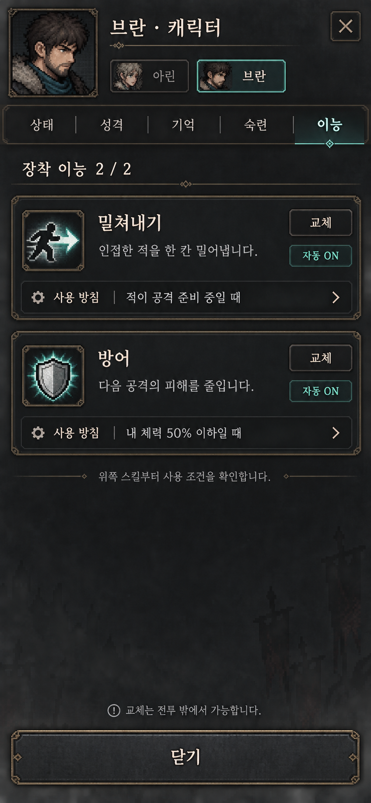

# 이능 탭 · 장착 카드 2개 목업 v1



- 기본 화면은 장착된 이능 2개만 표시한다.
- 카드마다 이름, 한 줄 설명, 자동 사용 여부, 사용 방침 요약, 교체 버튼만 제공한다.
- 교체는 해당 카드를 눌러 시작하므로 1번/2번 슬롯 선택을 다시 묻지 않는다.
- 사용 방침을 누르면 기존 공용 조건 편집 UI를 연다. 예시 조건은 스킬 종류를 제한하지 않는다.
- 위쪽 카드부터 사용 조건을 검사한다. 교체는 전투 밖에서만 가능하다.
- 검토용 목업이며 아직 게임 UI에 구현하지 않았다.
- imagegen 스킬의 내장 이미지 생성 도구로 생성. 원본 853×1844, 목표 논리 화면 390×844와 약 0.11% 비율 차이.

## 생성 프롬프트

```text
Use case: ui-mockup
Asset type: Korean mobile portrait dungeon RPG ability tab concept, ONE screen only, exact aspect ratio 390:844 (width:height), edge-to-edge screenshot, no phone frame, no multiple screens.
Primary request: Simplify equipped abilities to EXACTLY TWO concise stacked cards. This is a high fidelity dark pixel fantasy interface matching charcoal iron panels, muted brass fine borders, ivory Korean text, teal accents. Readable crisp Korean typography, restrained pixel-art icons, no ornate large illustrations.
Composition: single compact character management screen. Top title "브란 · 캐릭터" with a small close X; below small member selectors "아린" and selected "브란"; tabs "상태   성격   기억   숙련   이능" with 이능 selected. Subtitle "장착 이능 2 / 2".
In upper-middle place two compact full-width cards with generous readable spacing, each approx 150 logical pixels tall. Card 1 heading small push icon, "밀쳐내기", small "교체" text button at right. Description "인접한 적을 한 칸 밀어냅니다." Bottom inset row label "사용 방침" and summary "적이 공격 준비 중일 때" with chevron. Small enabled badge "자동 ON".
Card 2 heading small shield icon, "방어", small "교체" text button at right. Description "다음 공격의 피해를 줄입니다." Bottom inset row "사용 방침" with "내 체력 50% 이하일 때" and chevron. Small enabled badge "자동 ON".
Below cards one very subtle helper line "위쪽 스킬부터 사용 조건을 확인합니다." Then empty dark background breathing space, NO additional ability cards. Near bottom quiet hint "교체는 전투 밖에서 가능합니다." Bottom anchored wide "닫기" button.
Constraints: Exactly two equipped skill cards, do not display unequipped skills, no learned list, no slot 1 / slot 2 equip buttons, no skill tree, no inventory, no separate giant tactics editor. Skill conditions are summaries with disclosure only. No fabricated third skill, no combat background, no hand, no device bezel, no explanatory annotations outside UI. Portrait ratio must be narrow tall 390:844.
```
