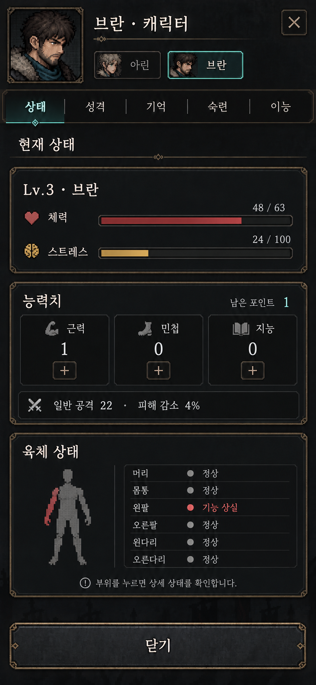
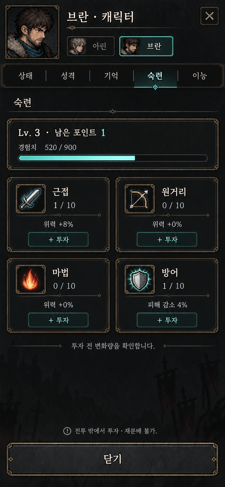
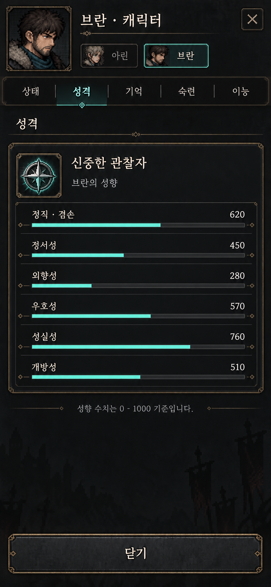
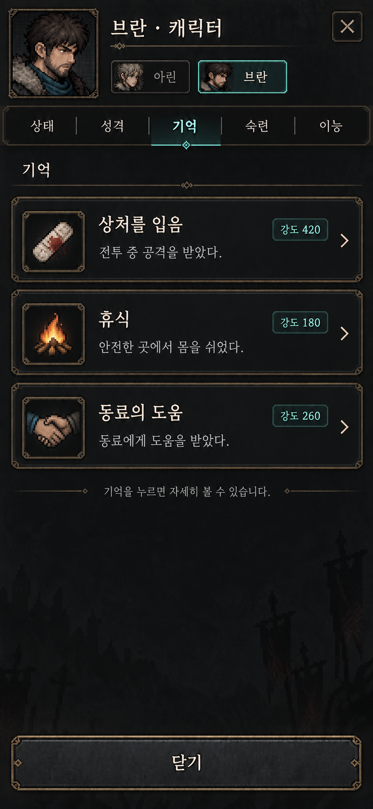

# 캐릭터 탭 통합 테마 목업 v1

승인된 [이능 목업](abilities-equipped-two-cards-v1.png)을 참조해 상태·숙련·성격·기억 4장을 제작했다.
이미지와 설계 문서만 추가하며 게임 UI 구현·배포 변경은 포함하지 않는다.

## 공통 규칙

- 같은 세로 화면 비율, 브란 헤더·파티 선택·5개 탭·하단 닫기 버튼 유지.
- 검은 철제 패널, 얇은 황동 테두리, 아이보리 글자, 청록색 선택 강조.
- 상태: 체력·스트레스, 능력치, 육체 상태 3개 카드.
- 숙련: 경험치 요약과 근접·원거리·마법·방어 2×2 카드.
- 성격: 성향 요약과 6개 게이지. 편집·투자 버튼 없음.
- 기억: 짧은 기록 카드와 강도. 상세 보기는 후속 구현 제안.
- 모든 수치·기억 내용은 레이아웃용 예시이며 실제 저장 데이터가 아니다.
- 구현 시 수치·게이지는 실제 데이터로 계산한다. 특히 숙련 XP 게이지는 현재 레벨 구간 기준이며 이미지의 채움 길이를 복제하지 않는다.
- 신체 좌우는 캐릭터 해부학적 좌우 기준으로 구현한다. 목업의 빨간 팔 위치는 개념 표현이며 정면 실루엣 좌우는 구현 시 교정한다.
- UI 요소는 네이티브 컨트롤로 구현할 예정이며 이 PNG를 통째로 게임 화면으로 쓰지 않는다.

## 이미지

### 상태



### 숙련



### 성격



### 기억



## 생성 정보

imagegen 스킬 · 내장 이미지 생성 도구 사용. 동일한 이능 이미지를 각 생성의 참조 이미지로 제공했다.

### 상태 프롬프트

```text
Use case: ui-mockup. Input image is the APPROVED THEME AND LAYOUT REFERENCE for a Korean mobile dungeon RPG.
Create ONE companion screen of this same app, at the SAME narrow tall portrait dimensions and aspect ratio as the input (853x1844, approximately 390:844 logical screen). No phone frame, no montage.
Preserve the input's identical top character portrait, "브란 · 캐릭터" heading, X button, two character chips "아린" and selected "브란", same tab strip "상태 성격 기억 숙련 이능", and same bottom anchored "닫기" button. Preserve charcoal textured panels, fine brass frames, ivory Korean font, cyan active highlights, minimal pixel icons. Do not enlarge header, keep exact reference proportions. Only change ACTIVE TAB and central content. No ability cards on these new tabs. Precise legible Korean, compact clear data, restrained card ornament. Enough negative space, never cram dense paragraphs. All content inside phone screen. Sample data only, no added game mechanics.
Active tab 상태 (cyan underline); 이능 inactive. Central subtitle "현재 상태". Three main full-width cards:
1. compact vitals card heading "Lv.3 · 브란"; "체력 48 / 63" with dark red HP bar, "스트레스 24 / 100" with amber bar.
2. "능력치" card, small "남은 포인트 1" at right; three equal inset columns "근력 1", "민첩 0", "지능 0", each with a small plus button below. A compact bottom row "일반 공격 22 · 피해 감소 4%".
3. "육체 상태" card: small abstract pixel human body silhouette at left, left arm muted red, all other parts gray. Right a compact six-row list "머리 · 정상", "몸통 · 정상", "왼팔 · 기능 상실" (red), "오른팔 · 정상", "왼다리 · 정상", "오른다리 · 정상". No gore. Footer helper "부위를 누르면 상세 상태를 확인합니다."
Do not display equipment, learned abilities, MP, dodge, parry, skill tree.
```

### 숙련 프롬프트

```text
Use case: ui-mockup. Input image is the APPROVED THEME AND LAYOUT REFERENCE for a Korean mobile dungeon RPG.
Create ONE companion screen of this same app, at the SAME narrow tall portrait dimensions and aspect ratio as the input (853x1844, approximately 390:844 logical screen). No phone frame, no montage.
Preserve the input's identical top character portrait, "브란 · 캐릭터" heading, X button, two character chips "아린" and selected "브란", same tab strip "상태 성격 기억 숙련 이능", and same bottom anchored "닫기" button. Preserve charcoal textured panels, fine brass frames, ivory Korean font, cyan active highlights, minimal pixel icons. Do not enlarge header, keep exact reference proportions. Only change ACTIVE TAB and central content. No ability cards on these new tabs. Precise legible Korean, compact clear data, restrained card ornament. Enough negative space, never cram dense paragraphs. All content inside phone screen. Sample data only, no added game mechanics.
Active tab 숙련 cyan underline, 이능 inactive. Central subtitle "숙련". One compact summary card: "Lv.3 · 남은 포인트 1", "경험치 520 / 900", cyan experience bar.
Below exactly FOUR equal cards in a compact 2-column 2-row grid, not a long list. Each uses small restrained pixel emblem, title, rank, one effect line, a small "+ 투자" button.
Top left sword emblem "근접" "1 / 10" "위력 +8%".
Top right bow emblem "원거리" "0 / 10" "위력 +0%".
Bottom left flame emblem "마법" "0 / 10" "위력 +0%".
Bottom right shield emblem "방어" "1 / 10" "피해 감소 4%".
Below grid quiet helper "투자 전 변화량을 확인합니다." Footer hint "전투 밖에서 투자 · 재분배 불가".
No skill rules, no ability equip list, no stat allocation, no branching skill tree.
```

### 성격 프롬프트

```text
Use case: ui-mockup. Input image is the APPROVED THEME AND LAYOUT REFERENCE for a Korean mobile dungeon RPG.
Create ONE companion screen of this same app, at the SAME narrow tall portrait dimensions and aspect ratio as the input (853x1844, approximately 390:844 logical screen). No phone frame, no montage.
Preserve the input's identical top character portrait, "브란 · 캐릭터" heading, X button, two character chips "아린" and selected "브란", same tab strip "상태 성격 기억 숙련 이능", and same bottom anchored "닫기" button. Preserve charcoal textured panels, fine brass frames, ivory Korean font, cyan active highlights, minimal pixel icons. Do not enlarge header, keep exact reference proportions. Only change ACTIVE TAB and central content. No ability cards on these new tabs. Precise legible Korean, compact clear data, restrained card ornament. Enough negative space, never cram dense paragraphs. All content inside phone screen. Sample data only, no added game mechanics.
Active tab 성격 cyan underline, 이능 inactive. Subtitle "성격". First compact summary card with a small compass emblem, heading "신중한 관찰자", subtitle "브란의 성향".
Then exactly SIX compact rows within ONE full-width brass-bordered card, not six giant panels. Each row has label at left, numeric at right and slim teal gauge beneath. Labels and values:
"정직·겸손" "620", "정서성" "450", "외향성" "280", "우호성" "570", "성실성" "760", "개방성" "510". Gauges represent value out of1000.
Quiet hint below "성향 수치는 0–1000 기준입니다."
No + buttons, no allocation points, no invented combat bonuses, no ability rules. Leave spacious breathing room above fixed close button.
```

### 기억 프롬프트

```text
Use case: ui-mockup. Input image is the APPROVED THEME AND LAYOUT REFERENCE for a Korean mobile dungeon RPG.
Create ONE companion screen of this same app, at the SAME narrow tall portrait dimensions and aspect ratio as the input (853x1844, approximately 390:844 logical screen). No phone frame, no montage.
Preserve the input's identical top character portrait, "브란 · 캐릭터" heading, X button, two character chips "아린" and selected "브란", same tab strip "상태 성격 기억 숙련 이능", and same bottom anchored "닫기" button. Preserve charcoal textured panels, fine brass frames, ivory Korean font, cyan active highlights, minimal pixel icons. Do not enlarge header, keep exact reference proportions. Only change ACTIVE TAB and central content. No ability cards on these new tabs. Precise legible Korean, compact clear data, restrained card ornament. Enough negative space, never cram dense paragraphs. All content inside phone screen. Sample data only, no added game mechanics.
Active tab 기억 cyan underline, 이능 inactive. Subtitle "기억". Exactly THREE concise full-width stacked brass-bordered memory cards, each with a small restrained pixel icon at left, title and one short context line, a small intensity chip at right and a disclosure chevron.
Card1 bandage icon "상처를 입음", "전투 중 공격을 받았다.", chip "강도 420".
Card2 campfire icon "휴식", "안전한 곳에서 몸을 쉬었다.", chip "강도 180".
Card3 handshake icon "동료의 도움", "동료에게 도움을 받았다.", chip "강도 260".
Subtle line below "기억을 누르면 자세히 볼 수 있습니다."
No ability cards, no inventory, no delete buttons, no invented buff numbers, no filters. Cards should be compact, preserving negative space similar to reference.
```
