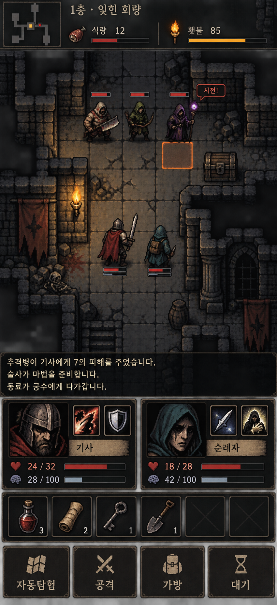

# Dark fantasy 32px — mobile mockup v1

Built-in image generation tool used. Art-direction preview only; not a game screenshot or a pixel-exact 32x32 spritesheet. No runtime assets replaced.

The generated screen uses a square-grid top-down environment with front/back readable sprites. Skill icons appear beside portraits rather than above them; final UI layout and native 32px sprite silhouettes require implementation review.

## Generation prompt

Use case: ui-mockup
Asset type: one full-bleed mobile portrait game screen mockup, 9:19.5 aspect ratio. No phone frame, no external margins, no presentation board.
Primary request: an original dark fantasy dungeon crawler with the oppressive ink-black shadows, bold silhouettes, desaturated worn colors and dramatic chiaroscuro associated with Darkest Dungeon, reinterpreted as authentic chunky 32x32 pixel-art top-down tiles and sprites. Not a side-view game. Not isometric. No copied franchise characters or logos.
Layout: compact top HUD occupies 8% of screen, top-down gameplay occupies 65%, overlapping translucent three-line log 6%, compact two-character party controls and shared inventory 15%, bottom navigation 6%. Gameplay fills entire width.
HUD: small square minimap upper left; beside it location text "1층 · 잊힌 회랑"; one horizontal resource row "식량 12" and "횃불 85" with slim hunger and torch gauges. No enemy name banner.
Gameplay: approximately ten square tiles across, continuous ruined dungeon corridors extending beyond screen rather than isolated arena. Flat square grid aligned horizontally/vertically, no diamond tiles. Quiet low-contrast weathered gray stone floor, ink-black cracks, thick ruined walls, a wooden locked chest, rubble, one wall torch. Two allied adventurers near center: sword-bearing weathered knight with faded crimson cloak and hooded companion with muted teal cloak. Three clearly distinct enemy silhouettes farther up the corridor: stocky melee raider with cleaver, skinny green hooded archer with bow, purple-robed sinister caster with glowing staff. Sprites approximately one tile tall, legible chunky low-resolution clusters, not detailed high-res painted figures. Small health bars. Caster has a small "시전!" badge and ONE subtly orange marked target square. No green movement overlay, no red area surrounding hero. Scene mostly well lit by ample warm amber torchlight, cooler dark perimeter but all actors readable. No dense particle clutter.
Log: three lines in readable warm off-white Korean, over dark translucent band overlapping bottom of playfield: "추격병이 기사에게 7의 피해를 주었습니다." / "술사가 마법을 준비합니다." / "동료가 궁수에게 다가갑니다."
Party panel: exactly TWO short portrait cards side by side, each with TWO square skill icons immediately above it, thin health and stress bars. Portraits use expressive grim inked dark-fantasy faces, larger-resolution than map sprites. Below both portraits a SINGLE shared full-width row of six consumable slots: potion, scroll, key, shovel, empty, empty.
Bottom four equal touch buttons with simple icons and readable Korean labels: "자동탐험", "공격", "가방", "대기".
UI material: understated charcoal iron, distressed parchment labels, thin muted brass borders, dark burgundy health bars. Functional readable mobile layout, minimal ornamental framing. Crisp pixel edges and deliberate low-color clusters on all gameplay art. No smooth 3D rendering, no photorealism, no mecha, no sprawling text, no title or watermark.
This is an art-direction mockup, not an exportable spritesheet.

