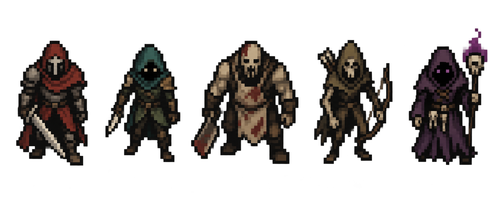

# 다크판타지 캐릭터 참고안 v1

왼쪽부터 기사, 동료, 추격병, 궁수, 술사. UI와 배경을 제외한 캐릭터 디자인 참고안이다.

내장 이미지 생성으로 제작했다. 실제 32×32 규격 스프라이트나 애니메이션 시트가 아니며, 생성 결과는 요청한 32px 표현보다 세밀하다. 실사용 시 캐릭터당 32×32 캔버스에 맞춘 단순화와 픽셀 정리가 필요하다. 게임의 런타임 에셋은 교체하지 않았다.

요청한 생성 방향: 32×32 셀, 캐릭터 최대 22×28 픽셀, 제한된 색상, 굵고 균일한 픽셀 덩어리, 검은 그림자와 저채도 다크판타지 색감, 탑뷰 RPG용 캐릭터 5종, 배경·UI·문자 제외. 위 규격은 생성 요청이며 검증된 출력 규격이 아니다.
