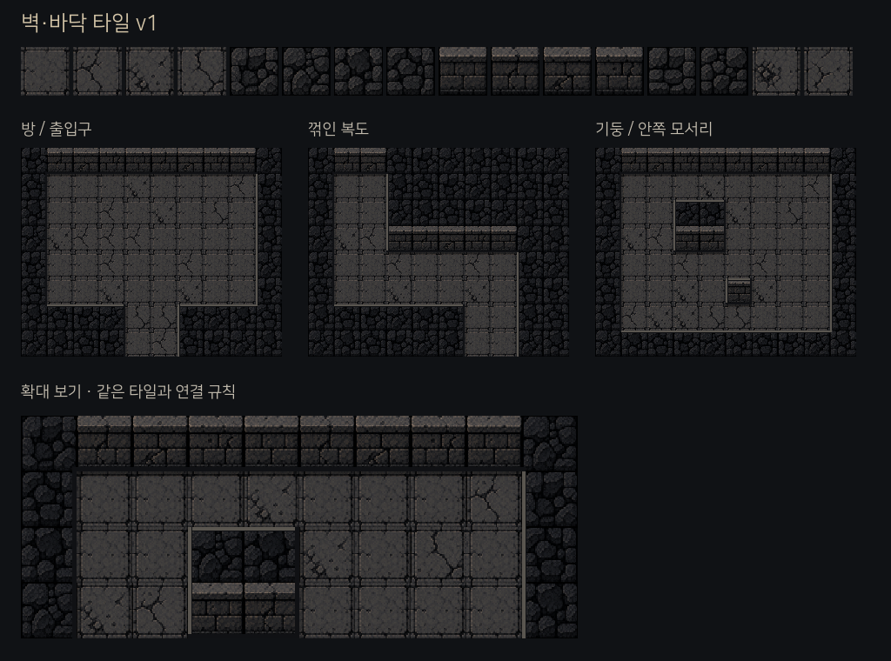
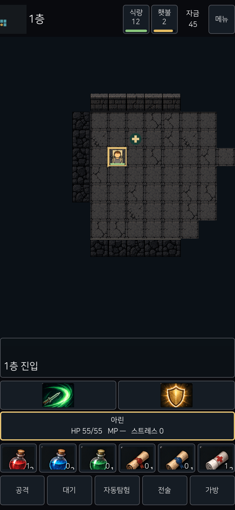

# 벽·바닥 타일 v1

## 리소스

`assets/topdown/dark-masonry-tiles-v1.png`: imagegen으로 생성한 4×4 아틀라스. `dark-fantasy-32px-v1.png`를 화풍 참고로 사용했다. 생성 원본을 보존하고 AtlasTexture로 영역을 선택한다. 논리적인 기준은 32px 타일이며 원본 파일 자체는 128×128 네이티브 픽셀 시트가 아니다.

| 행 | 구성 |
|---|---|
| 1 | 기본 판석·균열 변형 4종 |
| 2 | 벽 윗면 4종 |
| 3 | 벽 앞면·상단 턱 4종 |
| 4 | 추가 벽 2종·바닥 2종, 현재 예약 |

## 연결

- `expedition/masonry_tiles.gd`가 상하좌우 벽 여부로 노출된 면을 계산한다.
- 아래가 통행 가능한 칸이면 벽 앞면, 그 외에는 윗면을 표시한다.
- 바깥 테두리와 오목한 안쪽 모서리는 같은 규칙으로 덧그린다. 개별 생성 조각의 연결 오차에 의존하지 않는다.
- 바닥에 짧은 접촉 그림자를 넣는다. 그림자와 앞면은 각 칸 안에 그리며 이동·시야 판정을 바꾸지 않는다.
- 바닥 변형은 좌표 기준으로 고정한다. 카메라 이동이나 새로고침으로 변하지 않는다.
- 기존 물·목재·금속 지형은 유지한다.

이 버전은 낮은 벽 표현이다. 캐릭터를 가리는 높은 벽, 문, 장식, 동적 횃불 광원은 이번 범위에 포함하지 않는다.

## 검증

`tests/terrain_layouts.gd`: 상하좌우 16가지 연결 조합 및 기존 지형 연결성 검증.
`tools/art/masonry_preview.tscn`: 실제 게임과 동일한 타일 렌더러로 방·꺾인 복도·기둥·안쪽 모서리를 비교한다. Godot에서 이 씬을 실행하면 재현할 수 있다.

## v2 보완

`assets/topdown/dark-masonry-walls-v2.png`에 가로 앞면·좌측 세로 면·우측 세로 면·윗면을 분리했다. 아래가 열린 벽은 앞면, 좌우가 열린 벽은 해당 세로 면을 사용한다. 앞면 윗부분은 북쪽이 벽일 때만 0.3칸 높여 통행 칸의 캐릭터를 가리지 않는다. 위 스크린샷은 v1 기록이다.

대각선 이동은 목적지가 빈 인접 칸이면 코너 벽과 무관하게 허용한다. 근접 공격의 코너 차단은 유지한다. 직접 이동·자동 탐험·목표 도달 거리 계산에 같은 이동 규칙을 적용한다. 인접 칸은 코너에서도 표시해 터치할 수 있다.

## v3 벽 윤곽 연결

[0x72 Dungeon Tileset II](https://0x72.itch.io/dungeontileset-ii)의 가로 윗면·세로 테두리·모서리 연결 구조를 참고했다. 기존 생성 이미지는 유지하고 렌더링 구조를 변경했다.

- 모든 벽 윗면을 동일하게 0.72칸 올리고, 가로·세로 테두리를 같은 재질과 0.23칸 두께로 연결한다.
- 노출된 변과 오목한 모서리를 함께 계산한다. 세로 벽에 독립적인 정면 텍스처를 채우지 않는다.
- 바닥 → 벽 윗면 바탕 → 남향 앞면 → 연결 테두리 순서로 그려 인접 타일이 연결부를 덮지 않게 한다.
- 카메라 바로 아래의 벽도 그려 위로 올라온 부분이 화면 끝에서 사라지지 않게 한다.
- 인접 벽 주변 1,024가지 배치의 가로·세로 경계 14,336개 지점을 검사한다. 기존 100시드·900개 방 연결성 검사도 유지한다.

위 이미지는 v1 기록이며 v3 캡처는 생성하지 않았다. 형상 경계 검사는 화면의 미적 완성도 검증을 대신하지 않는다.
