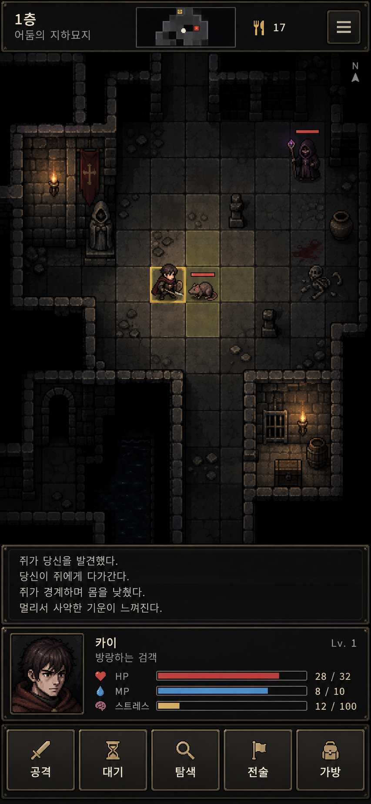

# 수동 로그라이크 탐험 UI 목업 v1

이미지 생성 목업이며 게임에 연결된 화면이나 에셋은 아니다. DCSS·픽셀 던전의 격자 전투 가독성과 림월드의 작고 기능적인 상태 패널을 결합한 방향이다. 특정 게임의 UI나 그림을 그대로 옮기지 않는다.

- 상단: 작은 지도, 층·식량, 메뉴.
- 중앙: 한 칸씩 읽히는 전장, 시야 밖 암전, 캐릭터와 적의 선명한 실루엣.
- 하단: 최근 로그 4줄 → 인물 초상화·HP/MP/스트레스 → `공격 · 대기 · 탐색 · 전술 · 가방` 한 줄.
- 전술 버튼은 준비한 주문과 장착한 파츠를 연다. 가방의 장비 탭은 보유·착용 장비를 함께 표시한다.

생성 방식: built-in imagegen, `ui-mockup`. 프롬프트 핵심: “390:844 portrait mobile traditional turn-based roguelike interface; combine DCSS/Shattered Pixel Dungeon tactical readability and RimWorld compact functional panels; dark fantasy connected stone grid, fog of war, one hero and two enemies; four-line log, hero portrait with HP/MP/stress, and exactly five equal bottom buttons labeled 공격 대기 탐색 전술 가방; no auto-battle controls, no explanatory text.”

검토 포인트: 실제 게임에서 글꼴·색·도트 크기는 프로젝트 에셋에 맞추되 화면 영역 비율, 정보 순서, 타일과 인물의 대비를 기준으로 삼는다. 생성 이미지 속 몬스터·초상화·던전 물체는 구현용 개별 에셋이 아니다.
