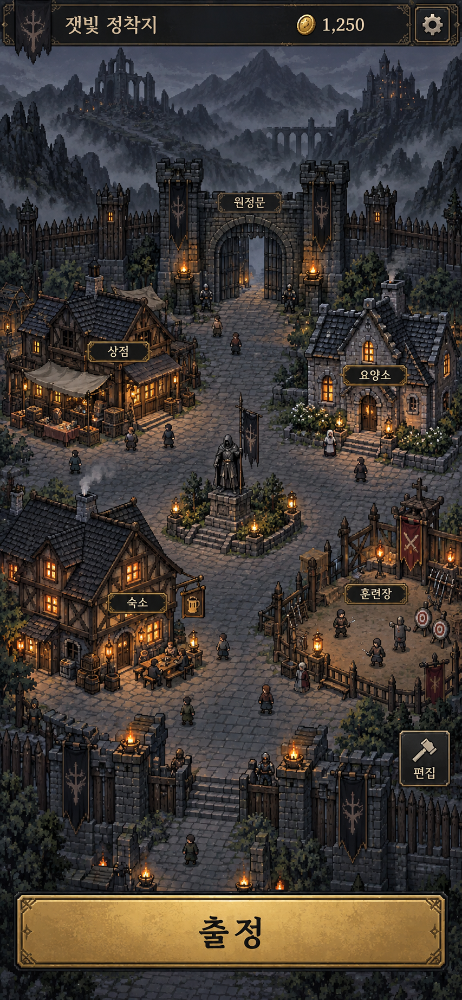

# 거점 화면 목업 v1

2026-09-22 · 승인 시안을 거점 배경으로 적용.

- 상단: 거점 이름, 보유 자금, 설정.
- 중앙: 건물을 눌러 시설을 여는 정착지 전경. 상점·요양소·숙소·훈련장·원정문.
- 하단: 출정 버튼 하나. 편집은 전경 우측의 작은 별도 버튼으로 진입.
- 전투용 캐릭터 카드·스킬·아이템 슬롯·전투 하단 메뉴는 표시하지 않는다.
- 설명문 없이 짧은 시설명과 동작명만 표시한다.
- 타일 편집은 별도 모드로 두고, 기본 화면에서는 격자를 숨긴다.
- 상점은 구매·환불, 요양소는 유료 회복, 숙소는 인원별 상태, 훈련장은 인원별 숙련 화면을 연다. 설정은 소리 켜기/끄기를 제공한다.
- 편집은 비활성 상태다. 건물 이동·증축을 구현할 때 배경과 건물 이미지를 분리해야 한다.
- 배경의 예시 자금은 실제 HUD로 덮고 현재 자금을 표시한다.
- 런타임 배경: `assets/ui/settlement-hub-v1.png`. 원본과 동일한 이미지에 시설 터치 영역을 겹친다.
- 귀환 정산은 별도 카드로 표시하며 정비 후 거점으로 돌아온다.

이미지: imagegen 스킬의 내장 이미지 생성 도구로 제작. 853×1844 세로형 시안.
