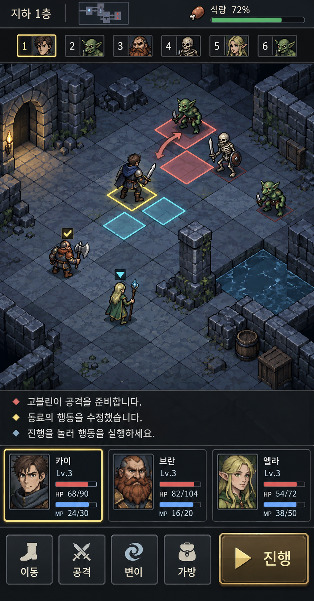
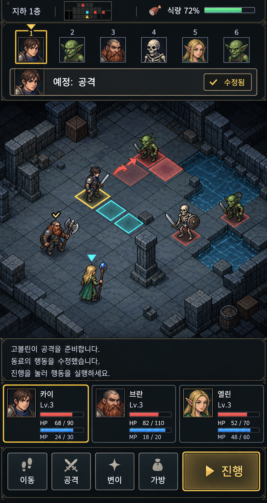

# 모바일 전술 전투 목업 v1

내장 `image_gen` 도구로 생성한 **검토용 디자인 제안**이다. 실제 실행 화면, 구현 완료 화면 또는 바로 사용할 수 있는 개별 스프라이트 시트가 아니다.
이번에는 코드 수정 `dd08ab8`과 함께 목업을 공유하며, 목업 레이아웃을 게임에 적용하지는 않았다.

## A — 전장 중심 (추천)

얇은 행동 순서 바, 넓은 전장, 아래쪽 3줄 로그와 파티 초상화, 하단 조작 버튼을 배치한다.

## B — 행동 순서 중심

상단에서 선택한 인물의 예정 행동과 수정 상태를 강조한다. 대신 전장이 차지하는 면적은 줄어든다.

## 비교 기준과 한계

- 적 위험 타일, 선택한 인물, 예정 행동 순서, 사용자 수정 여부를 빠르게 구분할 수 있는지 비교한다.
- 색만 의존하지 않고 선택 테두리, 숫자, 화살표, 체크 표시를 함께 사용한다.
- 현재 에셋을 직접 합성하지 않았다. 생성된 인물·지형 아트는 기존 게임 에셋과 다르다.
- 두 안은 같은 파티 구성과 전투 종류를 지시했지만 지형, 이름, HP/MP 등 세부 묘사가 완전히 동일하지 않다. UI 배치 비교용이지 동일 상태의 정확한 A/B 실험 자료가 아니다.
- 요청한 논리 화면은 390×844이고 생성 원본은 A 907×1734, B 914×1721이다. 채택 후 실제 화면 비율과 최소 44px 터치 영역에 맞춘 UI 검증이 필요하다.
- 공격 화살표와 위험 타일은 시각 언어 제안이다. 실제 타깃 방향과 피해 예측은 게임의 전투 예고 데이터에서 그려야 한다.
- A의 벽면 횃불은 생성 모델이 덧붙인 배경 장식이다. 삭제한 횃불 장비·소모 시스템을 다시 도입한다는 의미가 아니다.
- 프롬프트와 생성 방식은 [prompts.md](prompts.md)에 기록했다. 원본은 무손실 PNG로 보존한다.
- `export_presets.cfg`의 `docs/*` 제외 규칙으로 목업은 Web 게임 배포 패키지에 포함되지 않는다.

## 관련 코드 변경과 검증

[NPC 성장·공용 가방 결과](../../plans/party-growth-shared-bag-results.ko.md)에 구현 내용, 통과한 회귀 검사와 기존 UI 테스트의 미통과 한계를 기록했다.
