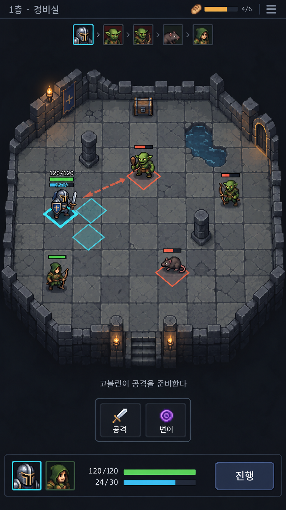

# 세로형 전장 중심 UI 목업 v1

이미지 생성 도구로 만든 검토용 목업이다. 실제 게임 UI 적용이나 디자인 확정은 아직 하지 않았다. `.gdignore`로 게임 리소스 가져오기에서 제외한다.

## 구성 제안

- 상단: 층·식량·메뉴와 좁은 행동 순서 표시.
- 중앙: 전체 8×8 전장, 최소한의 이동·공격 예고.
- 이동은 타일 직접 선택. 공격·변이는 캐릭터 선택 시에만 작은 메뉴로 표시.
- 하단 고정 다중 버튼 줄 대신 파티 초상화·선택 캐릭터 HP/MP·진행 버튼 유지.
- 상태·장비는 초상화/메뉴로 접근. 로그는 최근 한 줄만 표시하고 확장 가능하게 한다.

## 생성 조건과 한계

내장 이미지 생성 도구 사용. 세로 모바일 화면, Into the Breach의 전술 가독성을 참고한 판타지 던전, 거친 64픽셀 계열 그래픽, 최소 UI, 기존 HP/MP 규모 유지, 상시 몬스터 목록·인물 설명창 없음이라는 조건으로 생성했다.

배치 비교용 이미지이며 타일 수·투영·문자·수치의 정확성을 보장하지 않는다. 특히 바닥 격자와 강조 마름모의 투영 불일치는 실제 구현에서 바로잡아야 한다. 새 궁수나 장식 횃불 등 이미지 속 요소는 이번 커밋에서 게임 기능으로 추가되지 않는다.
