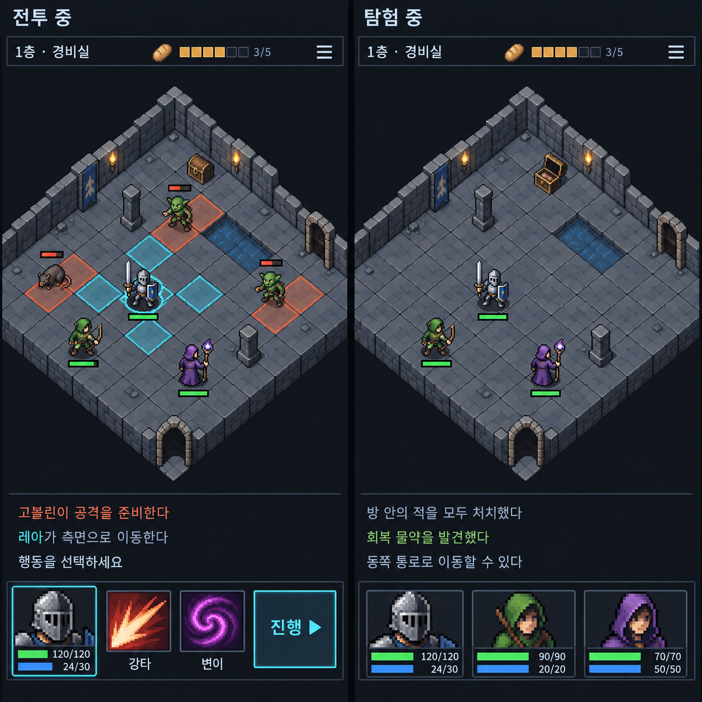

# 세로형 전투·탐험 UI 비교 목업 v2

내장 이미지 생성 도구로 만든 검토용 이미지다. 실제 게임 UI 코드는 변경하지 않았다. 이전 v1 목업은 보존한다. `.gdignore`로 게임 리소스 가져오기에서 제외한다.

위 문장은 목업 업로드 당시 범위다. 이후 승인된 상·하단 UI와 전투 흐름의 실제 적용 결과는 [구현 문서](implementation.md), [런타임 화면](runtime.png)을 참고한다.

## 구성

- 공통: 얇은 층·식량·메뉴 HUD → 아이소메트릭 8×8 전장 → 로그 3줄 → 하단 한 줄.
- 상단 행동 순서 표시, 상시 몬스터 목록, 자동 인물 설명 패널은 두지 않는다.
- 전투 중: 선택 캐릭터 초상화와 HP/MP, 스킬 2개, 진행 버튼.
- 탐험 중: 파티 초상화 최대 3개와 각 HP/MP.
- 다른 전투 캐릭터는 전장에서 선택하고, 초상화를 통해 상태·숙련·아이템에 접근하는 방향이다.
- 전환 기준은 방 종류가 아니라 실제 전투 여부다. 전투방을 정리하면 탐험 UI, 추격한 적과 조우하면 전투 UI를 표시한다.

## 생성 조건 및 한계

세로 화면 두 개를 나란히 배치하고, 같은 아이소메트릭 던전과 카메라·로그 위치를 유지하면서 하단 조작부만 비교하도록 요청했다. Into the Breach의 가독성을 참고한 판타지 픽셀 그래픽, 최소 UI, 기존 HP/MP 규모 유지가 조건이다.

생성 이미지의 타일 수·가장자리 잘림·수치와 게이지 비율은 정확한 구현 명세가 아니다. 실제 구현에서는 8×8 전체가 화면에 들어오고, 타일과 강조 표시의 투영이 일치해야 한다. 스킬 아이콘과 캐릭터는 예시이며 신규 게임 기능 추가를 뜻하지 않는다.
